# 软件工程第三次作业

| 项目 | 内容 |
| ---- | ---- |
| 这个作业属于哪个课程 | [https://edu.cnblogs.com/campus/fzu/202601SofwareEngineering](https://edu.cnblogs.com/campus/fzu/202601SofwareEngineering) |
| 这个作业要求在哪里 | [https://edu.cnblogs.com/campus/fzu/202601SofwareEngineering/homework/16743](https://edu.cnblogs.com/campus/fzu/202601SofwareEngineering/homework/16743) |
| 这个作业的目标 | 通过需求分析和原型设计初步熟悉结对编程 |
| 学号 | 052403137，182400320 |
| figma链接 | [拾伴｜校园失物招领 · 交互原型初稿](https://www.figma.com/design/JTLCFQJNsz3Ip4U7KElBEj/%25E6%258B%25BE%25E4%25BC%25B4%25EF%25BD%259C%25E6%25A0%25A1%25E5%259B%25AD%25E5%25A4%25B1%25E7%2589%25A9%25E6%258B%259B%25E9%25A2%2586-%25C2%25B7-%25E4%25BA%25A4%25E4%25BA%2592%25E5%258E%259F%25E5%259E%258B%25E5%2588%259D%25E7%25A8%25BF?t=NSR7TZQaHp10b5bg-0) |

## 0x00 《构建之法》读后感

第三章《软件工程师的成长》让我重新看待“熟练”：能力要靠工作质量与具体记录衡量。这次原以为需求拆解很简单，实际耗时却超过预估；后续应把遗漏的边界、返工原因与耗时一起记录，让估算有依据。熟悉工具之外，还要持续检验自己的判断。

第四章《两人合作》中，驾驶员负责操作，领航员负责检查，两者可以互换。我更看重持续复核的价值。从 PRD 讨论到原型微调，需要有人追问失败后怎么办、状态是否一致；后续应轮换操作与复核，避免一人包办。及时暴露分歧，才能减少后续返工。

第八章《需求分析》提醒我，需求还来自利益相关者。除了失主和拾物者，还要考虑保管、值班与审核人员。第二版补上这些角色，但目前仍是设计假设，需要用访谈和原型验证，并按价值与成本确定功能优先级；界面能走通，不能证明学校愿意接手。

## 0x01 需求分析

最初让 AI 生成[第一版 PRD](https://github.com/155TuT/2601-fzu-SoftwareEngineering-YuezhongWu/commit/3d16736d29f7e1e4fb30552ad605d33331e0e063#diff-8718df3686c7f4c70bcd21114ff690c0efe525b698c5237ccf77c3e70aaa29e8)：

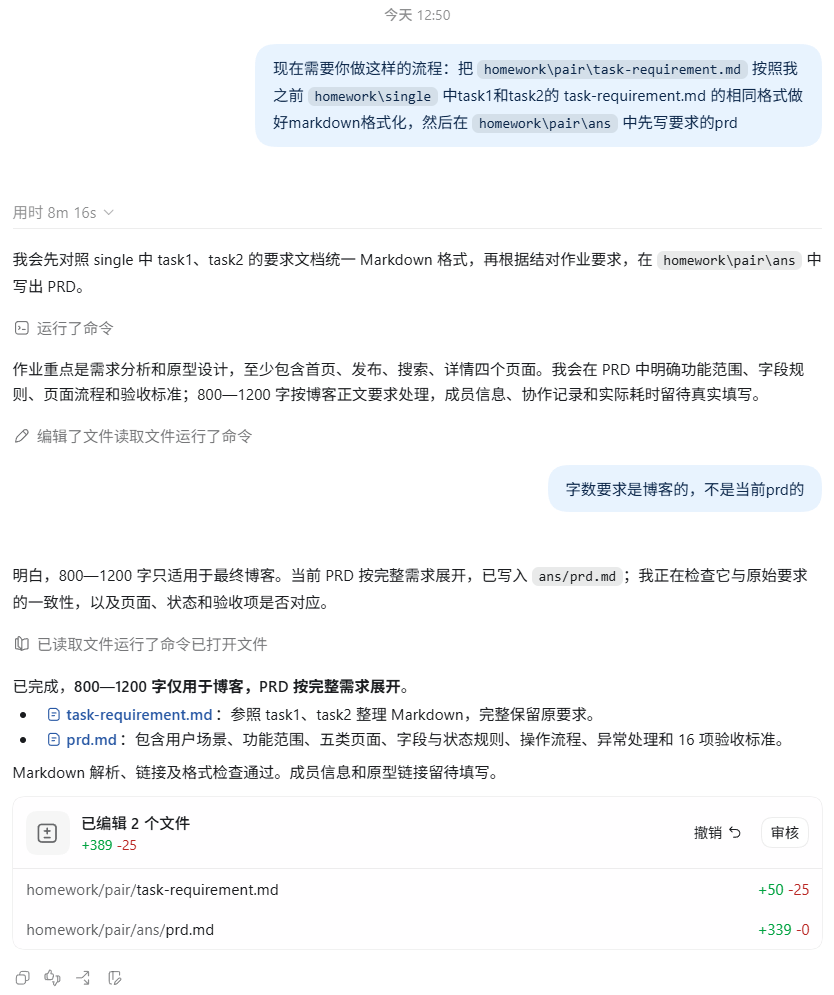

发布、搜索、详情和状态更新虽然齐全，却没回答信息从哪里来、浏览者为何帮忙、谁处理冒领。于是继续追问参与动机和归还过程：

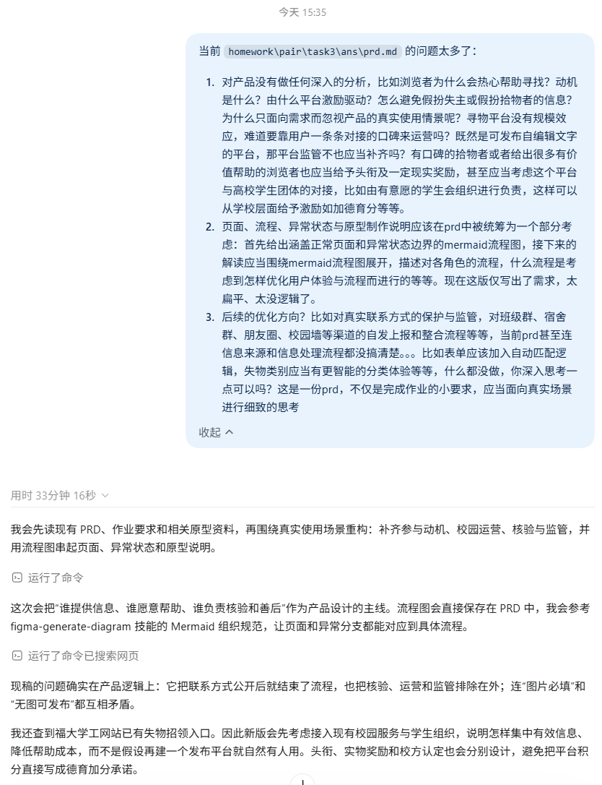

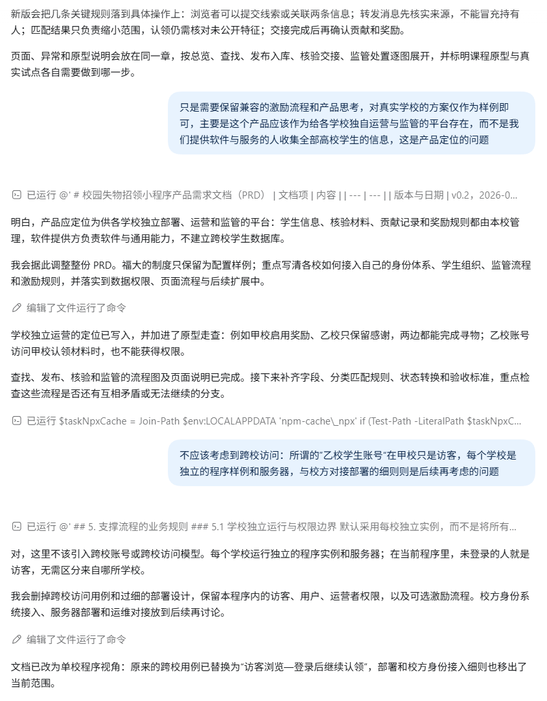

得到了现在的版本[refactor: prd: \#31468d7](https://github.com/155TuT/2601-fzu-SoftwareEngineering-YuezhongWu/commit/31468d784489656c3001a4602820e6f7eb17090e)。第二版从参与者的动机重新推导功：。拾物者可能赶时间、不方便保管，所以需要短表单和服务点移交；浏览者可能只在群里见过相关消息，所以提供关联记录、提交线索等轻量入口，并反馈帮助是否有效。头衔和现实奖励围绕核实后的贡献设计，保留学校加分的兼容流程，但不按发帖量奖励，也不替学校承诺加分。

这种低频服务并不能靠用户不断拉人、反复刷新首页维持，更值得考虑的是借助学生组织、校园墙和服务点，提高校内有效信息的覆盖。群消息可以自愿转报，但转报人不等于持有人，需要确认来源、关联重复记录，并在结案后反馈原渠道。表单则加入类别建议、同义词和时间地点匹配，减少重复填写与查找；建议错误或服务失败时，仍允许人工修改和继续发布。

对于可信度，第二版同时核验“是不是失主”和“是否真的持有物品”，保留未公开特征，按需授权联系方式，区分单方自报和已核实归还。可编辑的文字和图片还需要审核、举报、申诉与处理责任人。增加这些环节会提高操作成本，因此普通物品保持轻量核对，复杂争议再交由服务点协助，不能让所有用户都填一套繁重的证明材料。

文档结构也随之调整：把页面、流程、异常状态和原型说明合在一起，先用 Mermaid 总览与分流程图串起查找、入库、核验交接和监管，再解释角色在每个节点要做什么。搜索无结果后能订阅或继续发布，提交失败后保留输入，单方确认后进入待确认状态，每个分支都有下一步，也能追溯到它要解决的体验问题。

两次引导还纠正了产品定位的偏移。各学校使用独立的程序实例和服务器，自行运营监管；我们提供软件能力，不集中收集高校学生信息。当前程序只考虑本校身份与访客，没有必要设计跨校账号关系。真实学校的制度只是样例，产品保留可选激励和审核流程，具体认定、校方接入及部署细则留待后续。

不过，第二版列出了运营角色和处理流程，落地时这些分工能否成立，还需要与校方、学生团体实际沟通。独立部署前，应先了解学校已有的失物登记、保管和学生服务方式，确认由哪个部门负责、学生组织愿意承接哪些工作、遇到争议向谁升级。值班人手、假期安排、学生组织换届后的交接，以及故障由谁响应，都影响这套服务能否持续运行。程序能够部署，并不代表学校已经具备接手运营的条件。

德育分等激励尤其需要进一步审视。它可能提高参与意愿，也会给校方增加证据收集、贡献核实、重复申报检查、统计上报和申诉处理等工作。学生组织确认一条线索有效，并不意味着它有权认定德育加分；哪些行为可以认定、采用什么凭据、由谁复核、是否与已有志愿服务记录重复，都需要与有权限的校方人员确认。即使采用实物奖励，也仍有经费来源、名额分配和领取核销的成本，不能只从学生获得奖励的一面考虑。

## 0x02 原型设计

采用 Figma，入口见文首。下图是设计流程，原型目前仅覆盖基础操作；智能建议、身份与审核仅作交互模拟。页面、异常状态与走查清单见 PRD 第 4—5 节。

### 1. 查找物品

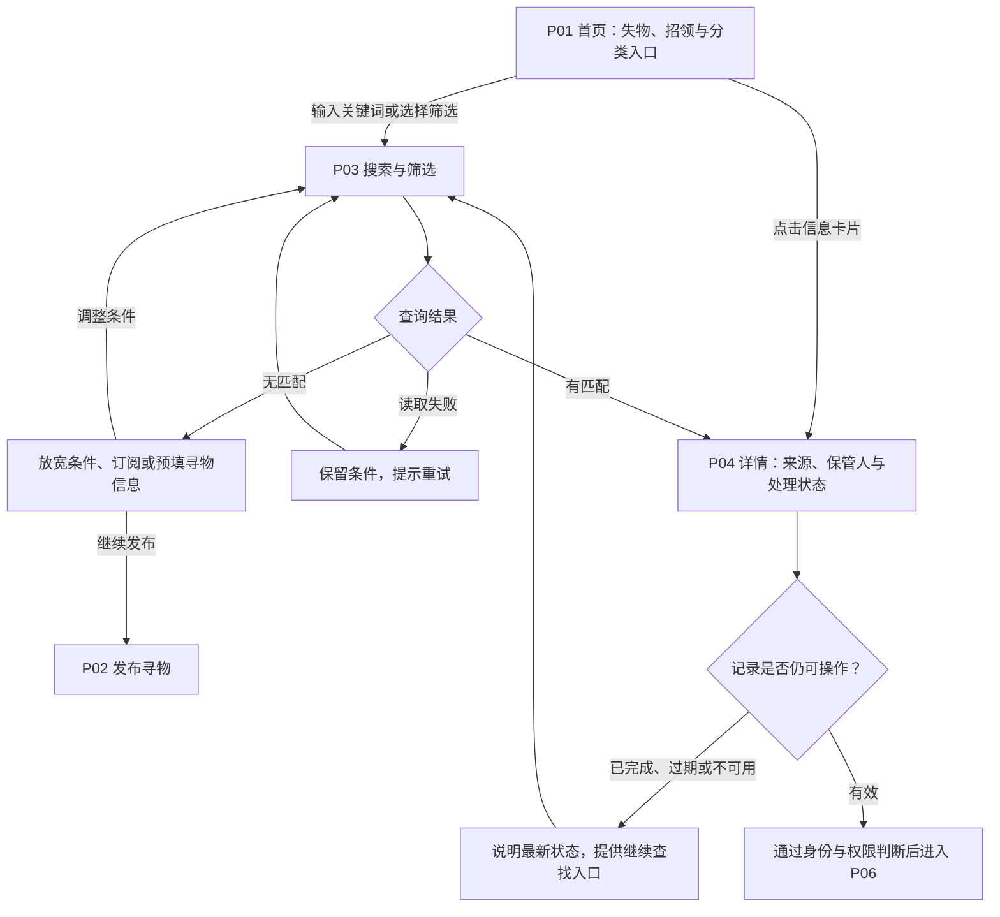

无结果可继续寻找，读取失败保留条件重试。

### 2. 发布与转报

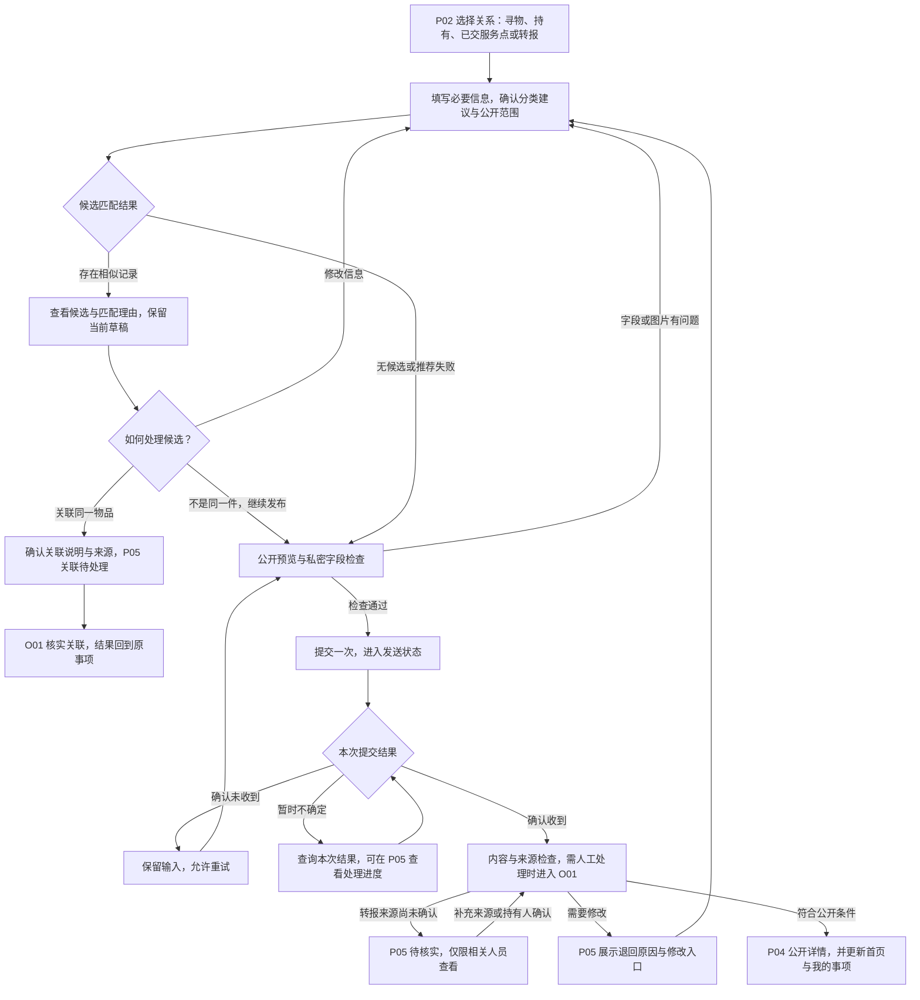

区分提交与公开，未确认来源先待核实。

### 3. 协助、认领与交接

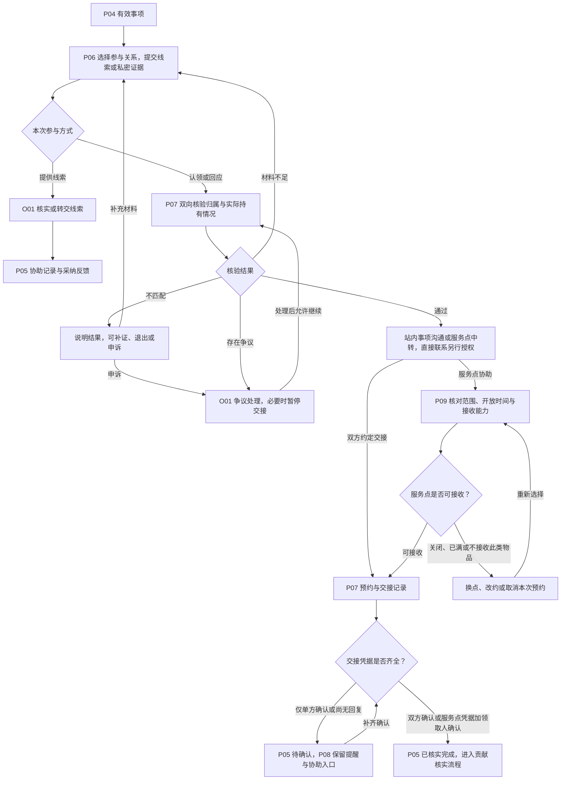

核验通过后交接，单方确认不算找回成功。

### 4. 事项处理与贡献反馈

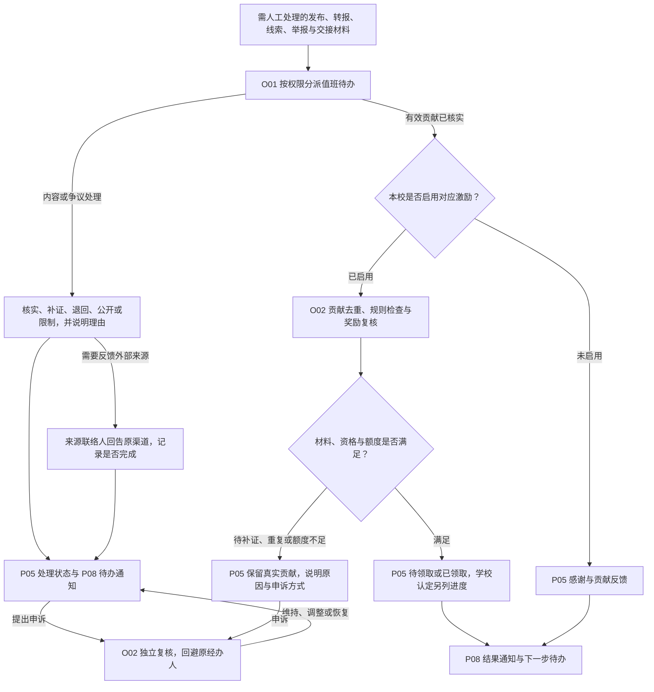

进展回到原事项，关闭激励也能完成寻物。

## 0x03 结对过程

先根据调研和思路给出prd，然后再进行讨论和对拍

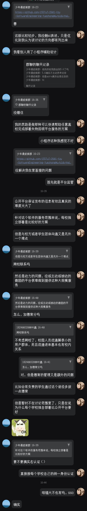

根据写好的prd进行原型制作

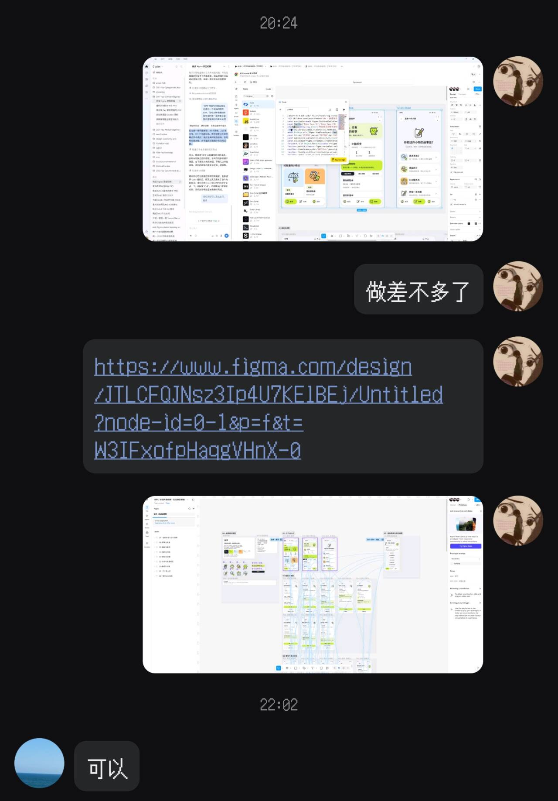

逐步微调页面逻辑和展示效果

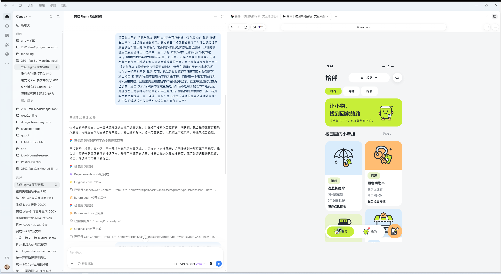

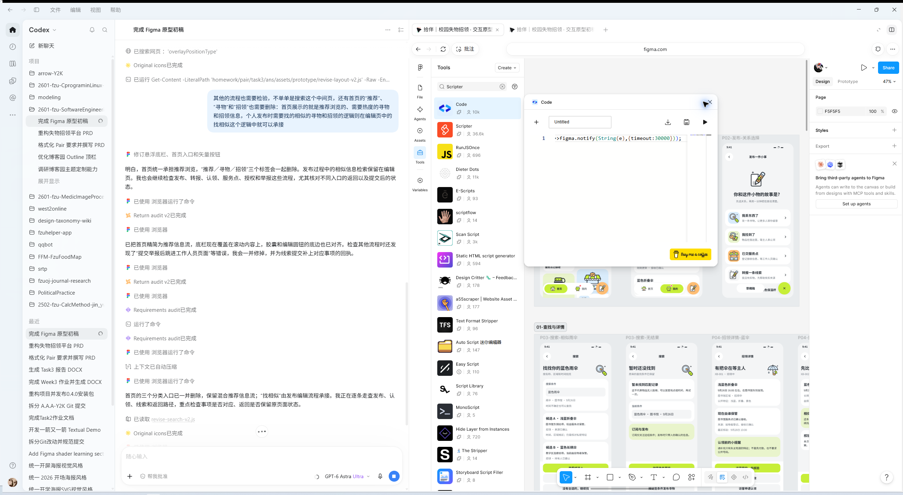

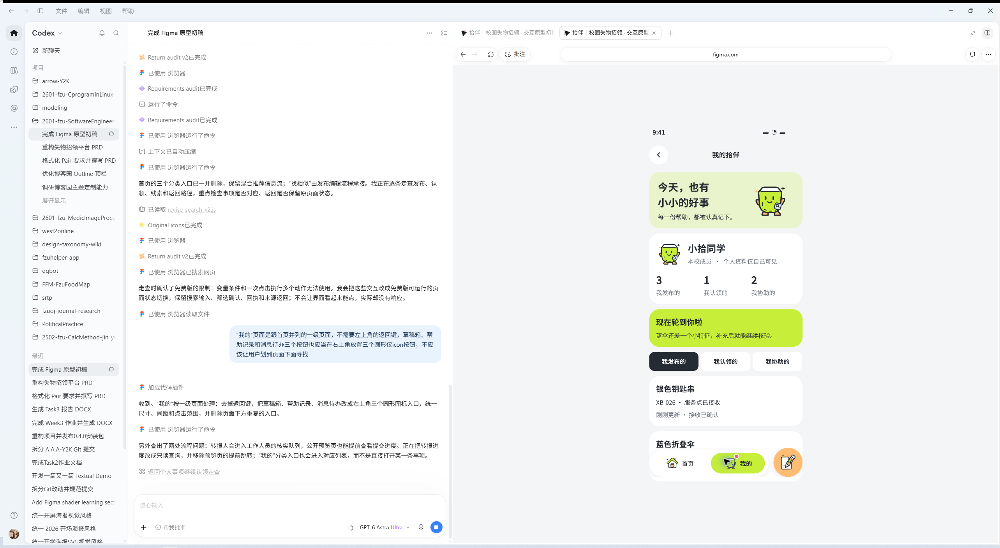

最后得到了现在的效果。其实有很多东西值得微调，但由于本次作业时间仅留了四天（且有三天都是假期），实在是没有过多的时间进行调整，仅做了最基本的流程，对产品主形象、产品定位、真实部署等至关重要的东西都没有做到很完善的思考

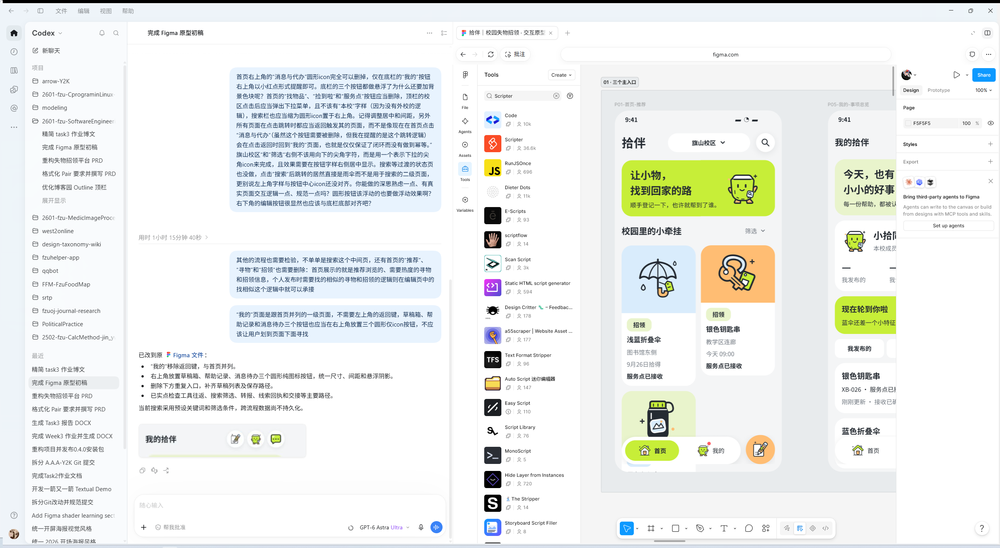

## 0x04 PSP表格

| PSP 阶段 | 预估时间/min | 实际时间/min |
| -------- | ----------- | ------------------ |
| PRD | 30 | 60 |
| 功能与页面规划 | 20 | 40 |
| 整理用户流程 | 10 | 15 |
| Figma 原型制作 | 360 | 300 |
| 博客撰写 | 60 | 30 |
| 合计 | 480 | 445 |

低估了对需求和流程的拆解复杂度，原本以为很简单的问题与流程没想到能拆出这么多边界

另外，figma其实对零基础的同学来说上手需要学的还是很多的，这次的时间真的很短，希望老师明白这点

## 0x05 个人总结

不要低估看起来简单的东西，哪怕是你已经学习或浸淫很久的东西也一样

正如乔布斯对斯坦福的同学们的毕业寄语：

> stay hungry, stay foolish
