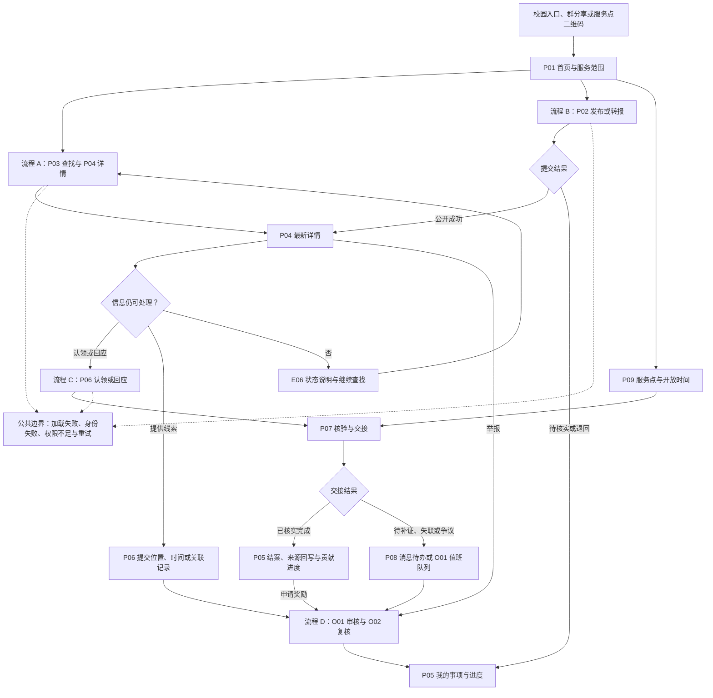
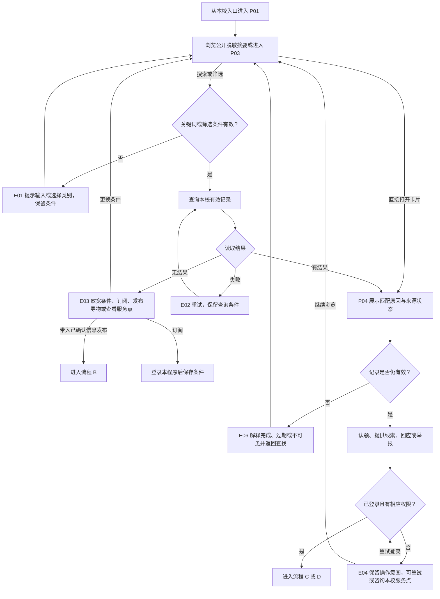
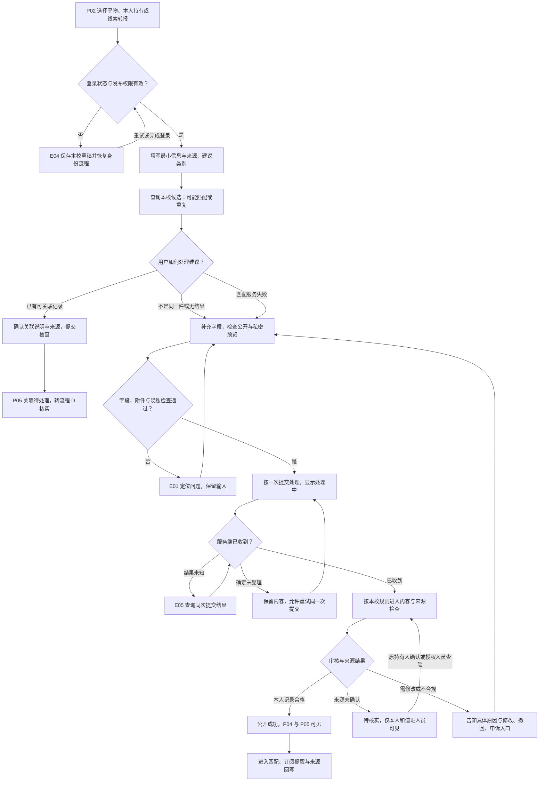
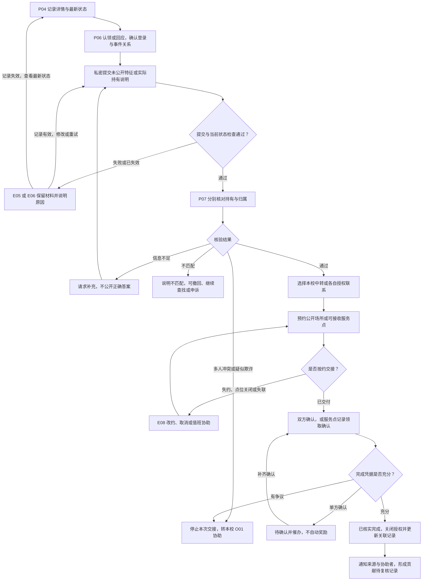
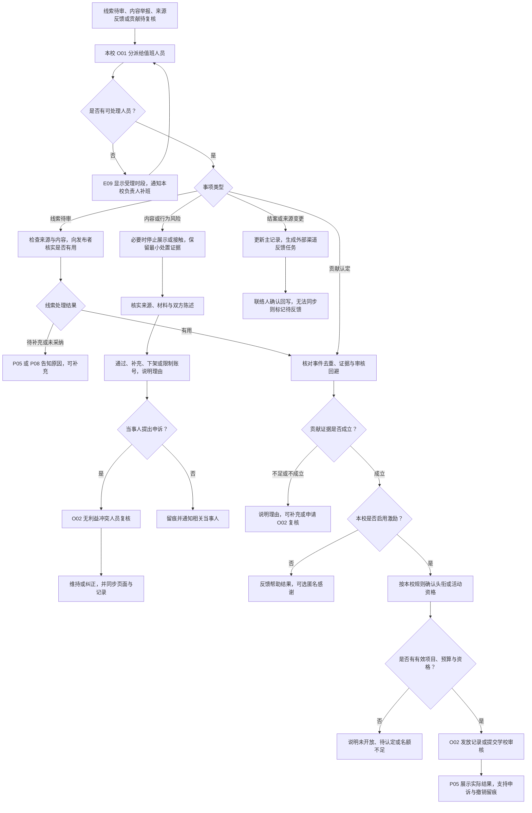

# 校园失物招领小程序产品需求文档（PRD）

## 1. 产品定位、问题与目标

### 1.1 我们要解决的不是单纯的“缺一个发布页面”

客户描述表明，寻物、招领消息散落在班级群、宿舍群和朋友圈，容易被覆盖，双方未必能看到彼此的信息。由此还会产生一串后续问题：转发者未必持有物品；同一物品被重复发布后状态不一致；失主不知道该去哪个服务点；拾物者担心反复解释和长时间保管；陌生人可以照抄公开描述冒领，或者假称捡到物品索要费用。

产品的核心工作应当是：**让可信的信息进入同一份可检索记录，让愿意帮忙的人以较低成本贡献线索，让物品通过可核验的流程回到失主手里。** 发布、搜索和详情页服务于这个结果。

本产品供学校及其指定组织独立运营和监管。每所学校使用独立的程序实例和服务器，软件提供方提供可复用的产品能力，不集中收集各校学生信息。本文只描述一套程序内部的用户、记录、权限与业务流程。

**在当前程序中，没有当前学校官方身份（老师、学生等）的人就是访客**，不按其来自哪所学校另设身份。平台只识别当前程序中的账号与权限。与校方对接身份系统、服务器部署及运维的细则留待后续确定，不纳入当前页面和演示流程。

现有校内服务是否可复用需要逐校确认。福大学工网站列有失物招领入口，可作为“先检查既有入口”的调研样例；这不代表已确认其办理能力，也不是本产品指定的运营依托。[样例来源：福大学工一站式服务](https://stuic.fzu.edu.cn/yzsfw/1.htm)

### 1.2 事实、推断与待验证假设

| 类型 | 当前依据或判断 | 对设计的影响 / 验证方式 |
| --- | --- | --- |
| 已知需求 | 客户明确提出发布寻物、发布招领、浏览与按名称搜索 | 保留四类必备页面和三条基本演示流程 |
| 已确认的产品定位 | 各学校的程序与服务器独立，由学校自行运营监管 | 按单校程序设计访客、用户与运营者；保留可替换的激励规则 |
| 学校样例资料 | 已查阅的福大页面包含服务入口和某学院激励规则 | 说明兼容现有服务、不同奖励口径的必要性；不推广为其他学校的事实 |
| 产品推断 | 遗失是低频事件，用户有需要才回来；拾物者的首要阻力可能是麻烦和保管责任 | 使用群消息、场所二维码和服务点入口触达；提供短表单、代办与移交记录 |
| 待验证假设 H01 | 场所工作人员、宿管和学生组织掌握的信息，比随机路过的浏览者更稳定 | 访谈并观察服务点的现有登记、保管和交班流程 |
| 待验证假设 H02 | 浏览者更愿意做“顺手提交线索”，而不是持续刷信息找物品 | 用任务走查验证关联两条信息、提交位置线索的成本与意愿 |
| 待验证假设 H03 | 有限的校内荣誉和实际奖励可增加有效帮助，但也会诱发重复发布、刷分 | 小范围试行，比较有效线索、重复率、人工复核成本与奖励成本 |
| 待验证假设 H04 | 类别、时间与地点的组合能降低检索成本 | 用包含同款物品、模糊时间地点的案例验证，不能以示意匹配分证明准确率 |

以下场景、阈值、排班和奖励规则均是设计提案；验证方法见第 7 节。

### 1.3 成功是什么，边界在哪里

用户结果分三层记录：发现候选信息、建立有效核验、确认归还。查看详情、展开联系方式、发出申请、对方回复都不能直接计作“找回成功”。

- **失主**：少重复描述，能知道最新进展、物品保管位置和下一步；暂时没有结果时仍有订阅、补充线索或服务点咨询的去向。
- **拾物者**：能迅速登记或移交，减少无效询问；完成交接后停止被打扰，贡献得到确认。
- **协助者**：清楚可以帮什么、提交后是否有用、为何被采纳或未被采纳。
- **运营者**：能区分持有人、转报人和认领人，处理违规、争议、过期记录与交班，而不是私下维护一张无法追溯的表。

本产品处理校园普通遗失物品。疑似被盗、危险物品、强行索款或人身威胁等情况应引导至校内保卫等正式渠道，并提供平台举报。学生志愿者不进行执法式调查，平台也不以算法或头衔裁定所有权。贵重物品、证件和存在争议的认领优先进入经确认可接收的校内服务点核验。

### 1.4 规模效应与取舍

失物招领存在**同一校区、相近时间和地点内的信息密度效应**：更多服务点和知情者提供有效记录，失主更可能查到对应物品；更多真实需求，也能让拾物信息更快得到核对。单纯增加注册人数与浏览量，不等于获得更多有效线索。大量重复、过期和虚假信息反而会降低效率。

因此，首要投入是单个校区的信息覆盖、统一编号、及时核验和线下交接能力。产品不依赖用户逐人拉新，也不以每日打开次数或发帖量为主要成功指标。普通学生通过原有群和校园入口按需使用，志愿者按班次处理，双方都不必长期刷新首页。

| 选择 | 原因与代价 |
| --- | --- |
| 先做一个校区、少量服务点 | 先验证信息能够持续进入且有人处理；代价是初期覆盖有限，首页必须如实展示服务范围 |
| 用现有群、校园墙和场所作为入口 | 降低安装、记忆和迁移成本；代价是部分外部副本不能自动更新，需要反馈责任人 |
| 公开信息少一些，核验信息分开收集 | 降低冒领与隐私风险；代价是认领多一步，需用清楚的进度与服务点代办补偿 |
| 规则推荐先行，保留人工搜索 | 可解释、便于纠错；代价是不能覆盖所有别称与模糊描述，需要持续整理分类词表 |
| 校方自行落实公共服务资源 | 默认不向失主收取查询、认领或“加速审核”费用；学校落实组织、人力与预算，软件方不代替学校经营寻物服务 |

软件可以向不同学校复用分类、权限和流程能力；找回效率来自每所学校自己的信息覆盖与运营。

## 2. 用户、参与动机与真实场景

### 2.1 角色不是固定身份

同一个人今天是失主，明天可能是拾物者或协助者。权限应由其在某一事件中的关系决定，不按永久“失主账号”“拾物者账号”分割。

| 角色 | 为什么会参与 | 阻力与顾虑 | 产品回应 |
| --- | --- | --- | --- |
| 失主 | 找回物品、减少补办与时间成本 | 焦虑、记不清细节、不愿公开号码；怕骗子先收费 | 模糊时间地点可填写；自动检索候选；私密核验；展示责任人、进度和举报入口 |
| 拾物者 / 当前保管人 | 善意、校园互助规范；希望尽快妥善处理物品 | 拍照填表麻烦、反复被问、不会鉴别失主、不方便保管 | 最小表单、线下服务点移交、非公开特征核对、预约交接和完成反馈 |
| 普通浏览者 / 协助者 | 帮熟人、恰好见过物品、顺手解决身边问题，或认同互助行为 | 与自己无关，不愿承担责任；不知道线索有没有用 | “我见过”“关联这条招领”“提醒原发布人”三种轻量操作；不要求持有物品；反馈线索用途 |
| 渠道联络人 | 班委、宿舍联络人、校园墙运营者减少反复转发和答复 | 多渠道重复劳动、原帖难追溯、无权代表他人公开信息 | 统一编号、授权转报入口、待核实区、可更新的分享链接与结案回执 |
| 值班志愿者 / 学生组织 | 服务同学、履行服务岗位，获得经核实的实践记录 | 值班负担、隐私责任、争议压力、人员换届 | 按队列分工、权限到期回收、升级处理、可交班的记录和可审核贡献 |
| 校内服务点工作人员 | 保管和归还物品，减少线下翻找与多头登记 | 储物空间、人手、营业时间、账物不一致 | 接收确认、保管编号、交接登记、开放时间；可不接收并推荐其他已确认服务点 |
| 校方合作负责人 | 提升校园服务质量、监督学生组织与活动 | 成本、责任和激励认定依据不清 | 试点协议、可审计台账、必要数据的汇总与导出、投诉与退出机制 |

平台不会假设所有浏览者都热心。先把偶发的“知道一点情况”变成容易提交的帮助，再用结果反馈和合适的激励维持参与；没有线索的用户无需被推送与自己无关的任务。

### 2.2 端到端场景及设计响应

| 编号 | 触发与现实限制 | 应有的体验与结果 | 对应流程 |
| --- | --- | --- | --- |
| S01 | 失主在图书馆丢伞，记得大致时段，但不记得在哪层 | 搜索雨伞并保留不确定范围；区分多把同款伞；用未公开特征核验；没有结果可订阅后续匹配 | A、C |
| S02 | 拾物者赶去上课，只能暂存钥匙 | 快速登记或直接交服务点；确认接收后更换保管人，后续询问由接收方处理 | B、C |
| S03 | 浏览者在宿舍群见到招领，物品不在自己手里 | 将其作为来源线索，邀请原持有人确认；不能以“我捡到了”创建可直接交接的记录 | B、D |
| S04 | 用户搜索“保温杯”，原记录名称为“黑色水杯” | 类别和同义词帮助找回候选；展示匹配原因，可手动改类或放宽范围；不能自动判定归属 | A、B |
| S05 | 多人认领同款耳机；另有人假称持有并索要邮费 | 不泄露正确核验答案；保留多份独立申请；必要时服务点查验持有与归属证据；举报后停止新的接触 | C、D |
| S06 | 校园墙、班级群和服务点同时登记了同一物品 | 保留多个来源、归并为同一事件；有疑义先关联；完成后更新主记录并提醒各来源结案 | B、D |
| S07 | 失主通过线下渠道找回，平台双方没有完成操作 | 可报告线下找回，记录为自报结案；从公开列表退出，但不自动给任何人发奖励 | C、D |
| S08 | 联系人不回应、志愿者下班，或者记录已经过期 | 显示最后核验时间、预计处理时段；保留待办和订阅；转服务点或撤回，不假装仍有人实时响应 | A、C、D |

## 3. 运营、激励与组织协作

### 3.1 谁来维持服务

每所学校自行指定监管负责人，并可授权有意愿的学生会、青年志愿者组织或学生社区服务组织承担日常运营。软件提供可分配的岗位与权限模板，不替各校预先任命运营组织。组织名称、服务点与合作关系均须由本校确认，不能预置成“官方合作”。

| 责任主体 | 负责事项 | 权限与交接边界 |
| --- | --- | --- |
| 校方合作负责人 | 确认项目范围、接收点、隐私责任、申诉升级和学校激励认定办法 | 对制度和重大争议负责；学校认定结果由其指定渠道返回 |
| 学生组织运营负责人 | 排班、培训、渠道合作、质检、奖励预算与周报 | 配置值班权限；换届移交账号、未结案件、台账和库存，不共享个人密码 |
| 当班志愿者 | 审核队列、来源确认、线索整理、催办和状态回写 | 只读分派案件所需信息；不得审批自己的贡献和申诉；不能随意导出联系方式 |
| 服务点保管人 | 实物接收、存放、核验、交付、库存核对 | 扫码确认接收才发生保管责任转移；承接人和开放时间对申请人可见 |
| 平台管理人员 | 账号权限、数据更正与删除申请、问题转交 | 由本校指定，管理权限不等于任意查看认领证据；必要操作记录原因 |

软件提供方不属于校内业务角色，不代替学校审核、联系学生或维护学生信息库；具体交付和技术维护安排在后续对接中确定。

独立部署前，应与校方和有意愿的学生组织核对既有失物登记、保管及学生服务方式，确认主管部门、可承接的工作和争议升级路径。值班人手、假期安排、换届交接以及故障响应负责人均须落实；程序能够部署，并不代表学校已经具备接手运营的条件。

**可配置的排班样例**：某校在落实人手后，可设置每日 08:00—22:00 的受理时段、当班主责与替补，以及受理时段内 4 小时首次响应的目标。疑似泄露、冒领和索款优先分派；非值班时显示下次处理时间与该校正式求助渠道。时间、工作日和响应目标由学校配置，这些数值不是所有学校必须采用的制度或现有服务承诺。

队列无人承接或连续超出处理能力时，应暂停扩散和需人工审核的新发布，保留草稿、已有记录查询与已确认服务点信息，并通知运营负责人补班。不能用“后续再补后台”作为公开运行期间无人处理举报的理由。

### 3.2 从校园现有渠道获得覆盖

每校冷启动不以空列表等待自然增长：可先由本校运营者选一个校区、2—3 个候选服务点和一个学生组织验证协作，核对仍未结案的记录和实际库存；只导入有授权、有来源、仍有效的信息。尚未接入的区域标为“暂未覆盖”，不以虚构记录填充。软件提供方不替学校批量采集群消息或建立全国失物信息库。

| 入口 | 信息进入方式 | 持续运营办法 |
| --- | --- | --- |
| 班级群、宿舍群 | 原发布者点击统一链接登记；他人可提交待核实线索 | 经群管理者同意设置联络人或固定入口；只投递相关区域摘要，避免重复刷群 |
| 朋友圈、校园墙 | 用户自愿转报公开摘要，或邀请原发布者确认 | 与有意愿的校园墙运营者约定反馈人；记录外部来源与回写状态 |
| 图书馆、食堂、宿舍等场所 | 工作人员 / 志愿者登记，接收实物后生成保管编号 | 现场二维码、服务时间、交班清单，减少“捡到但没空发”的流失 |
| 已有校内服务入口 | 经协商共用跳转入口或导入授权记录 | 先确认既有系统能力；没有接口时由授权人员人工登记，不假设可以调用校内数据 |
| 已发布记录的分享 | 生成脱敏摘要与主记录链接 | 打开链接读取当前状态；静态截图注明信息时间并提醒回到链接核验 |

这是“渠道带来信息、服务点保证接收、统一记录回传进展”的覆盖机制。每个合作渠道指定一个回写责任人；平台结案后形成待反馈任务，责任人确认已通知原渠道。无平台接口的群聊、朋友圈不能声称已自动同步或自动撤回截图。

### 3.3 善意、声誉与现实奖励如何形成闭环

减少操作与保管负担是第一层激励；第二层是及时告知“你的线索帮助了哪一步”；第三层才是经核实的贡献记录、头衔和有限现实奖励。点赞、浏览、转发次数和发帖量不算有效贡献。

平台保留贡献事件、认定证据、审核、撤销与导出的通用流程。学校可关闭积分、仅展示感谢，或自行启用头衔、实物奖励和校内认定；没有激励项目也应能完整寻物。下列数值与头衔只是一套可替换的配置样例，不是统一学校积分办法。贡献围绕本校去重后的“事件”计数，同一人同一事件按最高档计一次，不能靠拆分帖子或更换角色重复领分。

| 贡献 | 认定依据 | 平台贡献值提案 | 反馈与头衔提案 |
| --- | --- | --- | --- |
| 归还物品 | 双方确认交接，或服务点有接收、交付与领取确认记录 | 5 | 展示“已核实归还”；累计 3 起不同事件可获“暖心归还者” |
| 提供关键线索 | 线索说明了可核对的地点、持有人或关联记录；发布者反馈有用，并经值班人员复核 | 3 | 告知采纳理由；累计 5 起不同事件可获“寻物助力者” |
| 授权转报 / 登记 | 原来源已确认、补齐可检索信息且不是重复事件；经值班人员核实 | 2 | 告知信息已纳入；作为服务贡献留痕，不以数量直接评校级荣誉 |
| 值班与服务点协助 | 排班、实际服务记录和负责人签认 | 不按帖数折算 | 可生成实践记录；能否认定志愿时长由合作活动规则决定 |

“关键线索”可以在尚未找回时被认定，例如确认物品已经移交某服务点；不能要求所有善意帮助都等到最终归还才有反馈。没有被采纳、记错地点或匹配失败不等同于恶意，不扣分羞辱用户。

贡献值是不可转让的服务记录，不具有支付功能。公开资料仅在本人选择展示时显示头衔、已核实贡献数量及规则版本；头衔不代表身份真实性，更不能绕过认领核验。建议按学期复核头衔；恶意行为成立后按申诉结果撤销相关记录，单个举报不直接公开定性。

现实奖励采用学校自行启用的活动制：由本校组织确认经费或赞助后，公开总名额、单人上限、实物 / 文具 / 打印券等具体奖品和领取期限。奖励在贡献复核完成、经过学校配置的异议期（样例为 7 天）且没有未决争议后发放；实名凭证只向实际审核或发放方按必要范围提供。预算或库存不足应明确“本期无可领取奖励”，不先承诺后补预算，也不把失主支付感谢费设为归还条件。赞助方不能因此获得学生联系名单。

学校激励走可选流程：项目获本校认可 → 用户自愿申请 → 负责人核对服务记录 → 学校指定部门审核 → 返回通过或不通过及理由。界面分别显示“平台贡献已确认”和“学校认定待审核”，不得直接显示“已加德育分”。需配置适用学校 / 学院 / 年级、项目编号、规则版本、生效期、所需材料和认定回执；可对接德育、劳育、志愿时长或其他该校认可的口径，不能默认一条贡献等于多少学校分值。

启用前还应核算学校新增的证据收集、贡献核实、重复申报检查、统计上报和申诉处理工作，确认是否与已有志愿服务记录重复。学生组织确认线索有效，不代表它有权认定德育加分；适用行为、凭据和复核权限须由获授权的校方人员确认。实物奖励同样需要经费、名额分配和领取核销安排。

例如，福大经管学院 2026-09-10 发布的细则将志愿服务纳入劳育相关评价，并对学生组织内部评选荣誉另有限制。这仅说明产品需要兼容不同认定口径，不构成本平台、该校其他学院或其他学校可加分的依据。[制度样例：经管学院综合素质评价参考细则](https://jgxy.fzu.edu.cn/info/1219/25137.htm)

### 3.4 防止激励把服务带偏

奖励审核需排除本人给自己发帖认领、同一物品反复开单、同一群体相互确认、重复转报以及审核人审批本人贡献。重复配对、短时大量结案等异常只进入人工复核，不自动判作弊；有申诉入口和独立复核人。

奖励台账记录事件编号、贡献类别、证据摘要、审核人与发放批次；公开页面不展示失主姓名、联系方式和私密证据。志愿者绩效同时看有效帮助与处理质量，不能因追求结案数量而关闭未完成事件。一个事件关闭后又重开，原奖励暂停后续发放，已发奖励按复核结果处理并说明原因。

运营成本至少包含排班工时、培训交班、储物空间、技术维护、投诉复核和奖励预算。每周统计“每起核实归还需要的人工分钟”和“每条有效线索的奖励成本”。若覆盖增加主要带来垃圾信息和审核积压，就先改进来源质量，不能只以用户数增长证明运营成功。

## 4. 页面、流程、异常边界与原型设计

这张图是阅读顺序。A 负责发现，B 负责形成可追溯记录，C 负责核验与交接，D 负责线索处理、内容、争议和激励的善后；以下每张分图都对应这里的一个流程。P 表示学生端页面，O 表示值班工作台，E 表示异常状态。本人线下找回可在 P05 自报结案，与图中的“已核实完成”分开记录，具体状态见第 5 节。

### 4.1 导航与画面组织

一级导航为“首页 / 发布 / 我的”；消息待办 P08 从首页提醒和“我的”进入。P05 从“我的发布”扩展为“我的事项”，用发布、认领、协助三个分组承载不同关系，并提供贡献、隐私设置入口。搜索和详情返回时保留关键词、筛选项及滚动位置；从分享链接进入时提供返回首页入口。

| 页面 | 主要任务及关键内容 | 原型必须表达的状态 |
| --- | --- | --- |
| P01 首页 | 选择校区；浏览寻物 / 招领；搜索、发布、服务点入口；显示覆盖范围 | 列表、暂无信息、当前区域未覆盖、读取失败 |
| P02 发布 / 转报 | 选择本人寻物、本人持有、线索转报；分类建议、候选匹配、公开与私密字段预览 | 草稿、匹配建议、重复提示、字段错误、提交中、待审核、退回、公开成功 |
| P03 搜索 | 名称 / 同义词检索；类别、区域、时间范围筛选；订阅条件 | 初始、加载、结果、无结果、失败；清除筛选与保留条件 |
| P04 详情 | 物品摘要、来源身份、当前保管状态、最近确认时间、角色对应动作 | 有效、本人管理、仅线索待核实、核验中、完成、过期、下架或不可见 |
| P05 我的事项 | 跟踪发布、申请、协助和贡献；修改、撤回、结案、申诉 | 空记录、待处理、待审核、已完成、待确认、贡献待复核 |
| P06 认领 / 回应 / 线索表单 | 说明自己与物品的关系，提交未公开特征或来源 | 待身份校验、证据预览、提交失败、重复申请、待补证、撤回 |
| P07 核验与交接 | 查看必要材料、补充核对、双方联系授权、预约服务点与确认交付 | 不一致、待回复、待授权、核验通过、预约冲突、待确认、争议 |
| P08 消息与待办 | 匹配、审核、核验、交接和贡献的进度消息；打开时回到事项最新状态 | 未读、已读未处理、已处理、推送未授权或失败、关联记录已失效；已读不等于已处理 |
| P09 服务点 | 已确认的接收范围、位置、开放时段、联系方式与临时停用状态 | 开放、关闭、满容量、暂不接收该类物品、尚无可用服务点 |
| O01 值班队列 | 待确认来源、内容审核、举报、认领协助、超时与贡献复核 | 已分派、待补充、积压、无人值班、处理结果 |
| O02 复核与活动台账 | 申诉复核、奖励名额与发放、经同意的学校认定材料 | 回避本人案件、通过 / 不通过、预算不足、学校待认定、撤销与留痕 |

这些是任务视图，不要求每个状态都新建一张主页面。P06、P07 可作为详情内的子页面，O01、O02 在课程原型中用少量任务卡演示处理前后；不要求本次开发完整运营系统。所有真实上线的入口仍须有实际责任人和处理能力。

### 4.2 流程 A：浏览、搜索与发现候选

**失主的阅读路径**：先判断是不是自己的物品，再看是否还在处理、谁实际保管、更新时间和可以采取的动作。P04 的主按钮随记录类型显示“申请认领”“我可能捡到”“提供线索”；“转报待核实”只能补线索或邀请来源确认，不能进入已持有物品的直接交接流程。

本人查看自己的发布时，主操作为修改、撤回或结案，不出现向自己认领的动作；只知道位置或关联消息的浏览者进入线索表单，无需承担保管与交接责任。

P01 展示当前程序内可处理的信息，按发布时间排列，可切换寻物 / 招领；核验中的物品显示提示，仍允许他人提交独立材料，不能通过“先点认领”抢占所有权。首页显示本校服务名称与校区，校区用于定位物品所在区域。访客可浏览公开脱敏摘要；选择发布、订阅、认领或提交线索时进入本程序的登录流程，登录后回到原来的操作。

P03 支持名称、已确认的同义词与类别检索，附区域和时间范围筛选。空白关键词且没有筛选条件时提示输入；只选类别时可直接查找。未知时间、未知地点的记录不能简单当作“不匹配”排除，应另组显示“信息不完整，仍可核对”。精确排序规则见 5.3。

**无结果不是死路**。E03 保留关键词，提供放宽时间 / 区域、查看服务点、订阅后续信息和发布寻物。转发布时只带入用户已经确认的物品名、类别等条件，标明可修改，不把搜索猜测悄悄写成确定事实。订阅仅保存在本校实例，允许到期、暂停和删除，不默认发送全校消息。

**浏览者的帮助入口**：可以关联两条已有记录、说明自己见到物品的地点与时间，或者提供经允许的来源。界面应显示“你只是提供线索，无需保证物品归属”；最终核验由当事人与本校服务点完成。只有选择提交时才要求登录，不为一次普通浏览收集手机号。

**原型演示重点**：同义词得到候选、多把同款物品、无结果后的下一步、搜索返回保持现场，以及打开旧链接时读取到最新状态。身份失败展示 E04，不能用固定用户演示推导出真实身份校验已经实现。

### 4.3 流程 B：直接发布、跨渠道转报与入库

先区分信息关系，再填写内容。“我捡到了并保管着”“已交给服务点”“我只看到消息”不能混为一类。后两者分别要求接收确认或来源核实，不允许转报人填写一个未经授权的他人联系方式就变成可认领招领帖。

**拾物者减负**：首屏只问物品类别 / 名称、大致时间、区域和当前保管方式；图片可选。进一步信息按类别展开，支持暂存草稿。赶时间者可以查看 P09 并将物品移交服务点，由工作人员协助登记。地图、精确定位、长描述和手机号都不作为统一必填项。

**来源处理**：班级群、宿舍群、朋友圈或校园墙的转报由用户主动提交，不读取聊天记录。可以粘贴必要摘要或选择已有记录；截图需裁剪掉无关消息、头像与联系方式，经确认再上传。未经原发布者确认的内容先进入私有待核实队列；邀请对方进入本校实例确认其关系和授权，或由获授权的服务点核对实物。原来源不愿公开或无法确认时，不扩散原消息。

**自动匹配在提交前出现**：名称、类别、时间和区域已具备基本信息时显示候选卡片，并说明“类别相同、时间接近”等原因。候选可以打开查看而不丢失草稿；用户仍可选择“不是同一件，继续发布”。匹配服务失败时保留人工搜索和发布，不因推荐故障阻塞登记。系统不得仅凭相似度自动合并物品、认领或关闭帖子。

**重复记录处理**：同一持有人可确认合并自己的重复记录；不同发布者的疑似重复先关联，再由有权限的本校人员确认。合并保留来源、贡献和变更历史；旧链接转到主记录。误合并可拆分恢复关系，不能直接删掉另一个人的证据。寻物帖与招领帖相似时是“可能匹配”，不是必须合并的重复帖。

**提交与公开分开反馈**：通过表单校验只代表可以提交。“已提交，等待审核”与“已公开”使用不同页面状态；只有审核通过的版本进入首页、搜索和匹配。若提交超时，不立即生成新记录，应先查询同次提交是否已受理，避免弱网重复发布。用户修改已发布的物品特征、来源、图片或保管方式时，新版本重新检查；一般修改期间旧合格版本继续展示，涉及隐私泄露或虚假持有则立即停止相关展示。

**原型演示重点**：本人发布成功、转报待核实、系统建议后人工改类、发现重复、无图发布、照片含个人信息、退回修改、保存草稿和提交结果未知。发布类型改变时，保留通用内容，但清除不适用的保管声明与核验字段并让用户确认。

### 4.4 流程 C：双方核验、隐私联系与交接结案

**防冒领需要双向核验**。申请人要说明能证明归属的非公开细节；声称持有物品的人也要说明实际保管位置、近期持有情况或服务点接收记录。对持有存疑时，优先由服务点查验实物，或按本次核验要求补充不含个人信息的当下照片；网上找来的同款图片不算充分证明。平台账号、好评和头衔只能辅助追责，不能证明这个物品属于谁，也不能证明对方确实持有它。

P06 不把核验答案做成公开选择题。招领帖只描述足以搜索的外观，把内侧标记、具体挂件组合等部分特征留在私密区；申请人独立填写自己的证据。失主可提供历史照片、购买记录的必要部分，或到场展示设备解锁能力；不得要求交出密码、验证码、完整证件照。没有购买记录的人仍可请求服务点协助，不能因此被系统直接认定为冒领。

私密材料也不能无条件向“交易双方”互相开放。持有人预留的核验答案仅本人和获授权的核验人员可见；申请人材料仅本人、已核实关系的相应核验者和获授权人员可见。声称捡到物品但尚未证明持有的人，不能读取失主的完整私密特征再照抄冒充；材料不足时由服务点协助，或仅交换完成当前核对所需的最小信息。

“我可能捡到”是对寻物帖的回应：对方需要进入流程 B 建立或关联自己的持有记录，再与寻物事件关联，不能只发一句“在我这里”就获取失主联系方式。线索贡献者通常不需要看到双方的核验材料与联系方式，其帮助结果通过 P05 / P08 反馈。

普通物品可由当事人核对后交接；贵重物品、证件、多方冲突或可疑持有由本校指定服务点协助。多人申请彼此不可见私密证据；预约前只确定一个待交付对象，其余申请显示“正在核验”，不自动判定其他申请人造假。出现相互冲突的新证据时暂停交付，交由指定负责人处理。

**联系是有边界的授权动作**。默认在 P07 使用围绕事件的补充材料、回复和预约表单，可由校内服务点中转；不要求搭建完整即时聊天。核验通过后，双方各自选择是否向本次核验的对方提供一种联系方式，并分别确认接收者、用途和期限。一方授权不等于另一方授权；拒绝提供私人联系方式时仍可选择服务点交接。未通过本次核验、已封禁、事件下架或无关系的用户不能读取联系方式。

取消申请、撤回授权、事件完成 / 下架或授权到期后，系统阻止后续读取，并使已打开页面重新校验权限。页面提示对方可能已经记下信息，平台无法收回用户此前合法查看后形成的副本；不能把隐藏按钮当作数据已被撤回的保证。

**实物交接与帖子状态不同**。P09 只显示本校确认可接收的服务点；未被服务点确认接收前，物品仍由原持有人保管。改约、容量满或临时停用时给出可用时段、其他接收点和取消选项，不能凭一次线上预约就变更保管人。

交付后双方确认，或服务点登记交付并取得领取确认，才计“已核实归还”。只有一方点完成时显示“待确认”；超过学校设定的处理期转值班人员，不自动变成成功。发布者报告通过其他渠道找回时允许关闭自己的帖，标签为“自报找回，未由平台核实”，不替另一条关联招领帖结案，不自动计奖励。

**原型演示重点**：未知特征核验、不匹配不泄露答案、假持有人索款举报、双方不同意公开联系方式仍可交接、多人争议、服务点接收确认、单方完成待确认与自报结案。

### 4.5 流程 D：内容监管、来源回写、贡献与申诉

任何可自编辑文本、图片、转报摘要、补充证据、联系方式交换与举报材料都有相应治理入口。P04、P06、P07 可就当前事件举报，P05 可查看处理状态和申诉；不存在“只有公开帖子需要管、私下索款与骚扰不属于产品”的断点。

O01 按本校规则对内容和来源分层处理。普通记录经基础检查可发布；证件隐私、可疑索款、来源不明、频繁重复或历史违规记录进入人工审核。没有可靠识别能力的试点阶段，可以由本校选择先审后发。规则误报应可修改和申诉，不能只显示“发布失败”。首次上线至少要有真实可处理的审核和举报渠道，算法完善是后续优化。

监管同时保护被举报者。普通争议先收集必要材料；疑似严重泄露或欺诈可先停止相关展示与新授权，界面仅显示“暂不可见，正在核实”，不公开指控对方。处罚告知规则、范围、期限与申诉入口，申诉由非原处理人且无利益冲突者复核；恢复时同步解除错误限制、修正贡献记录。

结案后的来源回写和贡献审核在此处理。关闭激励只隐藏活动申请入口，不关闭线索采纳和结果反馈。开启激励时展示本校当前有效规则；规则调整保留版本和适用日期，已获得的记录不会因一次配置修改被悄悄改写。学校认定不通过也不抹去原本真实有效的帮助。

**原型演示重点**：举报受理、退回理由、下架后旧链接失效、申诉恢复、无人值班反馈、外部回写待确认，以及“仅感谢 / 平台头衔 / 现实奖励 / 学校认定”可配置的不同结局。

### 4.6 公共异常边界与恢复动作

下表补齐各图的边界，属于同一交互设计，不另列一套脱离流程的异常页面。

| 编号 / 所在流程 | 触发情况 | 用户看到什么 | 下一步与必须保持的内容 |
| --- | --- | --- | --- |
| E01 / A、B、C | 空条件、缺字段、日期冲突、格式超限 | 就近说明具体问题，定位首个错误 | 保留其他输入；日期不确定可改为范围或未知，不强迫编造日期 |
| E02 / A | 列表、详情或候选读取失败 | “暂时无法读取”，与无结果区分 | 重试、返回；保留条件和草稿；候选失败不阻断手动发布 |
| E03 / A | 无匹配或校区未覆盖 | 如实说明无结果 / 未覆盖 | 放宽范围、订阅、预填寻物或本校服务点咨询 |
| E04 / A、B、C | 访客发起需登录的操作、登录过期、验证失败或无权限 | 提示登录或说明权限不足，提供帮助入口 | 保留操作意图；登录成功后返回原流程，失败可继续浏览公开信息 |
| E05 / B、C | 提交失败、超时、重复点击 | 区分未提交、结果确认中、已收到 | 先查询本次结果再重试；不产生重复帖、重复认领或重复奖励 |
| E06 / A、C | 已完成、过期、撤回、下架、版本变化 | 展示有权获知的最新状态，不回显已隐藏的敏感内容 | 更新动作权限；保留本人的待办；可以继续查找、申请续期或申诉 |
| E07 / B | 图片不合规、含隐私或上传失败 | 显示是哪张图存在何种问题；提供公开预览 | 替换、裁剪遮挡或无图发布；失败附件不被当作上传成功 |
| E08 / C | 无人回复、多人争议、预约失效、接收点关闭 | 说明停在哪一步、谁负责、何时可处理 | 补证、改约、取消、服务点协助；超时不自动结案 |
| E09 / D | 审核退回、处理积压或无人值班 | 具体理由、受理时间和升级入口 | 修改、撤回、申诉或等待；运营者暂停超出能力的新开放范围 |
| E10 / C | 联系授权撤回或对方被限制 | 联系入口收起，说明授权已失效 | 校内中转、换点或举报；服务端阻止新读取，不能只隐藏按钮 |
| E11 / A、D | 消息推送未授权、失败或外部来源无法回写 | P08 保留待办；显示通知 / 回写未完成 | 用户可主动查看；联络人补回写；不以已发送代替已处理 |
| E12 / D | 奖励未开放、额度不足、重复申请、复核不通过 | 显示规则、原因和申诉方式 | 保留真实贡献；不生成虚假的领取成功或学校加分结果 |

已有输入时返回 P02，提供“保存本校草稿”“继续填写”“放弃本次修改”。草稿不进入搜索，不作为线索对外展示；共享设备退出时提示清理本地副本。退出账号后不允许下一账号读取前一人的草稿或核验材料。

手机竖屏以 390 × 844 为主要原型尺寸，正文建议不小于 14 px，主要点击区域建议不小于 44 × 44 px；这些是本稿设计目标。类型、来源可信状态、处理进度与错误必须有文字说明，不只靠颜色。长名称、多图、键盘弹出和较大字体下，主动作与错误说明应可达。

### 4.7 可点击原型的组装与走查

在专用原型工具中按“公共组件 → A 查找 → B 入库 → C 核验交接 → D 治理与激励”组织画面；用 P 编号加状态后缀命名，例如 `P02-pending-review`、`P07-awaiting-confirmation`，相同的返回、错误和进度组件共用。至少制作以下虚构案例，不使用真实学生姓名、联系方式、证件或群聊截图。

P02 按“关系与基础表单 → 分类建议与候选比较 → 来源与公开预览 → 提交与审核反馈”拆成同页步骤或状态。P07 单独制作联系授权组件，说明对象、用途、期限与撤回入口；O01、O02 可用低保真任务卡呈现，但处理结果须连回 P05 / P08。复用信息卡片、状态标签、表单项、底部操作区和确认弹窗，具体字段与异常沿用 5.2 和 4.6，不另设冲突规则。

| 数据 / 走查 | 起点与条件 | 要连通的画面与结果 |
| --- | --- | --- |
| D01 / 失主找伞 | 本校图书馆，蓝色雨伞；存在两条相似记录 | P01 → P03 → P04 → P06 → P07；先补非公开特征，正确候选核验成功 |
| D02 / 拾物者赶课 | 钥匙，无照片，拟移交服务点 | P02 → 发布成功 → P09 → 接收确认 → P04 更新保管人；接收前不能显示已移交 |
| D03 / 群消息转报 | 转报人没有实物，原来源尚未授权 | P02 → 待核实 → O01 → 原持有人确认 → 公开；未经确认不能直接认领 |
| D04 / 智能分类与匹配 | 输入“黑色保温杯”，建议水杯类，含重复及不同物品 | P02 修改建议 → 查看候选 → 返回草稿 → 关联或继续发布；模拟推荐失败可继续 |
| D05 / 冒领或假持有 | 耳机，多人申请，其中一人要求先付费 | P06 → P07 → 举报 → O01；暂停可疑接触，隐去他人私密答案，可申诉 |
| D06 / 结案与激励 | 同一事件先只有单方确认，再补齐交接证据 | P07 待确认 → 已核实完成 → P05 贡献待复核 → O02 → 本校奖励结果 |
| D07 / 可选激励 | 本程序关闭积分与学校加分，保留线索反馈 | 仍可完成 A—D 的寻物流程；完成后显示感谢，不出现不可用的领奖按钮 |
| D08 / 访客与旧链接 | 未登录访客打开详情，再尝试认领；另一条帖子已经完成 | 公开摘要可读；认领时提示登录；完成帖旧链接显示最新状态，不出现可认领按钮 |
| D09 / 自报与异常 | 线下自行找回、提交超时、点位关闭、推送失败 | 分别进入自报结案、结果查询、改约和站内待办；都不能伪装成核实成功 |

D01—D04 覆盖课程要求的浏览、发布和搜索，并呈现产品最重要的改进；D05—D09 用少量分支画面说明真实服务不能缺失的边界。激励复杂配置和完整管理台账可先以低保真交互演示，不以主页面数量限制产品思考。

原型中预置的搜索结果、自动分类、身份、审核和奖励均标注“交互模拟”。可点击演示只能证明流程可以被理解和走通，不能证明后端已保存、身份可信、信息隔离有效或算法准确；这些属于后续实现验收。

## 5. 支撑流程的业务规则

### 5.1 当前程序内的身份与权限

所有操作均在当前这套独立程序内完成。访客可以阅读公开信息；需提交、订阅、认领或管理记录时，先登录本程序。账号来源和登录方式在后续对接时确定，本次原型用明确标注的模拟登录状态表达流程。登录成功不等于已证明物品归属。

| 身份或事件关系 | 可以做什么 | 权限边界 |
| --- | --- | --- |
| 访客 | 浏览、搜索公开脱敏信息，查看服务点 | 提交操作前登录；不能读取联系方式和核验材料 |
| 已登录用户 | 发布、订阅、认领、回应、提供线索、举报 | 只能管理自己的事项；登录不授予他人记录管理权 |
| 发布者 / 实际保管人 | 管理自己的信息、核对申请、确认自己的交付行为 | 转报者不能代替实际保管人确认；不能读取无关申请的私密材料 |
| 认领申请人 | 提交自己的证据、补充、撤回、预约和确认领取 | 看不到其他申请人的材料或正确核验答案 |
| 服务点人员 | 按授权确认接收、保管与交付，协助核验 | 尚未接收时不能声明接管；只访问办理事项所需信息 |
| 运营与复核人员 | 按分派审核内容、处理举报、复核贡献与申诉 | 按案件最小授权；回避自己的申请，重要处理留痕 |

激励保留可替换的规则：可关闭积分、选择头衔、设置活动名额与预算、选择学校认定项目。界面展示当前有效规则与结果；关闭激励不得破坏寻物主流程。分类、区域和服务点信息也应可由运营者维护。这里定义产品行为，配置页面、校方接入协议与部署细则留待后续展开。

### 5.2 信息来源、字段与公开层级

信息处理链条为：**本人或授权来源提交 → 结构化与脱敏 → 候选匹配 / 去重 → 来源与内容检查 → 可见版本发布 → 核验交接 → 主记录更新与渠道回写 → 按期归档清理**。对应流程 B、C、D；每步保留负责者和结果，不能把收到了消息等同于消息真实有效。

| 来源类型 | 进入本校实例的条件 | 入库后如何处理 |
| --- | --- | --- |
| 本人寻物 | 已登录，说明物品与自身关系，必要信息有效 | 生成寻物记录；私密归属特征另存，公开部分经过审核 |
| 本人拾得 / 保管 | 声明实际持有或已移交；能补充相应依据 | 生成招领记录；声明未核实、接收已确认等状态分别展示 |
| 服务点接收 | 有权限的接收人确认实物和保管编号 | 接收记录关联原拾物者，保管人改为服务点；后续仍需认领核验 |
| 群聊、朋友圈、校园墙转报 | 转报人主动提交最小摘要，说明来源和是否已取得许可 | 未确认则仅进入待核实区；来源确认后发布，转报人不因此获得持有权限 |
| 学校既有记录导入 | 本校授权导入、记录仍有效，能够说明来源与当前责任人 | 先去重和核对库存；导入不自动视为原作者同意公开额外个人信息 |

首版不读取学生聊天记录，不常驻监听私人群，不爬取朋友圈，也不因校园墙内容公开就复制其中的个人资料。后续渠道接口仅由学校在获得授权、明确字段与撤回机制后接入。

| 字段 | 要求与含义 | 可见范围 / 交互规则 |
| --- | --- | --- |
| 校区 | 多校区学校需选择，单校区可默认 | 用于描述物品位置，不是切换学校或账户的入口 |
| 信息关系 | 本人寻物、本人持有、已交服务点、转报线索 | 决定后续字段和动作，不允许默认替他人声明持有 |
| 物品名称 | 必填，1—30 个字符 | 公开；建议具体名称，避免仅填“急寻”“有偿求助” |
| 物品类别 | 用户确认的主类，允许“不确定”；多件成套物品可附标签 | 公开；系统建议可改，不因判断不出细分类而不能发布 |
| 事件时间 | 明确时间、时间范围或“不确定”三选一；已知时间不晚于当前时间，区间起点不晚于终点 | 公开到用户确认的精度；分别解释遗失范围、拾取时间与发布时间 |
| 地点 | 校区 + 区域，可选具体地点；允许区域不确定 | 公开粗粒度区域；不强制定位权限，不公开宿舍房号和个人轨迹 |
| 公开特征 | 0—300 个字符，可填颜色、品牌、常见外观等 | 公开；提示至少保留一个可用于核验的非公开差异 |
| 公开图片 | 可选，0—3 张 JPG / PNG，单张不超过 5 MB | 必须预览公开效果；遮挡姓名、证件号、人脸、地址等无关内容；无图也可发布 |
| 私密核验信息 | 条件必填：线上认领时提交足以开始核对的特征或材料；可选到服务点补证 | 按 4.4 的双向核验规则分别授权，预留答案不向申请人披露；不进入搜索、分享图或匹配索引 |
| 保管方式 | 招领条件必填：本人保管 / 等待移交 / 服务点已接收 | 服务点确认前不得显示“已接收”；公开服务点与开放时间，不公开私人存放地址 |
| 来源类别与确认状态 | 转报条件必填；记录原消息时间、来源摘要、确认方式与责任人 | 公开只显示必要来源类型与确认状态；群名、原链接、授权依据按需私有保存 |
| 联系偏好 | 默认事件内表单或服务点中转；本人可额外登记一种联系方式 | 私密；公开展示前必须完成事件内授权；不是发布统一必填项 |
| 线索内容 | 1—300 个字符或关联的本校记录编号，附时间地点及确定程度 | 审核前仅接收者和有权限人员可见；采纳后公开摘要须另外确认 |
| 贡献与学校认定申请 | 仅启用相关项目且用户自愿申请时收集必要材料 | 单独展示目的、接收部门和保存范围，不预先采集所有人的学号或奖品邮寄地址 |

系统自动记录本校唯一记录号、事件关联号、发布者 / 当前保管者关系、发布时间、最后核验时间、版本、审核结果和状态变更。**事件号用于同一物品的关联、去重和奖励核对，帖子号用于保留每一条来源；两者不能混用。** 误合并拆分时重新检查关联申请和贡献计数。

### 5.3 智能分类与自动匹配

“智能”首先体现为减少输入和不必要的判断，不以必须引入图像模型作为前提。

1. **先描述再建议**：用户输入“蓝牙耳机”“饭卡”“保温杯”等名称后，根据学校启用的词表建议“电子设备 / 耳机”“证件卡片 / 校园卡”“生活用品 / 水杯”。用户可接受、修改或选择不确定。
2. **按类渐进补充**：钥匙提示数量与挂件；电子设备提示型号和外壳；书籍提示书名与版本；证件卡片优先提示遮挡与交服务点。用于防冒领的细节在私密区填写，不能因为表单追求完整而全部公开。
3. **保留模糊性**：多人使用同款物品；同义词、复合物品和时间地点不确定都属正常情况。“其他”提供文本补充，由本校运营者整理常见新类别，不强迫用户在错误分类中选择。
4. **透明且可纠错**：标注“建议类别”，自动填入的内容需要用户确认；用户改类后以其确认为准，不再次覆盖。图片识别、OCR 只能在后续作为辅助，不能自动发布或决定归属。

首版匹配采用本校可维护的规则：

| 步骤 | 规则 | 不应发生的行为 |
| --- | --- | --- |
| 候选召回 | 仅检索已通过审核、仍可处理的公开记录；相反类型用于寻找可能对应物品，同类型用于提示重复 | 未审核内容或私密材料进入候选 |
| 文本归一 | 去首尾空白，英文不区分大小写；通过已确认词表归一别称，匹配名称、公开描述和标签 | 模型猜测被当成用户提供的确定事实 |
| 排序 | 优先同细类，再看时间范围重叠、区域接近、名称与公开特征相符；条件相同按最近核验时间排列 | 把收藏量、奖励头衔或付费行为作为认领优先权 |
| 不确定项 | 未知类别、时间或地点单列为信息不足候选；保留全量检索与放宽条件入口 | 把“不知道地点”直接等同于“地点不同”而彻底过滤 |
| 展示 | 发布表单默认展示前 3 条并提供更多；写出可读原因，如“同为耳机、同一教学区、日期接近” | 显示“90% 就是你的物品”等未经校准的概率承诺 |
| 用户判断 | 可标记不是同一物品、提交关联建议、修改条件或继续发布 | 自动认领、自动移交、自动合并不同人的记录 |

寻物和拾取时间的语义不同：物品可能在失主察觉遗失前已经被捡到。失主填写的是可能遗失的范围；两条信息日期不同不直接排除，明显矛盾提示人工检查。地域仅使用学校配置的区域关系，不要求采集实时轨迹。

匹配触发于表单基本信息确认后、记录公开后，以及用户修改相关字段并通过审核后。已经结案、撤回、下架和过期的记录及时退出候选；订阅按本校规则合并通知、限制频率，用户可设置关注区域 / 类别、静默时段与有效期。关闭推送后仍可在 P08 查看更新。

首轮验证至少覆盖：同义词、相同外观的不同物品、晚发现遗失、未知地点、同名但不同物品、重复转报、过期记录及敏感字段。记录候选是否包含正确对象、误推荐和用户修正情况；结果未达到基线时继续提供规则和手动搜索，不以“AI”文案掩盖不可靠性。

### 5.4 状态模型与业务不变量

不能用单个“已完成”字段同时代表审核、实物保管、认领和奖励。界面显示一个主状态和必要的次状态，后台分别记录以下维度：

| 维度 | 主要状态 | 转换条件 |
| --- | --- | --- |
| 内容审核 | 草稿、待核实 / 待审核、已发布、退回修改、下架 | 公开必须通过相应检查；申诉恢复须保留处理记录 |
| 寻物进度 | 寻找中、核验中、已找回、已撤回、已过期 | 找回区分已核实与本人自报；逾期只停止公开查找，不等于已找回 |
| 招领进度 | 待认领、核验中、待交接、待确认、已归还、已撤回、已过期 | 已归还须有交付确认；仅发布者声明时进入待确认或自报撤回，不伪装为核实归还 |
| 实物保管 | 本人保管、移交待确认、服务点已接收、已交付 | 接收人确认后才转移；线上过期不改变线下保管责任 |
| 单份申请 | 待核验、待补证、不匹配、已撤回、核验通过、待交接、待确认、完成、争议中 | 同一物品可有多份独立申请；争议暂停相关交接，不清除其他申请人的材料 |
| 联系授权 | 未授权、有效、已撤回、已到期 | 限定事件、接收对象和期限；事件受限时中止新的读取 |
| 贡献与奖励 | 待复核、已确认、未通过、异议中、待发放 / 待学校认定、已完成、已撤销 | 贡献、实物发放、学校认定分别记录，不互相冒充完成 |

以下约束优先于页面按钮是否显示：

- 只有发布者或获本校授权的处理人员能修改记录；普通浏览者、转报者和未接收物品的服务点不能替实际保管人确认交付。
- 只有已发布且仍可处理的记录进入公开列表和匹配；审核下架即停止新认领与新联系授权，相关当事人仍可访问必要的案件状态和申诉入口。
- 同一物品只允许一个当前有效的交付预约；预约过期须核对实际交付情况再释放，不能在已经交付但未确认时重复交给第二人。
- 确认操作读取最新状态和版本；状态已变化时提示刷新，不以过期页面覆盖新结果。提交、确认和奖励发放均防止重复执行。
- 关联寻物与招领在核实确为同一事件、完成交付后同步结案；单方自报找回只关闭自己的寻物需求，并让对方确认实际保管状态。
- 学校可以配置有效期（例如 30 天）；到期前提醒确认，过期后不再推荐，可补充最新情况申请续期。长期未认领物品的实物处置服从本校制度，不因帖子到期自动丢弃或转让。
- 撤回后隐藏公开信息，已发生的认领、投诉和必要处置记录按本校规则留存；有未决争议时不能通过删除帖子抹去全部证据。
- 错误结案可申请重开：核对当前物品状态，重新检查公开内容，通知相关人，并复核可能受影响的奖励；不通过重开重复发奖。

### 5.5 隐私、内容治理与风险处置

产品按目的明确、最小必要、透明告知和限期保存原则设计公开与私密数据。实际处理主体、告知文本、保存期限和外部服务由各校确定并落实，软件提供配置与执行能力；一段提示文案不能替代实际控制。[设计依据：《个人信息保护法》第六、十七、十九条等](https://www.cac.gov.cn/2021-08/20/c_1631050028355286.htm)

| 风险 | 预防与限制 | 发生后的处理 |
| --- | --- | --- |
| 假扮失主 | 账号与事件关系、非公开特征、独立材料；失败后不暴露正确答案；限制批量试探 | 暂停可疑申请，人工复核；普通认错可解释与撤回，不能自动定为欺诈 |
| 假扮拾物者 | 检查实际持有 / 接收依据；转报与持有明确分开；核验前不披露失主联系方式 | 索要预付款、验证码或可疑链接时可就事件举报；中止新的接触并由本校处理 |
| 自编辑内容夹带广告、辱骂、引流或个人信息 | 公开字段和附件检查；高风险内容先审；修改重新检查；分享预览脱敏 | 停止展示相关版本、给出修改理由；反复违规按本校规则限制并允许申诉 |
| 骚扰与批量采集 | 身份与关系校验、访问频率限制、联系方式授权审计；无关人员不能下载证据 | 撤回授权、限制接触、举报；运营者按权限核查必要记录 |
| 志愿者滥用权限 | 按任务最小授权、限时分派、离岗回收、导出审批、审核回避 | 留痕、冻结相关权限、由本校独立负责人复核；软件方不代行裁决 |
| 信息泄露与错误通知 | 分享只含脱敏摘要；推送只提示有进展；日志避免正文、联系方式和完整证据 | 撤销相关访问、停止扩散、学校通知与处置；静态外部副本无法自动收回，应如实说明 |

公开审核不是只禁几个关键词。需覆盖描述、标题、图片、转报摘要、补充文字和链接；私密材料也需防范索款、骚扰与违规内容，但普通运营人员不能因此获得任意浏览全部私信或证据的权限。举报材料仅由分派人员读取，敏感内容不进入公共分析日志。

学校上线前应对每类数据配置保存目的、最短必要期限、责任人和删除任务：公开帖子在结案后退出推荐；联系方式授权在不再需要时关闭；私密核验材料在事件和争议处理所需期限结束后删除或去标识化；奖励、学校认定材料按获准项目的必要范围保存。未决争议可对相关最小材料设置保留，记录理由和复查日期，不能无限期冻结整名学生的全部记录。

用户可在本校“我的”申请查询、更正、撤回授权与删除。本校管理员处理并返回结果；备份到期清理、搜索索引和缓存移除也应纳入执行，不能只删前端卡片。使用第三方识别、消息或存储服务必须由学校另行确认；默认分类规则和业务数据在本校实例处理，不把学生图片或正文传给软件方的共享模型服务。

## 6. 交付范围与演进顺序

### 6.1 本次课程原型与真实运行的区别

课程要求明确本次不必实现复杂后台、实名认证、即时聊天和地图功能。可以用固定身份、预置候选和人工处理结果制作可点击原型；这不意味着真实产品可以永久排除身份、监管和交接责任。文档保留完整产品方向，开发按阶段取舍。

| 阶段 | 交付范围 | 验收出口与限制 |
| --- | --- | --- |
| R0：本次需求与原型 | P01—P05 基础流程；规则匹配 / 分类建议；P06—P09 的核心子流程；O01 / O02 的少量处理状态；访客、可选激励与异常分支 | D01—D09 能走查；明确模拟能力；没有真实身份、存储和审核时仅用虚构数据演示 |
| R1：单校主流程实现 | 本程序登录与事件权限；结构化发布、搜索、规则候选；来源确认；基本认领 / 联系授权；服务点交接；人工审核举报；关闭激励也可完整使用 | 验证完整业务与异常；实际校方对接和运行准备另行确定，不能把代码跑通等同于可对真实学生开放 |
| R2：减轻本校运营负担 | 更完善的词表和筛选、经授权的批量导入、线索关联、渠道回写提醒、审核质检、可选头衔与活动台账 | 试点证明瓶颈确实存在；审核量与错误率可承受；奖励项目有预算、规则和复核人 |
| R3：按校选配 | 经授权的渠道接口、可选图片辅助分类 / 遮挡、本校学校认定接口、更细的服务分析 | 对每项能力独立验证效果、权限、成本和退出路径；不得演变为软件方集中收集学生数据 |

R1 的人工处理可以通过简洁任务队列完成，不必一次建设复杂后台；但缺少核验、权限、举报处理人和隐私保护时不能称为可公开运营的首版。地图、自由即时聊天、复杂信用模型、平台现金悬赏与全渠道自动爬取不进入当前计划。

### 6.2 后续优化由什么问题触发

| 观察到的问题 | 优化方向 | 前置条件与成功判断 |
| --- | --- | --- |
| 用户写出联系方式后仍担心被骚扰 | 更细的联系授权、授权到期提醒、本校中转与异常访问检测 | 基础权限先实现；无私号交接路径可用；降低骚扰和无效联系，不承诺能阻止对方记下号码 |
| 群、校园墙消息仍大量遗漏或重复 | 学校授权的来源表单、联络人工作台、批量去重与结案回执；可选渠道接口 | 明确来源许可与反馈责任人；看有效信息覆盖和回写完成率，不抓取私人聊天记录 |
| 用户常选错类别、同义词搜不到 | 本校词表维护、按类补充字段、可纠错的图片识别 | 比较原始手动搜索与建议流程；误分类可恢复；私密图不进入共享训练集 |
| 候选过多或有效物品找不到 | 调整时间地点解释、特征匹配及订阅规则 | 用去标识化的本校授权样本或合成用例评测；观察候选覆盖与误推荐，不以演示数据宣称算法效果 |
| 志愿者处理不过来 | 分派、批处理、风险分层与岗位交班 | 先测队列和人力，再优化工具；审核质量恶化时缩小范围 |
| 有帮助但缺少持续参与 | 启用本校头衔、小额实物活动或学校认定适配 | 学校自定规则与预算；同时看有效贡献、刷分风险和人工成本；没有奖励也保留感谢与结果反馈 |
| 学校采用不同的奖励与管理制度 | 保留可替换的贡献规则、审核角色和结果回执 | 先确定业务扩展点；具体学校对接和配置工具后续设计 |

## 7. 验收、验证与效果指标

### 7.1 需求验收矩阵

下表是后续原型 / 实现的验收用例，当前均**待验证**。本文档的语法检查、流程图渲染检查不等于这些产品用例已通过。

| 编号 | 场景与操作 | 预期结果 | 验证层次 |
| --- | --- | --- | --- |
| T01 | 首页浏览、切换类型、进详情再返回 | 对应内容正确；条件和滚动位置保留；学校与校区明确 | 原型 + 实现 |
| T02 | 无图发布寻物与招领 | 校验通过后区分已提交与已公开，寻物 / 拾取文案和保管字段正确 | 原型 + 实现 |
| T03 | 字段超限、未来时间、未知时间或非法图片 | 错误就近说明；未知可填写；图片可删除后继续；其他输入保留 | 原型 + 实现 |
| T04 | 搜索别称、类别、无结果和读取失败 | 各状态区分；可放宽、订阅、预填发布；返回保留条件 | 原型 + 实现 |
| T05 | 自动分类错误、多个同款候选、匹配超时 | 用户可改类、拒绝推荐、继续手动发布；不自动合并或认领 | 原型 + 实现 |
| T06 | 未确认群消息转报后邀请原持有人确认 | 确认前只在待核实区；确认和审核后才公开；来源和持有人关系准确 | 原型 + 实现 |
| T07 | 合并重复来源后结案，再处理误合并 | 主记录保留来源；旧链接与反馈任务正确；拆分后重查申请和贡献 | 实现 |
| T08 | 他人、过期身份或无关系账号尝试管理 / 读私密信息 | 服务端拒绝；不能靠隐藏按钮通过；本人的合法事项仍可查看 | 实现 |
| T09 | 冒领、假持有、多份申请与不匹配 | 双向补证；不泄露正确答案；冲突转本校协助，不能抢先获得物品 | 原型 + 实现 |
| T10 | 拒绝提供私人联系方式、授权后撤回 | 可以本校中转交接；撤回后禁止新读取，旧页面更新提示 | 原型 + 实现 |
| T11 | 服务点未接收、已接收、关门或预约冲突 | 保管责任只有确认接收才转移；异常可改约；同一物品不重复预约交付 | 原型 + 实现 |
| T12 | 单方完成、双方完成、本人自报找回 | 分别为待确认、已核实完成、自报结案；关联记录和奖励按实际结果处理 | 原型 + 实现 |
| T13 | 重复点击、超时重试、旧页面提交完成 | 查询同次操作结果或提示刷新；不产生重复记录、交付和奖励 | 实现 |
| T14 | 编辑后夹带隐私、举报下架、申诉恢复 | 新版本重新检查；旧链接不泄露受限内容；复核与恢复均留痕 | 原型 + 实现 |
| T15 | 过期、撤回、重开、推送失败和来源回写失败 | 不再推荐失效记录；未决事项有去向；站内待办与待反馈可继续处理 | 原型 + 实现 |
| T16 | 激励关闭、平台头衔启用、学校认定不通过 | 核心流程均可使用；本校规则可替换；不把贡献值冒充学校分数 | 原型 + 实现 |
| T17 | 同一事件重复申奖、审核本人、预算不足 | 按事件去重、审核回避、展示未发放原因；有复核与申诉 | 实现 |
| T18 | 访客浏览后提交认领，登录后继续原操作 | 未登录可看公开摘要；认领时进入登录；完成登录返回当前物品，无权读取他人材料 | 原型 + 实现 |
| T19 | 用户更正信息、撤回授权和申请删除 | 显示处理结果；公开索引与相应访问同步更新；未决争议保留必要材料并说明原因 | 原型 + 实现 |
| T20 | 无值班人员或奖励项目过期 | 开放范围受控；告知时段与帮助入口；过期奖励不继续承诺 | 原型 + 实现 |

### 7.2 先验证哪些产品假设

首先由采用学校组织小范围访谈与任务观察，覆盖失主、拾物者、仅提供线索者、渠道联络人、服务点人员和监管负责人。初轮可每类邀请 2—3 人用于发现流程问题，不据此推断全校比例。

原型走查让参与者自己完成“无图发布并移交”“同款物品认领”“转报未授权消息”“不公开私号交接”“处理已过期信息”等任务，记录是否完成、卡住位置、需要解释的词和误解原因。不要让设计者一路提示后再把结果写成易用性已经验证。

随后进行由本校控制的有限试点。先记录既有渠道的处理方式与人工耗时，再比较新流程；若并行对照不可行，说明活动、考试周和样本量的影响，不宣称因果改善。可用合成案例验证权限、异常和匹配规则，但真实找回效果必须来自真实且经授权记录的结果。

### 7.3 指标口径与责任

效果分析由各校在本校实例内进行，软件提供方不收集学生行为明细。学校如自愿分享产品反馈，只提供经过核查无法识别个人的汇总或脱敏问题，不能以“分析需要”为由回传全文和联系方式。

| 指标 | 定义与排除项 | 用于判断 |
| --- | --- | --- |
| 7 日核实找回率 | 某期新建且已完整观察 7 日的有效寻物事件中，7 日内已核实找回的比例；按事件去重，单方自报另列 | 核心结果；只描述平台已登记需求，不代表校园所有遗失事件 |
| 首次有效帮助时长 | 从有效记录公开到首次经确认有用的线索 / 核验响应；同时报告仍无帮助的事件数量 | 信息覆盖与响应是否改善；不能只统计成功者 |
| 核验与归还耗时 | 分别记录候选出现、核验通过、实物交接三个时点，报告中位数及较慢事件情况 | 问题在匹配、沟通还是线下服务 |
| 线索有效率 | 经复核有实际帮助的去重线索 / 已处理线索；待处理单列 | 帮助入口和激励是否带来有用信息 |
| 来源覆盖与回写率 | 合作渠道实际有效入库量、去重比例；应反馈结案任务中已由责任人确认回写的比例 | 是否减少遗漏、重复与过期转发 |
| 治理质量 | 待审积压、超时比例、有效投诉及误处置申诉情况；严重泄露单独报告 | 运营能否承受扩张，不能用高封禁率证明治理有效 |
| 负担与激励成本 | 每起核实归还的人工分钟、每条有效线索的奖励成本、未决激励争议 | 流程和奖励是否可持续 |
| 用户控制 | 联系授权撤回是否实际生效、无私号路径成功率、删除请求完成情况 | 隐私功能是否真的可用 |

不把点击“联系”、浏览量、帖子数、注册人数或领奖数量当作找回率。找回率目标应在本校建立基线后制定；当前不虚构提升百分比。

## 8. 作业交付对应与待确定事项

### 8.1 与本次作业的对应

| 作业要求 | 本文对应内容 | 后续交付与证据 |
| --- | --- | --- |
| 分析用户需求和现实困扰 | 第 1—3 节的定位、动机、场景、覆盖与运营机制 | 博客提炼核心取舍；真实调研尚未进行时明确说明 |
| 列出主要功能 | 第 4 节页面与流程、第 5 节业务规则、第 6 节阶段范围 | 保留发布、浏览、搜索、详情、修改状态，补齐必要闭环 |
| 首页、发布、搜索、详情 | P01、P02、P03、P04，辅以 P05—P09 | 用专用原型工具连接；允许状态和子页复用 |
| 浏览、发布、搜索三条演示 | 流程 A、B 与 D01—D04 | 原型可点击走通，有成功和失败分支 |
| 流程图 | 第 4 节总览与 A—D Mermaid 图 | 在 PRD 中维护源代码；博客可选择局部导出展示 |
| 简单清楚、便于后续实现 | 第 6 节 R0 / R1 分层，先规则匹配和人工队列 | 不把完整产品规划都变成第二次作业必须实现的功能 |
| 专用原型工具、在线链接、800—1200 字博客 | 本文是完整 PRD，不受博客篇幅替代 | 工具和实际可访问链接在博客填写，不能以本文替代原型 |
| 阅读、PSP、结对记录与个人总结 | 属于两位同学实际学习与协作记录 | 按真实过程完成；未知时间留待补充，不在 PRD 中编造 |

### 8.2 决策状态

已经确定的产品原则：各校独立运行与监管；软件提供方不汇集学生信息；激励可关闭、可按学校替换；公开与私密信息分开；相似度不能决定归属；来源未核实不能冒充持有；成功必须区分核实与自报。

| 待确定项 | 由谁决定 | 决定前如何设计与限制 |
| --- | --- | --- |
| 具体登录方式、服务器部署与校方接入 | 后续由采用学校与软件方对接 | 当前只表达访客、已登录用户与业务权限；用虚构账号完成原型，不扩展部署设计 |
| 运营组织、监管部门、服务时段与接收点 | 采用学校 | 使用岗位与点位模板；未确认不能显示“官方运营”或开放无人承接的发布 |
| 学校分类、地域词表与有效期 | 本校运营负责人 | 提供通用模板，可编辑、可回退；模糊分类仍有正常发布路径 |
| 私密材料保存与删除安排 | 学校指定负责人及技术管理员 | 明确目的、期限和执行责任后才接入真实数据，不默认无限期保留 |
| 荣誉、现实奖励或学校加分 / 时长认定 | 各校获授权部门 | 默认关闭奖励兑现与学校认定；先保留贡献事实、感谢与可审核流程 |
| 外部渠道与识别服务接入 | 学校及相应渠道 / 服务方 | 默认人工授权转报和本校规则匹配；无接口授权不宣称自动采集、回写或识别 |

本文所列学校页面只作为可核查的样例与设计参考，查阅日期为 2026-09-28；不代表学校与项目存在合作，不替代采用学校的实际制度、调研和运行验收。
