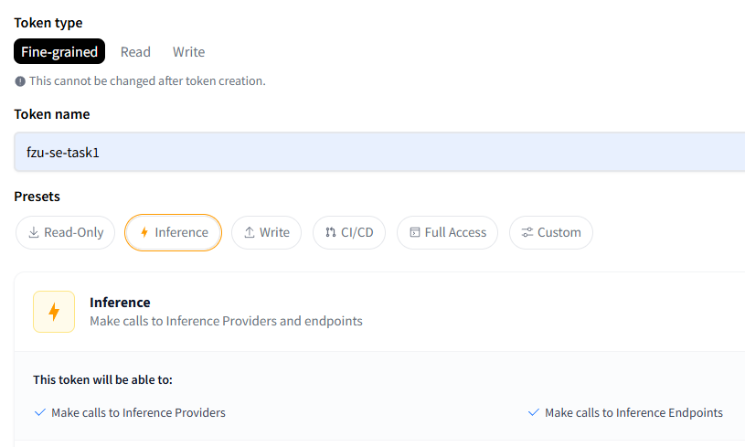
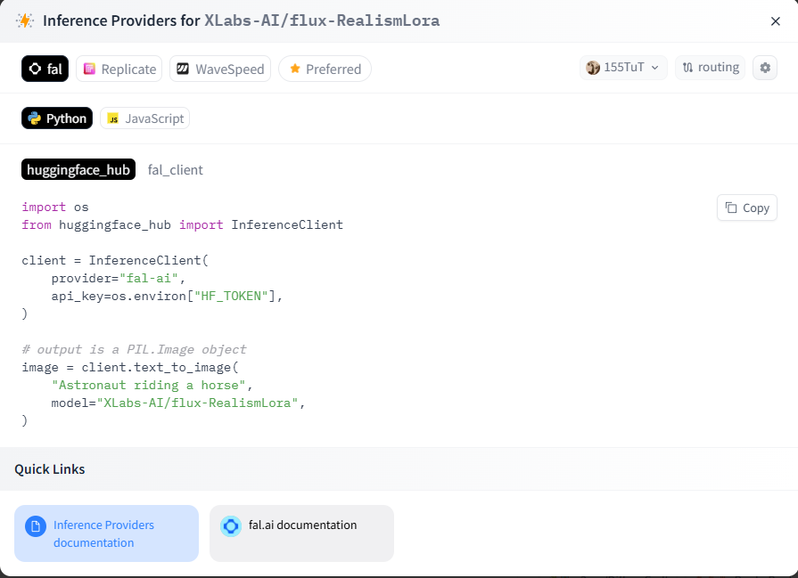
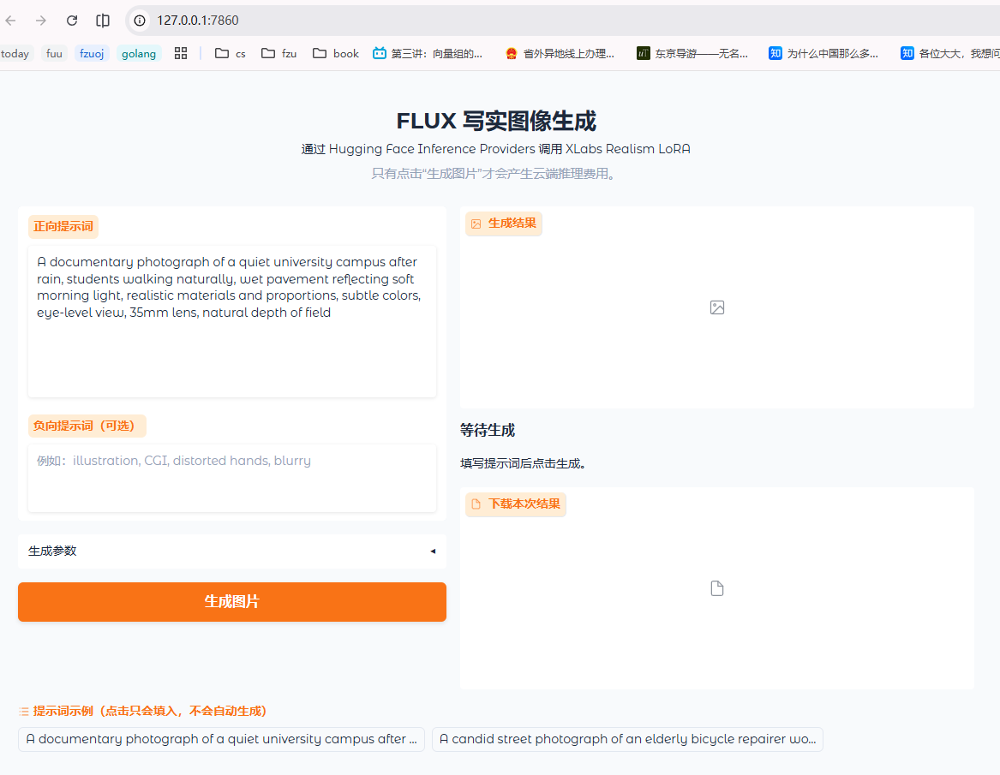
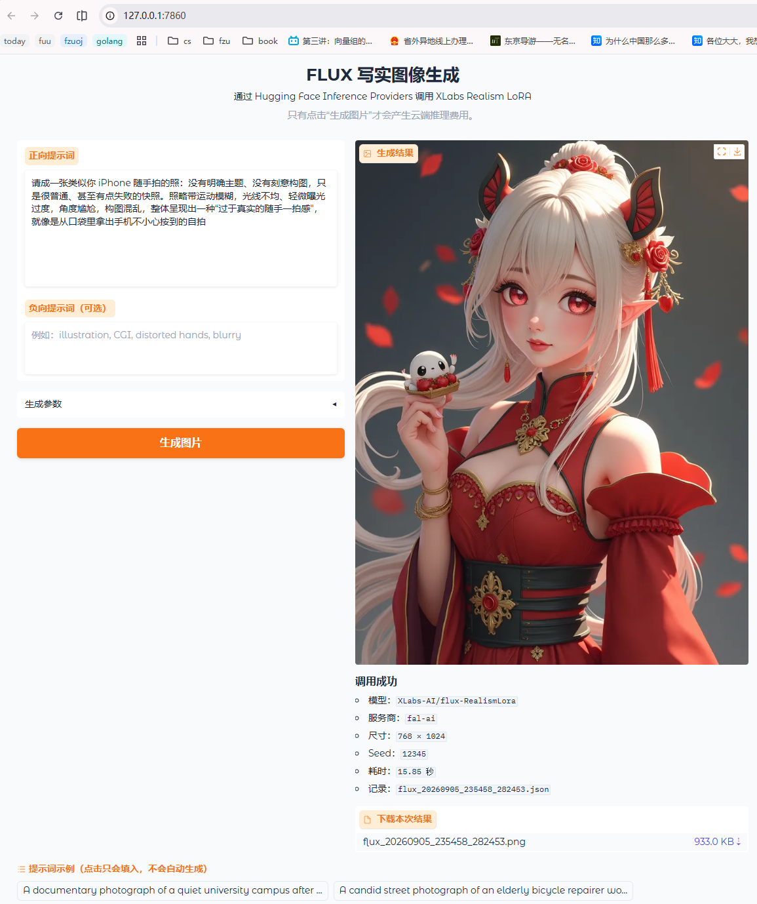
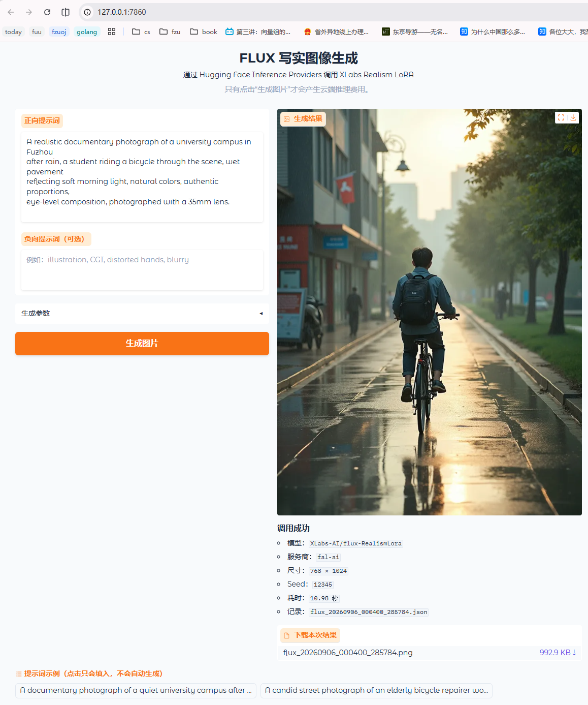
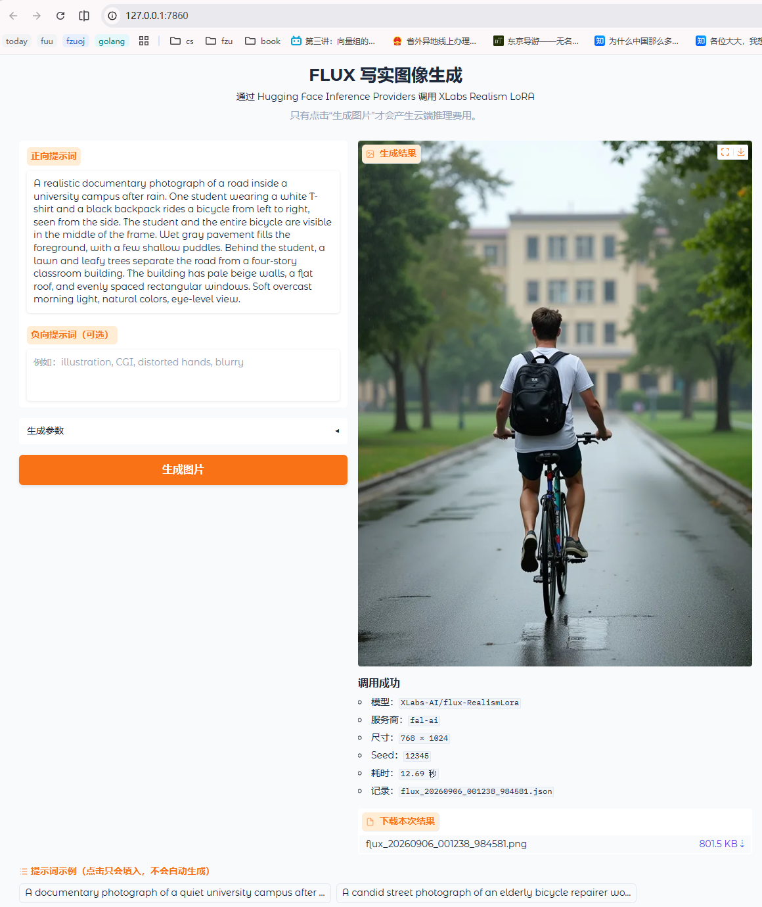

# huggingface-API调用的体验心得

其实之前一次都没有使用过 huggingface，注册也只是因为听说 qwen-3.8-27b 这个稠密开源模型已经可以学习 opus 4.6 的大部分能力而慕名围观，甚至不知道 huggingface 的基础架构也是和 github 一样的 git 仓库，还提供了 spaces 来给大家做开源模型相关的开源工作实现，还能做到免部署、直接在云端运行代码，感觉是更工程向的 colab 一样

## 具体实现

可查看这个小项目的[说明](../huggingfaceapi/README.md)

## 获取api

看起来很简单的一步，其实还是有一些细节的。首先按照老师的要求，要申请的是 huggingface 平台 的 apikey，而不是用于 comfyui workflows 的 comfy cloud api

`要调用这个模型有很多手段，我最开始看到了最低显存要求是12g，想试试能不能本地部署，但是我的配置是 Nvidia RTX 5060 laptop 8g 版，并且在查阅资料后得知使用共享显存也需要量化等手段，且同样可能爆显存，因此就作罢了，后续或许会试试在mac上本地跑，不过这种两年前的旧模型还是算了吧，不如折腾 qwen-3.8-27b 了`



token type选的是大方向：只读/只写/细粒度（可custom），这里由于需要接模型所以选择了 Inference，没有选 Full Access 则是因为安全考虑（泄露api后的危害有限）

## 调用api

在模型页面的 Inference Providers 中，在直接输入 prompt 测试的左下角发现了 View Code Snippets 的选项，打开以后是这样的：



很明显的调用 mvp，显示了需要注意的模型提供商，选用的语言和调用方式。这里我先查阅了基本的价格信息和 huggingface 的定价

- Hugging Face 免费账户每月有 0.1 美元 Inference Providers 额度，且网页模型组件的生成也会消耗同一额度。
- fal 的 FLUX LoRA 当前价格是 $0.035/百万像素，不足一百万像素也按一百万像素计费。
- 因此 $0.10 ÷ $0.035 ≈ 2.86，实际能完整支付约 2 次。

因此差不多设置成 768×1024，每张低于一百万像素但会按一百万像素计费，也就是约 $0.035，这样刚好可以免费生成三张图片

~~不过我直接充了10＄，以防后续还有其他的api调用环节~~

接下来就是本地交互部分：模型返回的图片只会在内存里，仍需要通过文件流导出到文件中；并且由于命令行界面不太便捷，但这只是一个小演示，因此采用 Gradio 把普通 Python 函数快速包装成浏览器页面而无需另外编写 React/Vue 前端或后端接口。而在 [app.py](../huggingfaceapi/app.py) 的流程中， `generate_image()` 负责调用 API，Gradio 自动提供提示词输入框、生成按钮、状态信息、图片预览和文件下载控件，自此在分析完后便配合 agent 完成了这个由 python 编写的本地调用 api 的 mvp。

## 交互生图流程

当前api调用软件的初始前端页面如图：



### 第一轮

我先测试了一个一直想测试的prompt：

```text
请成一张类似你 iPhone 随手拍的照：没有明确主题、没有刻意构图，只是很普通、甚至有点失败的快照。照略带运动模糊，光线不均、轻微曝光过度，角度尴尬，构图混乱，整体呈现出一种“过于真实的随手一拍感"，就像是从口袋里拿出手机不小心按到的自拍
```

效果如图：



毕竟是两年前的模型，我就先开始查询模型相关信息：

> [!TIP]
> 以下是 codex 的查询结果

结论：**接口可以接收中文，但这个模型明显更擅长英文。作业最终生成建议使用英文提示词。**

### 中文输入能力

从程序角度看，`prompt` 是普通 Unicode 字符串，因此中文不会导致 API 报错：

```python
image = client.text_to_image(
    prompt="雨后的大学校园，写实摄影，清晨柔和光线",
    model="XLabs-AI/flux-RealismLora",
)
```

但“能够输入”不等于“中文理解能力与英文相同”：

- `flux-RealismLora` 的模型页面标注语言为 **English**，公开的提示词和训练 caption 示例也都是英文。[Realism LoRA 模型卡](https://huggingface.co/XLabs-AI/flux-RealismLora)
- FLUX 使用两个文本编码器：OpenAI CLIP ViT-L/14 和 Google T5 v1.1 XXL。[Diffusers FLUX 架构说明](https://huggingface.co/docs/diffusers/api/pipelines/flux)
- CLIP 官方明确说明，它没有针对英语以外的语言进行专门训练或评估。[CLIP 模型卡](https://huggingface.co/openai/clip-vit-large-patch14)
- T5 v1.1 XXL 使用以英语为主的 C4 数据训练，模型页面同样标注 English，它不是多语言版 mT5。[T5 v1.1 XXL 模型卡](https://huggingface.co/google/t5-v1_1-xxl)

因此中文提示词可能识别一些常见概念，但复杂构图、人物动作、材质和摄影术语更容易丢失或误解。

最适合作业的流程是：

1. 先用中文写清楚创意。
2. 将其整理成完整英文提示词。
3. 把中文构思和英文最终提示词都写进博客。
4. 可以生成一次中文版本、一次英文版本作为对照，分析语言对结果的影响。

例如：

```text
中文构思：
雨后的福州大学校园，一名学生骑自行车经过，清晨柔和光线，真实摄影。

实际提交给模型：
A realistic documentary photograph of a university campus in Fuzhou
after rain, a student riding a bicycle through the scene, wet pavement
reflecting soft morning light, natural colors, authentic proportions,
eye-level composition, photographed with a 35mm lens.
```

### 它是不是完全自主训练的

不是。`XLabs-AI/flux-RealismLora` **不是从零训练的完整模型**，而是在 `black-forest-labs/FLUX.1-dev` 基础上进行 LoRA 微调得到的写实增强适配器。

大致结构是：

```text
FLUX.1-dev 基础模型
    +
XLabs-AI Realism LoRA
    =
当前 API 生成效果
```

具体来说：

- `FLUX.1-dev` 是 Black Forest Labs 发布的约 120 亿参数 Rectified Flow Transformer，并使用了 guidance distillation。[FLUX.1-dev 模型卡](https://huggingface.co/black-forest-labs/FLUX.1-dev)
- XLabs-AI 使用 LoRA 和 DeepSpeed，在图像与对应 caption 数据上微调，使模型更偏向真实摄影质感；其训练代码说明训练分辨率为 `1024×1024`。[x-flux 训练仓库](https://github.com/XLabs-AI/x-flux)
- LoRA 只训练一组较小的低秩附加参数，不是重新训练整个 120 亿参数模型。
- XLabs-AI 没有在模型卡中完整公开 Realism LoRA 的实际数据来源、数据量和该检查点的全部训练超参数，只公开了数据格式：每张图片对应一个包含英文 `caption` 的 JSON 文件。

所以准确地说：

本项目调用的 `XLabs-AI/flux-RealismLora` 并非完全从零训练的图像生成模型，而是以 Black Forest Labs 的 `FLUX.1-dev` 为基础，通过 LoRA 参数高效微调增强真实摄影风格。推理时由基础模型负责主要图像生成能力，Realism LoRA 对生成风格和细节表现进行调整。这比写成“XLabs 自主训练的 FLUX 模型”更准确。

> 由 gpt5.6 sol max 在 20260904 23:16 回答

### 第二轮

毕竟是两年前的模型，仅基于真实摄影风格做了微调，那我或许应该更多考虑的是摄影相关的提示词，我先用他提示的这个试试吧：

```text
A realistic documentary photograph of a university campus in Fuzhou
after rain, a student riding a bicycle through the scene, wet pavement
reflecting soft morning light, natural colors, authentic proportions,
eye-level composition, photographed with a 35mm lens.
```



看起来不错，比较写实了，但是 `Fuzhou` 很明显没办法泛化，左侧街头的建筑招牌更有点港风，再来一轮试试看吧

### 第三轮

这次先把 `Fuzhou` 换成具体的画面描述。或许可以是大学校园内部的道路：路面宽阔，两侧有草坪和树木，教学楼与道路之间留有距离，建筑是浅色外墙、平屋顶和排列整齐的窗户。这样就把原本希望地名传达的环境，拆成了可以直接画出来的内容。不过这些描述是我这次想测试的场景设定，并不代表对真实建筑的复原。

中文构思：雨后的大学校园，一名背着黑色双肩包、穿白色短袖的学生骑自行车从左向右经过。前景是湿润的灰色路面，中景是学生，背景是草坪、阔叶树和一栋浅米色的四层教学楼。阴天早晨，光线柔和，整体像一张普通的校园纪实照片。

实际提交给模型的提示词：

```text
A realistic documentary photograph of a road inside a university campus after rain. One student wearing a white T-shirt and a black backpack rides a bicycle from left to right, seen from the side. The student and the entire bicycle are visible in the middle of the frame. Wet gray pavement fills the foreground, with a few shallow puddles. Behind the student, a lawn and leafy trees separate the road from a four-story classroom building. The building has pale beige walls, a flat roof, and evenly spaced rectangular windows. Soft overcast morning light, natural colors, eye-level view.
```



在我体感上还不如上一张，肢体动作太诡异了，估计是提示词过多牵扯出的内容漂移...算了就这样吧

## 体验与心得

对这种古早的扩散模型其实我也没抱太大期望，之前确实[阅读过相关论文](https://155tut.github.io/2025/12/04/learn-of-stylessp/)，这下总算体会到了

居然是第二张更好看一点，或许应该尝试配平正向和负向引导词？不过 gpt-image 和 seedance 太好用了，生图的流程也是先翻译和泛化再丢到实际的生图模型中，可以看看我为西二在线纳新海报[生成背景图](https://github.com/155TuT/svg-poster-maker/blob/main/west2online/bg/ai-hero-background-prompt.md)攥写的prompt。这种调优或许工程上有一定意义，但是我个人使用实在不想多费心思了。

另外其实我 AI 生图看了很多了，或许对所谓“AI味”会更敏感和严苛一点，这个应该是个人波动，不纳入流程参考了
