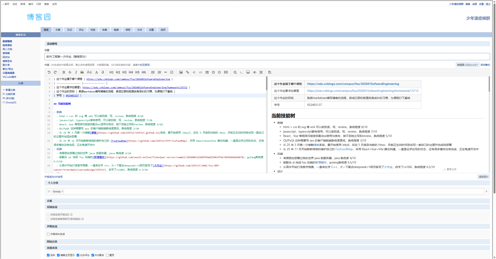

# 随笔

已按要求发表于[博客园](https://www.cnblogs.com/155TuT/p/22857676)

## 当前技能树

- 前端
  - html + css 和 svg 等 xml 可以做到读，写，review，熟练程度 8/10
  - javascript，typescript都有使用，可以做到读，写，review，熟练程度 7/10
  - React，Vue 等框架仅能做到配合ai使用与修改，做不到独立写和review，熟练程度 5/10
  - Qt/PyQt 这种需要写 qss 的客户端前端熟练度更低，熟练程度 3/10
  - 从 25 年 3 月第一次接触[博客](https://github.com/155TuT/155TuT.github.io)系统，最开始使用 Jekyll，后在 5 月换到当前的 Hexo，目前正在找时间尝试写一套自己的主题并完成自部署
  - 从 25 年 11 月开始断断续续的维护自己的 [FzuFoodMap](https://github.com/155TuT/FFM-FzuFoodMap)，采用 React+Vue+Vite 静态构建，一直是边学边写的状态，还有很多模块没有完成，正在龟速开发中
- 后端
  - 有跟朋友部署过我的世界 java 版服务器，java 熟练度 4/10
  - 能配合 ai 完成 fuu 后端的[新增模块](https://github.com/west2-online/fzuhelper-server/commit/265b00311948f99a032981ff4e7483b84dd18678)，golang熟练度 6.5/10
  - 从高中开始打信息学竞赛，一直有在学 C++，大一下配合deepseek-r1网页版写了[大作业](https://github.com/155TuT/2402-fzu-OOP-Lancer/tree/main/coursedesign/155TuT)，自学了cs106l，熟练程度 6.5/10
- 设计
  - 平面设计方面，其实结合前端比较多，或许可以看看我的纯svg画的[西二在线纳新海报](https://github.com/155TuT/svg-poster-maker)，日常figma，penpot，ps等都有使用，~~有很多废稿就不展示了~~
  - 目前担任西二在线设计组组长，正在从头重构设计方向的[考核路线](https://github.com/west2-online/learn-design)，计划在社团纳新开始前完成所有内容。`其实我这里设计的task1跟老师这边差不多，感兴趣的话或许可以看看当前我已设计完的考核路线`

我的技术偏好肯定是开源优先的，然后平时会更倾向于做一些设计相关的工作，但是也必须考虑对接代码等全栈工作

面向ai的态度则已经写在设计组考核方案中了，其实我认为考核的时候不应该禁止ai，而是推动ai的合理使用，虽然这对考核设计者的水平要求很高，但我觉得在这个ai蓬勃发展，gpt-6 astra已经达到agi前夜水平的当下，这些都是我们作为考核者应当克服的困难

## 代码量

其实不知道怎么算代码量，烧的token的话大概80亿gpt，30亿deepseek这样，代码量真的没统计过，而且很多文本工作其实也不计入代码量

## 本课程中最期待学习的知识

我应该是暂时担任本组组长的，尤其设计组的考核路线中有产品经理这个方向，我想我也应当践行一下该如何管理整个项目。一直以来我都不太擅长跟人合作，基本是单打独斗，其实这是不好的，本次软工课程恰好给了我一次实践的机会吧。

## 软件工程课程学习指南

以下内容由 gpt-6 astra 生成

```text
软件工程课程学习指南：从个人开发走向团队交付

一、学习目标与资料选择

本学期建议围绕一个小型团队项目，贯穿需求、设计、实现、测试、发布和维护。
结合你已有的前端、后端与设计经历，重点补齐需求取舍、独立审查代码和团队协作能力。
最终应能解释：为什么做这个功能、为什么这样设计、如何证明它可用、队友如何继续维护。

参考课程各有侧重：
1. MIT 6.031 Software Construction：选学规格说明、测试、代码审查、版本控制、不可变性与抽象数据类型。
  本文采用 Spring 2022 版本，该版本使用 TypeScript，可以直接衔接你的 JavaScript/TypeScript 基础，不必为了跟课另换项目技术栈。
2. CMU 17-803 Empirical Methods：选学研究问题、访谈、问卷、实验设计和证据评估。
  该课主要面向计算机科学博士生，本学期先借用基础方法，高阶统计分析留作拓展。

以下阶段、练习与时间分配是针对你的情况提出的建议，并非上述课程或本校的教学安排。
以任课教师的实际进度和团队项目要求为准，不要求同步完整修完两门公开课。

二、起步阶段：明确问题和最小范围

先结合课堂理解软件生命周期、迭代开发与需求变更，再选择一个可在学期内交付的问题。
例如围绕校园工具、设计任务协作或现有项目中的一个独立功能，确定目标用户和使用场景。
项目启动时可访谈 3—5 位潜在用户，询问他们最近一次遇到问题的过程、现有做法及困难。
这是发现问题的探索性练习，不能把少量访谈当成所有用户的意见。

把需求写成“谁在什么场景下，希望完成什么任务”，区分必须完成、可选和暂缓的功能。
每项核心需求附上验收条件。例如图像生成页面应明确空提示词、等待、成功和失败时的行为，
避免只有“支持生成图片”这样的笼统描述。性能、隐私和可访问性也应按项目需要明确约束。
产出：一页项目说明、核心用户流程、按优先级排列的需求清单，以及首轮可交付范围。

三、设计阶段：把界面、数据和模块连接起来

利用你的设计优势先画低保真原型，检查主流程、错误提示和空状态，再决定视觉细节。
同时画一张简要模块图，明确前端、业务逻辑、数据存储或外部服务之间的责任与依赖。
对关键接口写清输入、输出、前置条件、异常行为和副作用；类型声明不能代替全部语义约定。
例如生成接口需要约定参数校验、失败返回形式，以及重复提交时采取什么处理策略。

实践 MIT 6.031 的抽象思想：界面组件负责展示，业务规则集中表达，外部服务通过独立模块访问。
用短文记录重要设计取舍及原因，优先解决当前需求，避免提前增加无实际用途的复杂架构。
产出：可讨论的原型、模块与接口说明，以及少量关键设计决策记录。

四、开发阶段：让协作进入日常流程

把需求拆成能在几天内完成并验收的小任务，每项任务写明负责人、依赖和完成条件。
约定 Git 分支与合并方式，使用 Issue 跟踪工作，通过规模适中的 PR 提交变更并开展同伴审查。
审查时关注需求是否满足、边界情况是否处理、命名与结构是否清晰、是否引入不必要的依赖。

作为组长，重点练习拆分任务、协调接口、尽早暴露阻塞和组织验收；让队友真正拥有自己的模块。
每周安排一次简短同步，讨论已完成内容、当前困难和下一步，并演示可运行的增量。
如果进度落后，先调整范围和优先级，保住核心流程，而不是不断叠加未完成的功能。
产出：持续更新的任务清单、经过审查的变更记录和每轮可演示版本。

五、质量阶段：从“能运行”到“有证据说明可用”

参考 MIT 6.031 的测试方法，先根据规格划分输入类别，再选择正常、边界和异常用例。
对核心逻辑尝试“规格—测试—实现”的顺序；修复缺陷后保留回归测试，防止问题再次出现。
单元测试检查规则，集成测试检查模块配合，关键用户流程再通过端到端或手工验收。
覆盖率可帮助发现遗漏，但高覆盖率并不自动意味着断言正确或需求完整。

以 API 页面为例，除成功生成外，还应检查空输入、服务失败、超时和连续点击等情况。
多数自动化测试可模拟外部服务，再安排少量真实调用检查，记录运行条件与结果。
在持续集成中自动执行项目实际需要的类型检查、测试和构建，减少合并后才发现的问题。
产出：测试策略、关键用例、缺陷与修复记录，以及可重复执行的检查流程。

六、评估与交付阶段：用观察改进产品

借鉴 CMU 17-803，先提出一个具体问题，例如“修改错误提示后，用户是否更容易恢复操作”。
事先确定任务完成率、完成时间或误操作次数等指标，并记录用户解释，结合数字与访谈理解问题。
比较两个版本时尽量统一任务和环境，注意熟悉程度、任务难度与测试顺序可能影响结果。
小样本可以帮助发现可用性问题，但不足以直接证明普遍有效，更不能轻率声称因果关系。

发布前让队友从干净环境按 README 启动项目，检查依赖、配置示例、部署步骤与核心流程。
真实密钥不写入仓库或截图；为发布版本记录已知问题，并说明失败后如何恢复到可用版本。
最后复盘需求变更、估时偏差、协作阻塞和缺陷来源，提出下一轮可执行的改进。
产出：使用反馈、可复现的运行说明、版本记录和项目复盘。

七、每周学习节奏与 AI 使用

可先尝试每周安排 4—6 小时课外时间：约 1 小时阅读，2—3 小时实践，1—2 小时审查与复盘。
阅读顺序建议为：MIT 的规格说明与测试 → 代码审查与版本控制 → 抽象和模块设计；
CMU 的访谈方法可在需求阶段穿插学习，实验设计则在有可运行版本后使用。
时间紧张时，保留与当前项目直接相关的阅读和练习，根据团队进度调整投入。

可以让 AI 帮助解释概念、比较方案、草拟代码和补充测试思路，但要自己确认需求并审查结果。
每周挑一个小模块，独立说明其输入输出、设计理由和失败条件，再亲自定位或修改一个问题。
记录关键 AI 建议、采用或否决的理由及验证结果，观察自己能否逐渐独立阅读和维护代码。

八、如何判断本学期确实有所进步

检查自己能否独立完成需求澄清、接口设计、缺陷定位和一次有效的同伴审查；
检查团队是否按验收条件交付核心功能，其他成员是否能够接手，用户反馈是否促成实际修改。
代码量可以按统一口径统计，但应排除依赖和自动生成文件，并说明个人修改与 AI 辅助的范围。
token 用量不能换算成代码量，也不能代替能力评价；代码量目标需要按真实基线另行设定。
保留需求、PR、测试、发布与复盘记录，让学习成果既能展示，也能被他人检查。
```

参考资料与选读入口（上文课程内容已对照官方网站核实，实践安排为 AI 综合建议）：

- 课程导读：[CS 自学指南 · MIT 6.031](https://csdiy.wiki/软件工程/6031/) 与 [CS 自学指南 · CMU 17-803](https://csdiy.wiki/软件工程/17803/)。
- 软件构建与选读顺序：[MIT 6.031 Spring 2022 课程主页](https://web.mit.edu/6.031/www/sp22/)。导读中的 Java 介绍与所选版本有差异，2022 年版本使用 TypeScript。
- 规格与测试方法：[Specifications](https://web.mit.edu/6.031/www/sp22/classes/06-specifications/) 与 [Testing](https://web.mit.edu/6.031/www/sp22/classes/03-testing/)。
- 访谈、实验设计与评估：[CMU 17-803 课程主页](https://bvasiles.github.io/empirical-methods/) 与 [Learning Goals](https://bvasiles.github.io/empirical-methods/learning-goals.html)。

## 对指南合理性与帮助的分析参考

这份指南把学习内容对应到可检查的项目成果：需求对应验收条件，设计对应接口约定，开发对应协作记录，质量对应测试，交付对应运行说明，这种安排比单纯罗列技术名词更容易落实。

能给我带来帮助的是任务拆分、同伴审查和用户反馈三个环节。任务拆分可以练习组长如何组织协作；同伴审查可以检验对框架和 AI 生成代码的理解；用户反馈则能把已有的设计能力与实际需求验证联系起来。

局限则是尚未掌握本课程完整教学大纲、团队选题和成员分工，每周时间安排也只是起点。CMU 课程的研究训练深度远超一般课程，因此只适宜选学基础方法，是否继续深入则应由项目问题和个人兴趣决定。可先明确验收条件、开展同伴审查、完成一次用户反馈与复盘，再逐步扩展。

## 附加截图

按照要求使用Markdown编写作业，并在博文中附加后台博文编辑页面的截图。


