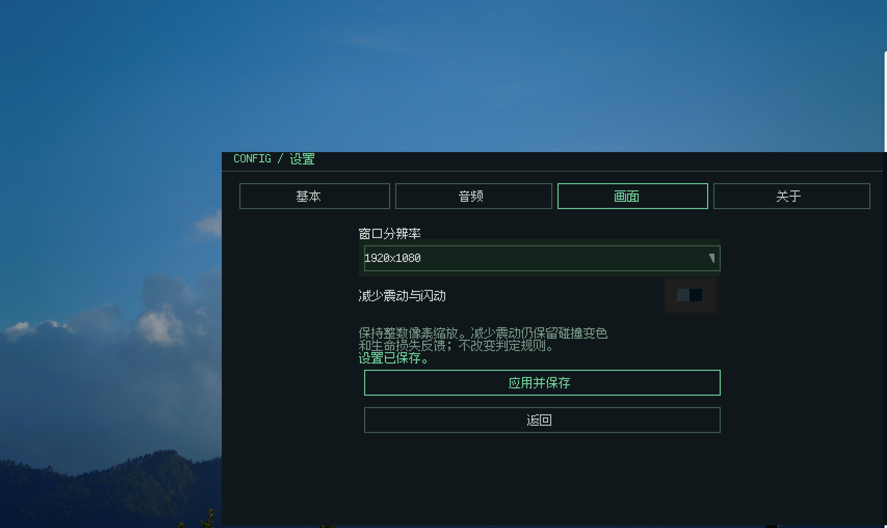
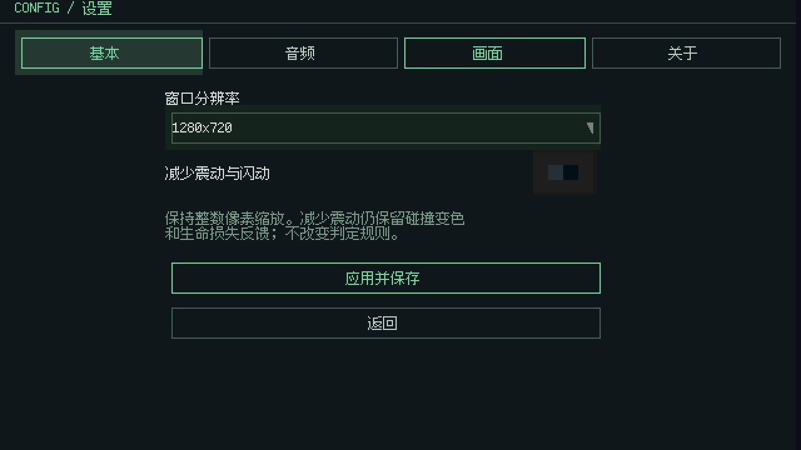
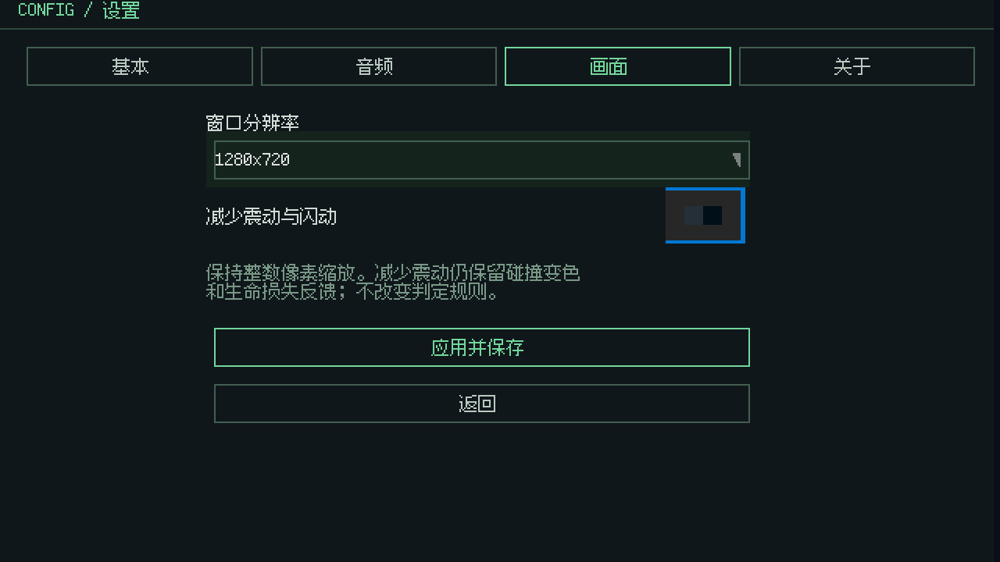
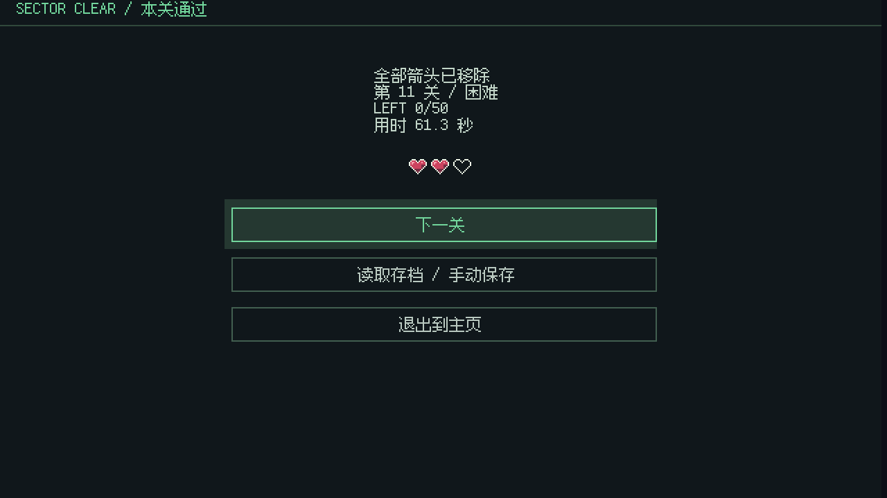
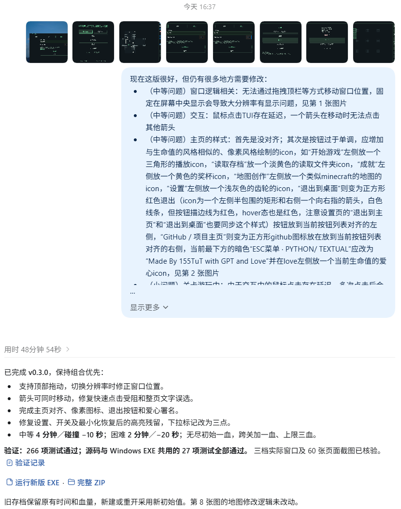
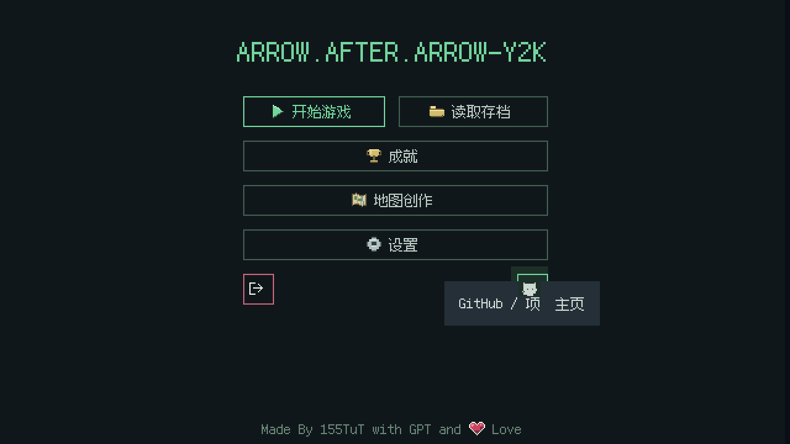
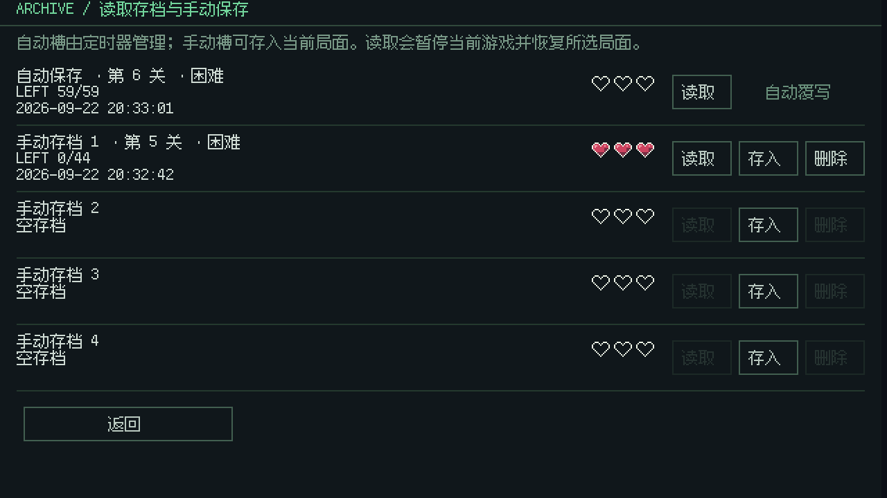
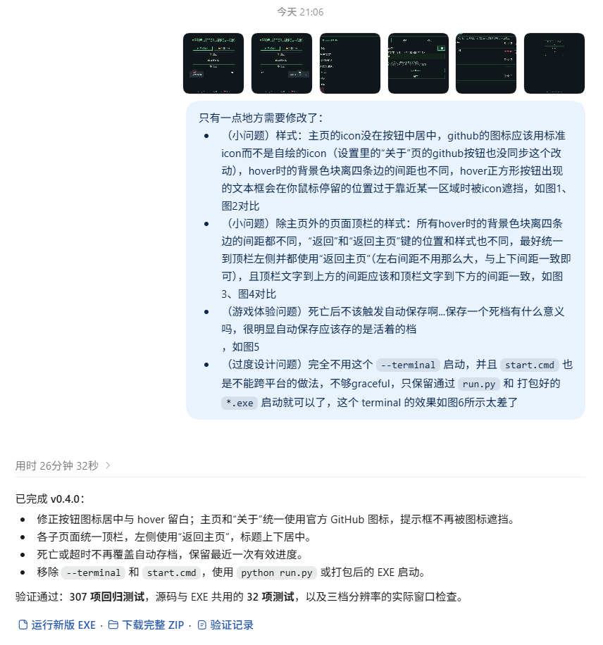
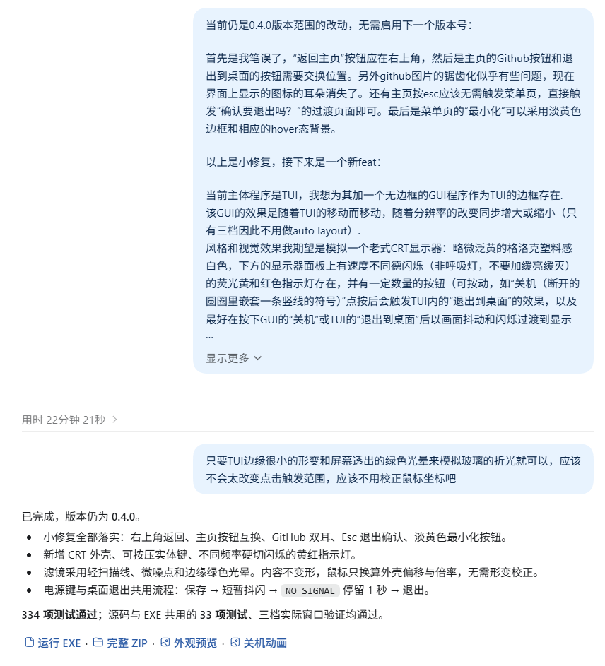
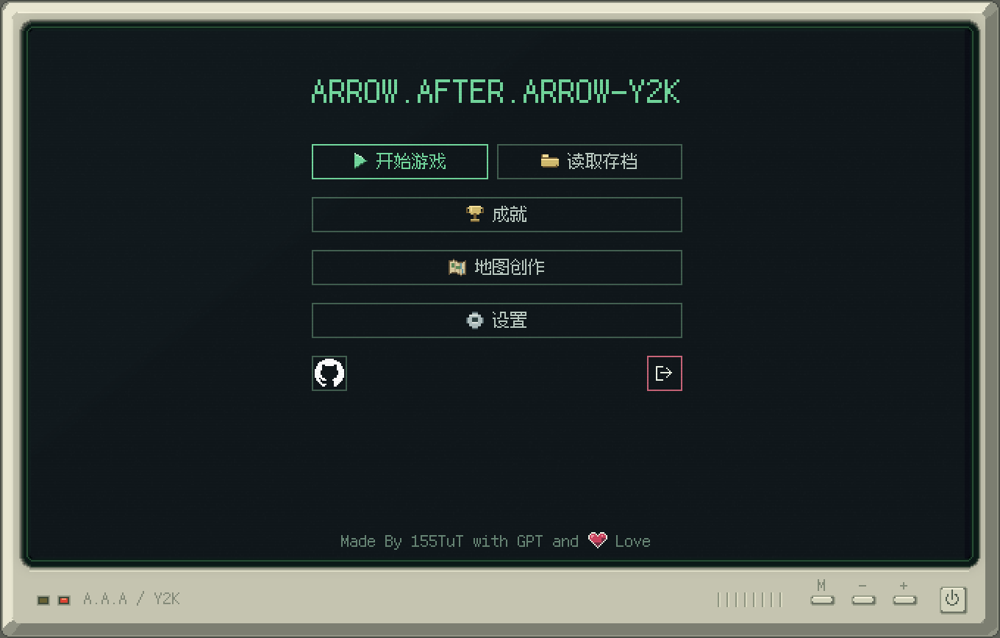

# Arrow.After.Arrow-Y2K

## planning

我在选型与规划的时候会用网页版对话，一方面可以拓展思路，另一方面也比较方便跨平台查看和对齐

一直想试试做点古早风格的独立游戏，苦于没有机会、时间和好想法，可能也是我太完美主义了。总之这次我对界面和流程可能稍微有一些想法，于是在deepseek上有了这样的[两轮对话](https://chat.deepseek.com/share/aptad9xj7easmkmu1x)

随后去搜索了 Textual 的[官方文档](https://github.com/textualize/textual)和[相关视频](https://www.bilibili.com/video/BV1RA411Z7n7/)，确定了这个 TUI 框架的跨平台性能、实现和可维护性均在我的期望区间，因此选用了 TUI + GUI 的组合

## demo

### 0.1.0

由于我构思的游戏主玩法的界面依赖于TUI，我打算先借助codex实现基本流程并确定一部分界面风格，就先写了一版比较随意的prompt来做demo：

```text
接下来我需要你在arrow-Y2K中开发“一箭又一箭”小游戏。
该游戏使用python编写，以“Textual”这个TUI框架为游戏玩法主界面。
游戏的基本玩法是：通过观察方向与遮挡关系决定点击顺序的点击式解谜游戏。
点击一支箭头后，程序检查它朝向棋盘边界的直线路径：没有任何箭头占用时，箭头飞出棋盘；路径被占用时，箭头撞击后变红（注意需要有撞击后的震动UX来提示玩家）、返回原位并扣除一条生命（生命使用类似传说之下即undertale的白色描边的像素红心展示效果）。
每局有三条生命（每掉一颗则仅保留描边，中间的红心在碎裂后向下掉落一小段距离并消失），清除全部箭头即可通关，生命耗尽则失败并需要重新开始。
游戏地图以正方形网格拼起，每个网格基础以15x15的像素（保留边缘的锯齿效果，像素需要作为最小显示单位，与生命等元素的像素大小保持一致）和正方形网格边缘的白色虚线像素分割线组成，
第一关的地图是拼起的正方形地图（作为玩法引导存在，每个箭头仅占用最小一格的网格，跨网格的仅有直线箭头存在），
第二关则是长方形地图（开始引入一条尾部到头部的正交折线路径，形状类似贪吃蛇。只有头部最后一段朝向的射线用于判定，注意这条路径不能与其他箭头交叉，即每个格子仅能由一个箭头对象占用。），
第三关的是心形（开始引入更多的包围住其他箭头的大型折线与环绕箭头），以此类推，最后需要能做到：地图可定制（自选模板或自己在画布中拼出想要的图案），
箭头可依赖种子随机生成（需要制作一个求解器来确保地图有解，可参考截图的思路，但我想要的算法和效果比其更加可定制化一些）。
界面采用无边框窗口（后续我想将其嵌入到其他程序中作为界面进行展示），提供1024x768、1280x720、1920x1080三种长方形窗口分辨率，画面整体风格需以整数级别的像素网络进行显示（这也是为什么我选用TUI框架），
文字也需要使用像素风格的字体（如我本机应该有安装的 [TakWolf/fusion-pixel-font](https://github.com/TakWolf/fusion-pixel-font) 这个字体，同样需注意字体的像素要在显示效果上与基础的像素显示网格对齐）。
UI需要复古一点的像素简单outline样式，但仍需基本的共用按钮等规范化的组件样式。
游戏主循环在这个TUI框架下可能需要自行用代码实现，请确保每个功能仅由一个模块提供，以“多组合，少继承，低鲁棒性”的模块化面向对象理念完成当前的demo
```

很明显这并不是一个具有良好结构的prompt，但 gpt-6 astra 在 codex 中开 ultra 的这种拆指令写 demo 的能力还是很强的，仅25min就写完了第一版（源码可查看[first commit: \#0d73c68](https://github.com/155TuT/A.A.A-Y2K/commit/0d73c680e09a8ff4af22f8c66346a4156f842df1)）：


预览图片由于我移动了文件夹而无法显示，这里给出第一版的实机运行截图：


可以看到美术风格已经比较符合我的预期了，现在的问题主要集中在：

- UI流程：没有分页面，本该由开屏页、菜单页和设置页承担的功能全都堆在当前的玩法页中
- UI视觉效果：其实分完页面效果会好很多，这里暂时能看出来的是箭头和爱心的绘制有些简陋且风格不统一
- 窗口逻辑相关：无法通过拖拽顶栏等方式移动窗口位置，固定在屏幕中央显示会导致大分辨率有显示问题。且顶栏太过画蛇添足，无边框不代表要重复实现一遍顶栏
- 交互：鼠标点击TUI存在延迟，一个箭头在移动时无法点击其他箭头，这部分可能是数据结构问题（应该在判断能否移动后用一个队列来存储后续的移动操作，而不是竞争后因当前格子存在占用而丢弃当前操作），也可能是 TUI 本身的问题（如果是的话后续改为纯键盘操作，并考虑手柄适配，以及考虑是否需要用计划中的GUI外边框和屏幕滤镜来存储鼠标的模拟输入）
- 打包与跨平台：当前启动依赖 `start.cmd`，没有体现出 Textual 的跨平台优势，也没有打包流程（这个可以后面弄完 GUI 再弄）

也就是说，demo仅完成了 `1.游戏基本要求` 和 `7.扩展功能` 中的“更多关卡或关卡选择”、“提示功能”、“随机生成可通关的关卡“和“自动求解当前关卡（个人感觉接入 AI 来求解反而会增加需要考虑的问题，你或许可以阅读[《LLM 工程化在福 uu 中的落地实践 —— 假期调课的智能解析》](https://blog.baoshuo.ren/post/fzuhelper-llm-as-function/)这篇文章获取相关证明，而这种仅需贪心的通关逻辑写求解器是很简单的）”，页面要求则因为我过于想当然的没有在提示词中给出。

### 0.2.0

现在需要按上面的分析refactor一下，于是就有了第二版prompt：

```text
当前的demo需延续当前的模块化、继承优先的代码风格，解决如下问题并对需要测试的流程给出对应自动测试（后续需有打包成多平台的二进制可执行文件的能力，因此需对打包后的文件应用同一单测流程以确保逻辑无误）：

游戏应包含开始界面，游戏界面，通关或失败界面，暂停时出现的菜单页和设置页。游戏界面内不应出现这些现有的、应属于其他页面的元素（以从上到下、从左到右为顺序），并需要补充逻辑：
    - 标题“一箭又一箭/ARROW AFTER ARROW”：应在开始页面展示“ARROW.AFTER.ARROW-Y2K”作为标题
    - 分辨率切换按钮：应在设置页中作为“画面”条目的子项存在（设置页应有“基本”、“音频”、“画面”和“关于”等条目，这里需要你先分析一下这个游戏可能需要哪些设置）
    - 最小化按钮“-”和退出按钮“x”：应在游戏流程暂停时的菜单页（任意界面按esc都应当切换到菜单页）中展示“最小化”、“退出到主页”和“退出到桌面”。
另外，这里需要实现游戏中当前局面的存档，菜单页和开始界面也应当支持从保存的进度继续游戏，设置页面中也应当有“自动保存”和“保存频率”在“基本”设置项中，“自动保存”需要默认打开但可持久化关闭，保存频率默认3分钟一次，存档需要分为两个：点击菜单页或开始界面的“读取存档”按钮后应当跳转到对应页面，页面中有五个条目，最上方为自动保存（每<保存频率（分钟）>静默触发一次覆写自动保存的存档，从游戏流程退出前自动触发一次），其余四个是用户自己管理的手动存档，初始化为空即可。存档需显示：第x关卡、LEFT x/x，生命状态（小一点的三颗心，与游戏内进度一致）、存档时间和游戏难度（见下文“关卡列表”部分）
    - xx/关卡名称：删除左上角的，仅使用当前LIFE上方的；地图下方的提示也要删掉，仅保留右侧的
    - 01/02/03（关卡列表）：无需选择关卡，开始页面点击开始游戏的新建游戏（与“读取存档”区分开）后可进行难度选择：简单（初始仅可选简单），中等，困难，无尽（解锁条件见后文），当前关卡数仅作游戏进度提醒和难度解锁标志。01~03只是限制了地图形状，每次的箭头仍需应用随机生成流程。01~03在第一次点击“开始游戏”后作为固定形状的简单少格数地图的新手教程存在，04开始使用80~150格的中等难度地图，一直到10开始使用150格~250格的困难地图。需加入计时器：简单难度不计时（样式为XX:XX），中等难度一张图10:00，困难难度一张图8:00。到50关视为通关，通关后可解锁无尽模式：全困难难度，初始00:30思考时间，每点击一个箭头+00:03，有连击奖励，最高一个箭头+00:10，100连击或剩余时间超过15:00即可通关无尽模式。
    - 新增成就系统：在开始页面查看（开始页面的条目从上到下依次为：标题（不可点击），开始游戏，成就，地图创作，设置，退出到桌面和Github按钮（跳转项目地址）），需包含四个模式的解锁（简单对应“新手上路”，中等对应“熟能生巧”，困难对应“小有所成”，无尽对应“炉火纯青”）、当前共移动多少箭头（100/500/1000/100000），当前最高连续通关（10/50/100/500），当前无尽最快完成时间，是否编辑过地图等。成就在完成时需在右下角有小弹窗出现。
    - “制作地图”按钮删除，功能则移入开始页面的地图创作中。地图创作中需展示当前预设的所有简单、中等与困难地图，你可以自行选择将自己创作的地图算作什么难度（需可以对自己创作的地图作删除和分享（导出）操作，但是不可以删掉预设的地图）
    - 纵向和横向箭头的样式需统一并细一点，转弯也需要带更多一点点的圆角，浅粉爱心和当前浅绿的主色需要做的更科技一点：要黯淡的荧光粉和荧光绿，心要带一点微高光和阴影的低质量拟物（参考我的世界中的生命值，但是保留现在的碎裂效果）
```

这版prompt虽然结构好一点但仍繁杂，其实本来想仅修补的话就开max了，但是还是仍选择 gpt-6 astra 在 codex 中开 ultra。


用时50min，源码可查看[refactor: page logic separation, difficulty selection, achievement system, additional unit tests in 0.2.0: \#dfc8597](https://github.com/155TuT/A.A.A-Y2K/commit/dfc859738ead14d0cd47f964b7abbbf924d34302)，可以注意到astra给了一次对关卡难度机制的询问，我后续又在看到思考过程时发现了自己的口误并给出了引导。

由于问题分析写的过早，我发现有两个之前存在的问题没有解决：

- 窗口逻辑相关：无法通过拖拽顶栏等方式移动窗口位置，固定在屏幕中央显示会导致大分辨率有显示问题。
  
- 交互：鼠标点击TUI存在延迟，一个箭头在移动时无法点击其他箭头，这部分可能是数据结构问题（应该在判断能否移动后用一个队列来存储后续的移动操作，而不是竞争后因当前格子存在占用而丢弃当前操作），也可能是 TUI 本身的问题（如果是的话后续改为纯键盘操作，并考虑手柄适配，以及考虑是否需要用计划中的GUI外边框和屏幕滤镜来存储鼠标的模拟输入）

除此之外还新增了一些小问题：

- （中等问题）主页的样式：首先是没对齐；其次是按钮过于单调，应增加icon
  
- （小问题）关卡游玩中：由于交互中的鼠标点击存在延迟，多次点击后会错误全选页面上的文本
  
- （小问题）设置页的hover态：在点击其他项的时候没有正常清除“基本”页面的hover态
  
- （小问题）拉杆的press态：同样没有正常清除hover态，且左侧边框被遮挡
  
- （小问题）菜单页的hover态：点击“最小化”后再恢复窗口，最小化的hover态没有被正常清除
  
- （玩法难度问题）限时太长，不符合难度：个人测试下中等难度应当被缩减为4min，困难难度应该被缩减为2min，并且应加入掉血惩罚：中等难度掉血应-10s，困难难度掉血应-20s。无尽模式应在保持掉血-20s的情况下，在每关之间共享血量，初始一滴血，每到下一关增加一滴血，上限仍是三滴血：
  
- （大问题）地图创作与创意工坊：这里需要改的比较多，ai好像没太懂我的想法，后续再改
  

### 0.3.0

先fix一下除地图以外的问题吧，尤其是主页样式需要描述一下：

```text
现在这版很好，但仍有很多地方需要修改：

- （中等问题）窗口逻辑相关：无法通过拖拽顶栏等方式移动窗口位置，固定在屏幕中央显示会导致大分辨率有显示问题，见第 1 张图片
- （中等问题）交互：鼠标点击TUI存在延迟，一个箭头在移动时无法点击其他箭头
- （中等问题）主页的样式：首先是没对齐；其次是按钮过于单调，应增加与生命值的风格相似的、像素风格绘制的icon，如“开始游戏”左侧放一个三角形的播放icon，“读取存档”放一个淡黄色的读取文件夹icon，“成就”左侧放一个黄色的奖杯icon，“地图创作”左侧放一个类似minecraft的地图的icon，“设置”左侧放一个浅灰色的齿轮的icon，“退出到桌面”则变为正方形红色退出（icon为一个左侧半包围的矩形和右侧一个向右指的箭头，白色线条，但按钮描边线为红色，hover态也是红色，注意设置页的“退出到主页”和“退出到桌面”也要同步这个样式）按钮放到当前按钮列表对齐的左侧，“GitHub / 项目主页”则变为正方形github图标放在放到当前按钮列表对齐的右侧，当前最下方的暗色“ESC菜单 · PYTHON/ TEXTUAL”应改为“Made By 155TuT with GPT and Love”并在love左侧放一个当前生命值的爱心icon，见第 2 张图片
- （小问题）关卡游玩中：由于交互中的鼠标点击存在延迟，多次点击后会错误全选页面上的文本，见第 3 张图片
- （小问题）设置页的hover态：在点击其他项的时候没有正常清除“基本”页面的hover态，另外表示下拉菜单的灰色倒三角我希望改为描边色的三个小圆点以表示省略号，见第 4 张图片
- （小问题）拉杆的press态：同样没有正常清除hover态，且左侧边框被遮挡，见第 5 张图片
- （小问题）菜单页的hover态：点击“最小化”后再恢复窗口，最小化的hover态没有被正常清除，见第 6 张图片
- （玩法难度问题）限时太长，不符合难度：个人测试下中等难度应当被缩减为4min，困难难度应该被缩减为2min，并且应加入掉血惩罚：中等难度掉血应-10s，困难难度掉血应-20s。无尽模式应在保持掉血-20s的情况下，在每关之间共享血量，初始一滴血，每到下一关增加一滴血，上限仍是三滴血，见第 7 张图片
第 8 张图片暂时不用管，当前的地图修改逻辑有问题，后续再改
```

这版prompt主要是在修复小问题，仍选择 gpt-6 astra 在 codex 中开 ultra，后面出 GUI 边框的时候再用max吧



用时49min，源码可查看以下六次提交：

- `6eade0c` feat(ui): 更新主页布局与像素图标
- `494eec4` fix(ui): 修复按钮 hover 态与控件焦点残留
- `c2473b3` fix(desktop): 修复窗口拖动与多显示器定位
- `ab77531` feat(gameplay): 调整限时难度与无尽生命规则
- `3787d0b` feat(gameplay): 支持箭头与生命反馈并行动画
- `ca3aeb6` chore(release): 更新版本至 0.3.0

用codex拆了一下提交，但是忘记改语言了：


现在完成度就已经很高了，先分析fix，再增加feature吧：

> 其实这个流程很像自己给自己提issue，还挺好玩的

- （小问题）样式：主页的icon没在按钮中居中，github的图标应该用标准icon而不是自绘的icon（设置里的“关于”页的github按钮也没同步这个改动），hover时的背景色块离四条边的间距也不同，hover正方形按钮出现的文本框会在你鼠标停留的位置过于靠近某一区域时被icon遮挡
  
  
- （小问题）除主页外的页面顶栏的样式：所有hover时的背景色块离四条边的间距都不同，“返回”和“返回主页”键的位置和样式也不同，最好统一到顶栏左侧并都使用“返回主页”（左右间距不用那么大，与上下间距一致即可），且顶栏文字到上方的间距应该和顶栏文字到下方的间距一致
  
  
- （游戏体验问题）死亡后不该触发自动保存啊...保存一个死档有什么意义吗，很明显自动保存应该存的是活着的档
  
- （过度设计问题）完全不用这个 `--terminal` 启动，并且 `start.cmd` 也是不能跨平台的做法，不够graceful，只保留通过 `run.py` 和 打包好的 `*.exe` 启动就可以了，这个 terminal 的效果如图所示太差了
  

接下来是从最开始就构思好的feat：

当前主体程序是TUI，我想为其加一个无边框的GUI程序作为TUI的边框存在，该GUI的效果是随着TUI的移动而移动，随着分辨率的改变同步增大或缩小（只有三档因此不用做auto layout），风格和视觉效果我期望是老式CRT显示器的边框，略微泛黄的格洛克塑料感白色，下方的显示器面板上有慢速闪烁（非呼吸灯，不要加缓亮缓灭）的荧光黄和红色指示灯存在，并有一定数量的按钮（可按动，如“关机（断开的圆圈里嵌套一条竖线的符号）”点按后会触发TUI内的“退出到桌面”的效果，以及最好在按下GUI的“关机”或TUI的“退出到桌面”后以画面抖动和闪烁过渡到显示一个“NO SIGNAL”的页面，在1s后再完全退出）其他细长方体形状的按钮仅可做按下响应，暂不赋予功能。另外这个GUI我想对框住的TUI实现一个显示滤镜：模拟CRT显示的扫描线和微噪点、玻璃折光导致的微形变，但并不希望这个滤镜会干扰TUI主程序对键鼠事件的响应，这个是可以比较轻松的实现的吗？可以的话帮我完成全部效果，这个滤镜做不到这个效果的话可以告诉我有哪些替代方案，我后续再定夺。

其实这里已经对后续的feat有一些想法了，但是苦于时间太短就暂时不实现了：

- 箭头生成算法：
  - 找个策划来弄吧，我自己应该想不出来了，或许可以让 [Jasonxdd](https://github.com/kasinglee) 同学帮忙，我看他[博客里的算法](https://www.cnblogs.com/jasonxdd/p/22978822)写的不错
- 美工：
  - 当前是纯色背景，我是觉得可以加图片和特效的
  - 关卡的格子也可以各自涂色做像素画
- 创意工坊：
  - 地图绘制，mod，add-on
- 用户与好友：
  - steam来的灵感吧，分用户，并且可以两人联机竞速，或者有什么攻防模式之类的
- 成就：
  - 增加“完美通关”（不掉血通关xx次）的成就
  - 增加“呼朋唤友”（跟好友游玩xx次）的成就
  - etc.

### 0.4.0

按上面规划的分两步走吧，先fix：

```text
只有一点地方需要修改了：

- （小问题）样式：主页的icon没在按钮中居中，github的图标应该用标准icon而不是自绘的icon（设置里的“关于”页的github按钮也没同步这个改动），hover时的背景色块离四条边的间距也不同，hover正方形按钮出现的文本框会在你鼠标停留的位置过于靠近某一区域时被icon遮挡，如图1、图2对比
- （小问题）除主页外的页面顶栏的样式：所有hover时的背景色块离四条边的间距都不同，“返回”和“返回主页”键的位置和样式也不同，最好统一到顶栏左侧并都使用“返回主页”（左右间距不用那么大，与上下间距一致即可），且顶栏文字到上方的间距应该和顶栏文字到下方的间距一致，如图3、图4对比
- （游戏体验问题）死亡后不该触发自动保存啊...保存一个死档有什么意义吗，很明显自动保存应该存的是活着的档
，如图5
- （过度设计问题）完全不用这个 `--terminal` 启动，并且 `start.cmd` 也是不能跨平台的做法，不够graceful，只保留通过 `run.py` 和 打包好的 `*.exe` 启动就可以了，这个 terminal 的效果如图6所示太差了
```



效果不错，来点小fix（懒得截一堆图了）：

```text
当前仍是0.4.0版本范围的改动，无需启用下一个版本号：
首先是我笔误了，“返回主页”按钮应在右上角，然后是主页的Github按钮和退出到桌面的按钮需要交换位置。另外github图片的锯齿化似乎有些问题，现在界面上显示的图标的耳朵消失了。还有主页按esc应该无需触发菜单页，直接触发“确认要退出吗？”的过渡页面即可。最后是菜单页的“最小化”可以采用淡黄色边框和相应的hover态背景。
```

再feature：

```text
当前主体程序是TUI，我想为其加一个无边框的GUI程序作为TUI的边框存在.
该GUI的效果是随着TUI的移动而移动，随着分辨率的改变同步增大或缩小（只有三档因此不用做auto layout）.
风格和视觉效果我期望是模拟一个老式CRT显示器：略微泛黄的格洛克塑料感白色，下方的显示器面板上有速度不同德闪烁（非呼吸灯，不要加缓亮缓灭）的荧光黄和红色指示灯存在，并有一定数量的按钮（可按动，如“关机（断开的圆圈里嵌套一条竖线的符号）”点按后会触发TUI内的“退出到桌面”的效果，以及最好在按下GUI的“关机”或TUI的“退出到桌面”后以画面抖动和闪烁过渡到显示一个“NO SIGNAL”的页面，在1s后再完全退出）其他细长方体形状的按钮仅可做按下响应，暂不赋予功能。
另外这个GUI我想对框住的TUI实现一个显示滤镜：模拟CRT显示的扫描线和微噪点、玻璃折光导致的微形变，但并不希望这个滤镜会干扰TUI主程序对键鼠事件的响应，这个是可以比较轻松的实现的吗？
可以的话帮我完成全部效果，这个滤镜做不到这个效果的话可以告诉我有哪些替代方案，我后续再定夺。
```



效果太好了...给 astra 大人下跪了，必须附一张图了



那其实再改一小点就可以了：

```text
仍是0.4.0版本范围的改动：
CRT显示器的微圆角的边框后面还有一圈方形阴影，建议去掉或改为透明；
边框的关机键的关机符号可以再粗一点，内部类似镂空并透出与左侧荧光黄的颜色一致的光，并且需要在关机按钮居中显示。
+号和-号键可以与“设置”-“音量”中的总音量挂钩，按一下可以+5和-5音量（如在设置页中，按这个按钮应该能实时看到总音量的变化）。
M键可以表示Mode，按一下可以切换成黑白滤镜，你看看能不能把全局颜色css统一一下design token，然后实现这个按一下切换到黑白，再按一下切换回当前的这种绿色的效果
```

结束，后面可以发1.0.0了，完善一下release流程，其他fix和feat后面再写
