# 软件工程第二次作业

| 项目 | 内容 |
| ---- | ---- |
| 这个作业属于哪个课程 | [https://edu.cnblogs.com/campus/fzu/202601SofwareEngineering](https://edu.cnblogs.com/campus/fzu/202601SofwareEngineering) |
| 这个作业要求在哪里 | [https://edu.cnblogs.com/campus/fzu/202601SofwareEngineering/homework/16717](https://edu.cnblogs.com/campus/fzu/202601SofwareEngineering/homework/16717) |
| 这个作业的目标 | 使用 Python 和 AIGC 完成“一箭又一箭”小游戏 |
| 学号 | 052403137 |
| GitHub 仓库 | [https://github.com/155TuT/A.A.A-Y2K](https://github.com/155TuT/A.A.A-Y2K) |

## 0x01 项目展示

项目名为 **Arrow.After.Arrow-Y2K**，本次展示对应当前的 0.4.0 版本。内屏使用 Textual 管理界面与交互，外层是带像素风格 CRT 显示器外壳的 SDL 窗口。

### 开始界面

主页提供开始游戏、读取存档、成就、地图创作、设置、GitHub 和退出入口。玩法之外的功能分到各自页面，游戏时只保留棋盘和必要信息。

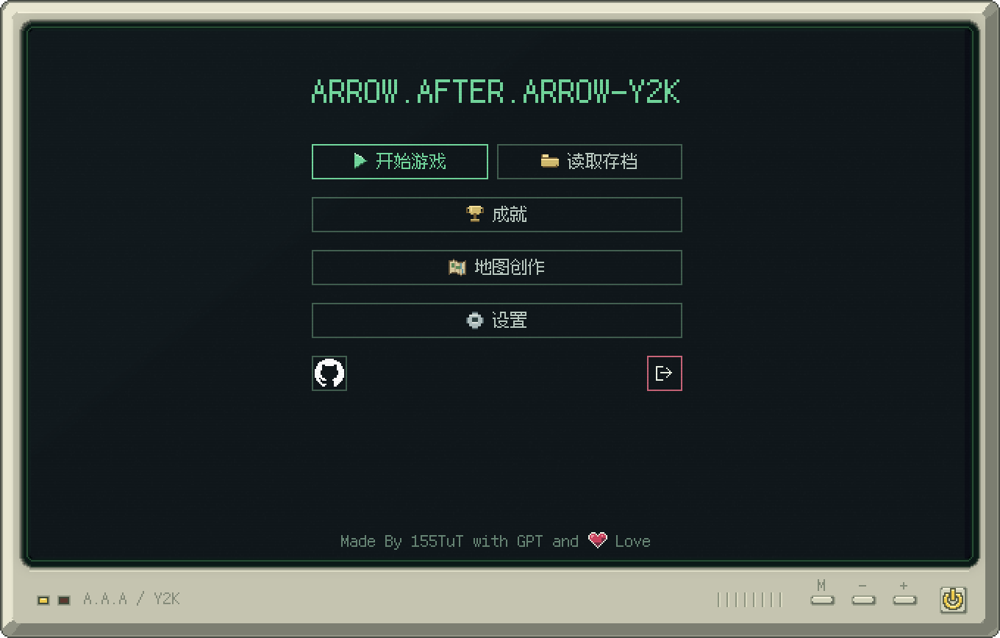

### 游戏过程

右侧显示关卡、难度、生命、剩余箭头数量与计时器，并提供提示、自动演示、重来和暂停操作。

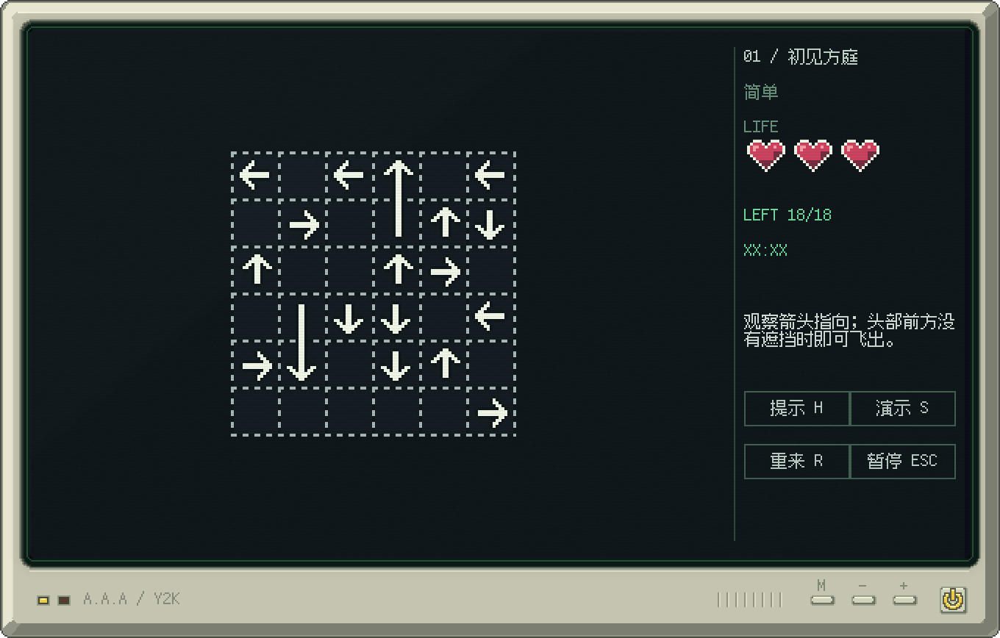

下面的 GIF 展示一次碰撞反馈、箭头逐步飞出与本关通过。

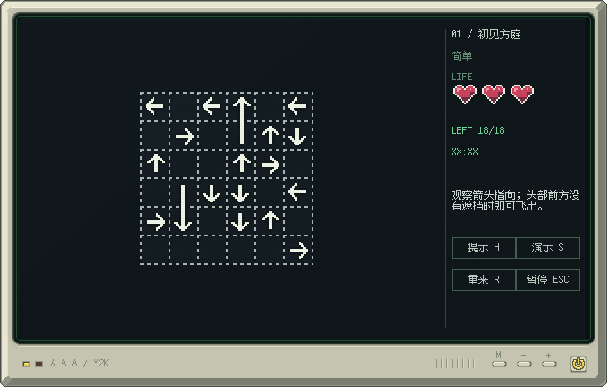

### 通关与失败界面

普通关卡全部清空后显示本关通过，可以进入下一关；生命耗尽或倒计时归零后显示挑战失败，可以重新开始当前地图。

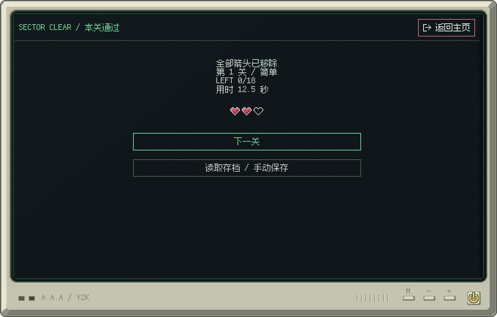

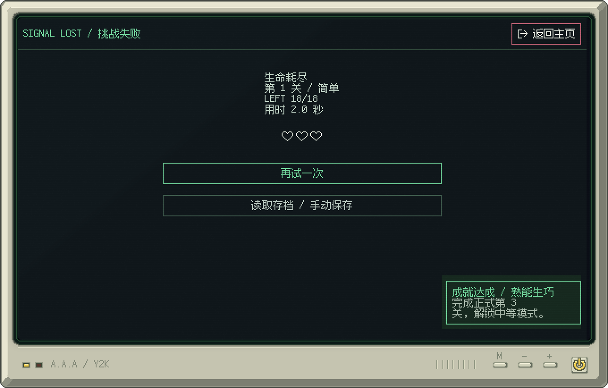

以上四张截图与玩法 GIF 使用当前程序的真实 Textual 合成器和 CRT 呈现器生成，通过应用控制器执行游戏规则，使用独立测试数据与注入时钟。GIF 为采样后的自动回放，图中的用时与成绩属于测试场景，不是我的人工通关成绩。人工试玩情况另见测试部分。

### CRT 关机效果

退出时先保存可恢复的局面，再经过短暂抖闪和 `NO SIGNAL` 画面关闭窗口；外壳上的 `+` / `−` 可以调整主音量，`M` 可以切换彩色与单色显示。

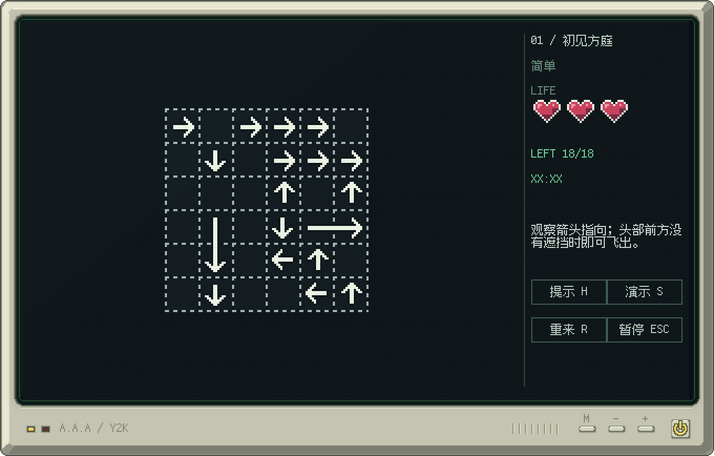

关机 GIF 沿用项目已有验证产物，由同一个 CRT 呈现器采样生成；实际窗口的退出时序另有原生宿主测试。

## 0x02 项目介绍

### 选型与风格

我在选型与规划的时候会用网页版对话，一方面可以拓展思路，另一方面也比较方便跨平台查看和对齐

一直想试试做点古早风格的独立游戏，苦于没有机会、时间和好想法，可能也是我太完美主义了。总之这次我对界面和流程可能稍微有一些想法，于是在deepseek上有了这样的[两轮对话](https://chat.deepseek.com/share/aptad9xj7easmkmu1x)

随后去搜索了 Textual 的[官方文档](https://github.com/textualize/textual)和[相关视频](https://www.bilibili.com/video/BV1RA411Z7n7/)，确定了这个 TUI 框架的跨平台性能、实现和可维护性均在我的期望区间，因此选用了 TUI + GUI 的组合
最终使用 Python + Textual + pygame-ce/SDL + Pillow：Textual 负责页面、组件、输入和时钟，SDL 宿主负责无边框窗口、事件转发与显示，像素素材和 CRT 效果通过统一的绘制流程合成。这里的 TUI 是界面组织方式，用户运行的是桌面图形窗口。

格子由 15×15 源像素内部与 1 像素虚线边界组成，格心间距 16。箭头、红心、文字与按钮保持整数像素显示；配色以暗色背景、荧光绿和荧光粉为主，外壳采用略微泛黄的暖白色。三档内屏分辨率为 1024×768、1280×720 和 1920×1080。

### 规则与操作

玩家通过观察方向与遮挡关系决定点击顺序。点击箭头身体任意一格后，程序从头部下一格沿朝向检测到棋盘矩形边界：没有占用则飞出并消除；有占用则前冲、震动、变红、退回并扣除一颗心。心形白色轮廓保留，内部碎裂下落。清空当前关卡即可继续；普通战役每关三颗心，生命耗尽或限时归零则失败。

作业基础版采用单格箭头，本项目在同一套判定上扩展了直线与正交折线箭头。单格箭头是路径长度为 1 的情况；多格箭头只检测头部最后一段方向的射线，身体格子参与占用判断，射线也可能撞到自身。模板中的空洞不会截断射线。

| 操作 | 输入 |
| --- | --- |
| 发射箭头 | 鼠标点击箭头任意身体格，或方向键移动光标后 Enter |
| 提示 / 自动演示 | H / S；自动演示不计入玩家成就与通关纪录 |
| 重新开始 | R 或“重来”按钮；恢复当前地图的初始布局与状态 |
| 暂停 | 游戏及功能页按 Esc；暂停期间不计时 |
| 主页退出确认 | 在主页按 Esc |
| 调整音量 / 切换单色 | CRT 外壳 + / − / M 按钮 |
| 移动窗口 | 拖动 CRT 外壳或内屏顶栏空白、标题区域 |

### 关卡与扩展功能

| 模式 | 关卡安排 | 初始限时与生命 |
| --- | --- | --- |
| 简单 | 第 1–3 关简单，第 4–10 关中等，第 11–50 关困难 | 简单不倒计时，中等 04:00，困难 02:00；每关三颗心 |
| 中等 | 第 1–10 关中等，第 11–50 关困难 | 中等 04:00，困难 02:00；每关三颗心 |
| 困难 | 第 1–50 关困难 | 02:00；每关三颗心 |
| 无尽 | 持续生成困难地图 | 首图 00:30、一颗心；后续继承时间和连击，生命加一、最多三颗 |

简单前三关固定为小方形、长方形、心形，箭头仍按种子生成。通过第 3 / 10 / 50 关分别解锁中等 / 困难 / 无尽；普通模式完成第 50 关即通关。中等地图为 80–150 格，困难为 150–250 格。

碰撞时中等额外扣 10 秒，困难与无尽额外扣 20 秒。无尽每成功移除一支箭头，先增加连击，再奖励 `3 + min(7, 连击 // 10)` 秒；100 连击或剩余时间严格超过 15:00 时获胜。

扩展部分还包括一个自动存档槽与四个手动槽、成就、提示与自动求解、可通关地图的种子生成、20×16 地图创作画布、自制地图 JSON 导入导出、本地合成音效、CRT 外壳和 Windows 可执行文件。地图创作可以使用，但原开发记录中提到的进一步交互调整、创意工坊、联机等设想仍属于后续计划。

### 开发环境与运行

项目要求 Python 3.11+。已有验证记录中的本机环境为 Windows 11、Python 3.13.5、Textual 6.12.0、pygame-ce 2.5.8、Pillow 12.3.0、PyInstaller 6.22.3。

```powershell
python -m venv .venv
.\.venv\Scripts\Activate.ps1
python -m pip install -e .
python run.py
```

可使用 `python run.py --resolution 1024x768` 指定分辨率，或使用 `python run.py --seed my-seed` 固定生成种子。打包版解压完整 ZIP 后运行 `A.A.A-Y2K.exe`，需保留旁边的 `_internal` 目录。源码与二进制共用启动入口和共享测试实现；本机已验证 Windows，macOS/Linux 需要各自的构建与运行结果，不能据此直接认定通过。

字体使用 Fusion Pixel，项目随附字体许可；GitHub 图标采用官方 Invertocat 资源并保留来源说明。其余菜单像素图标、箭头、红心及 CRT 外壳由项目绘制，音效由本地代码合成。具体资源说明保留在项目的 `src/arrow_y2k/assets/` 下。

## 0x03 实现思路

本节围绕数据、路径检测、状态变化、关卡生成与动画协调说明实现。代码块直接摘自当前项目源码，保留实际函数，而不是另写一套演示逻辑；完整模块可以在 GitHub 仓库中查看。

### 1. 箭头、方向与棋盘的表示

坐标使用 `(x, y)`，向右为 x 增大、向下为 y 增大。四个方向直接保存为位移向量。下面是 `src/arrow_y2k/model.py` 中的 `Direction` 与 `Arrow`：

```python
class Direction(Enum):
    UP = (0, -1)
    RIGHT = (1, 0)
    DOWN = (0, 1)
    LEFT = (-1, 0)

    @property
    def delta(self) -> Cell:
        return self.value

@dataclass(frozen=True)
class Arrow:
    id: str
    cells: tuple[Cell, ...]
    direction: Direction

    def __post_init__(self) -> None:
        if not self.id or not self.cells:
            raise ValueError("An arrow needs an ID and at least one cell")
        if len(set(self.cells)) != len(self.cells):
            raise ValueError("An arrow cannot visit a cell twice")
        for a, b in zip(self.cells, self.cells[1:]):
            if abs(a[0] - b[0]) + abs(a[1] - b[1]) != 1:
                raise ValueError("Arrow paths must be orthogonally contiguous")
        if len(self.cells) > 1:
            previous, head = self.cells[-2:]
            if (head[0] - previous[0], head[1] - previous[1]) != self.direction.delta:
                raise ValueError("Direction must agree with the last path segment")

    @property
    def head(self) -> Cell:
        return self.cells[-1]
```

`cells` 按尾到头排列，最后一个格子是头部。构造时检查路径非空、没有重复格子、相邻格子正交连续，并检查最后一段与方向一致。因此，方向与箭头外观不会各自维护一套矛盾的数据。

`Board.mask` 是有效地图格子的不可变集合，支持矩形、心形、空洞与断连图案；`Board.arrows` 保存箭头。棋盘构造时检查 ID 唯一、箭头没有越出模板，而且同一个格子不能属于两支箭头。`occupancy` 将每一个身体格映射到箭头 ID，点击身体与碰撞检测都使用这张表。

`GameSession.board` 保留初始棋盘，`remaining` 保存当前剩余箭头；重开时由初始棋盘重建剩余集合。`GameRun` 在单张棋盘外组合关号、难度、倒计时、连击和战役状态，不为每一种难度建立一套继承类。

### 2. 路径检测：从头部下一格开始逐格扫描


核心函数为 `Board.first_collision`（`src/arrow_y2k/model.py`）：

```python
def first_collision(self, arrow_id: str) -> Collision | None:
    arrow = next(arrow for arrow in self.arrows if arrow.id == arrow_id)
    dx, dy = arrow.direction.delta
    x, y = arrow.head
    occupied = self.occupancy
    width, height = self.width, self.height
    distance = 0
    while True:
        x, y = x + dx, y + dy
        distance += 1
        if not (0 <= x < width and 0 <= y < height):
            return None
        if (x, y) in occupied:
            return Collision((x, y), occupied[x, y], distance)
```

这里有几个容易写错的边界：

1. 先走一步再检查，不能把箭头自己的头部当作障碍。
2. 到达矩形边界外直接返回 `None`，表示可飞出；位于边缘且朝外的箭头也走这条分支。
3. 遇到的第一个占用格就是最近障碍，无论它是另一支箭头的头部、尾部还是自身身体，都返回碰撞。
4. 循环没有用“是否属于 mask”作为停止条件，因此射线能够穿过心形或断连模板中的空洞。

例如一行 `→ · →`，左箭头首先检测到右箭头；右箭头向右走一步就出界，因此应先移除右箭头，再移除左箭头。对于折线箭头，不需要把整个身体平移一遍来检测，规则只关心头部方向上的这条射线。

若射线上最多扫描 L 个格子，射线扫描本身是 O(L)。当前实现每次还会构造占用表、查找箭头和计算边界，实际调用成本也包含这些工作，不能把整个函数简单写成只有 O(L)。


### 3. 点击、消除、扣血与重开


`GameSession.click` 统一修改单张棋盘的规则状态：

```python
def click(self, arrow_id: str) -> MoveResult:
    arrow = self.remaining.get(arrow_id)
    if self.status != "playing" or arrow is None:
        return MoveResult("ignored", arrow, None, self.lives)
    self.moves += 1
    collision = self.current_board.first_collision(arrow_id)
    if collision is not None:
        self.lives -= 1
        if self.lives == 0:
            self.status = "lost"
        return MoveResult("collision", arrow, collision, self.lives)
    del self.remaining[arrow_id]
    if not self.remaining:
        self.status = "won"
    return MoveResult("escaped", arrow, None, self.lives)
```

碰撞时不删除箭头，只扣一次生命并返回碰撞位置；合法时从 `remaining` 删除箭头，空集合代表本关通过。非游玩状态、未知 ID 和已消除箭头都返回 `ignored`。返回值仍携带箭头对象，所以规则已经删除它之后，画面仍能播放完整飞出动画。

战役层 `GameRun.click` 再根据这一结果处理碰撞扣时、连击、无尽奖励和第 50 关的最终通关。生命与时间被同一次碰撞同时耗尽时，优先记录“生命耗尽”；简单关没有倒计时。

重开时不会重新生成一张随机图，而是恢复保存的初始棋盘。下面是战役层的重开函数（`src/arrow_y2k/campaign.py`）：

```python
def restart(self) -> None:
    self.session.restart()
    if self.mode == "endless":
        self.session.lives = 1
    self.seconds_left = countdown(self.difficulty)
    self.elapsed_seconds = 0.0
    self.combo = self.best_combo = 0
    self.outcome, self.failure_reason = "playing", ""
    self.counted = self.assisted = False
```

其中 `self.session.restart()` 恢复全部初始箭头、三颗心、移动次数与单图状态；无尽再设为一颗心。战役层恢复本难度的初始计时并清零连击与用时。下一关则由 `GameRun.advance()` 根据模式、种子和下一关编号建立新局面。

### 4. 随机关卡为什么有解

1. 使用局部 `random.Random(str(seed))`，从排序后的模板格子中抽取目标数量的占用格。数量为 `max(1, floor(mask_size × density + 0.5))`。
2. 设尚未分配给箭头的占用格为 U。选择格子 h 和方向 d，使 h 前方射线与 U 不相交；对能够形成多格路径、能依赖先前剥离区域的选择提高权重。
3. 从 h 向内生长尾部，保持连续、不重复、不与已构造箭头交叉；第一段决定头部方向。长度受硬上限约束，转弯倾向控制可选延伸的偏好。数据 API 的最小长度是偏好值，断连/短分支可迫使路径更短。
4. 从 U 删除整条新路径，记录箭头 ID，重复直至 U 为空。

任意非空有限 U 的最上方格子朝上一定没有 U 中的遮挡，因此始终存在可选 h、d；每步至少删去一格，最多执行目标占用格数步。h 的射线在尾部生长前就与 U 不相交，而尾部完全来自 U，因此不会产生头部撞自身的情况。

按记录顺序复放时，先前剥离的箭头已经移除，剩余箭头只占据当时 U 的格子，所以每一步都合法。生成器还调用独立的规则验证与求解器，不仅信任构造记录。该方法不依赖满盘 Hamilton 路径，适用于任意空洞和断连模板。
以上说明直接沿用项目架构文档。对应 `generation.py` 的生成流程最终会执行如下检查：
```python
board = Board(mask, tuple(arrows))
certificate = tuple(arrow.id for arrow in arrows)
if not validate_certificate(board, certificate):
    raise AssertionError("Constructive generator produced an invalid certificate")
solution = solve(board)
if not solution.solvable:
    raise AssertionError("Independent solver rejected generated board")
return GeneratedLevel(board, solution, str(config.seed))
```

### 5. 提示与自动求解为什么不需要大模型

移除箭头只会删除占用，不会增加任何遮挡；因此一个当前可移除的箭头可以提前移除，而不破坏任何后续合法步骤。求解器反复选取当前可出界箭头并删除即可。若非空棋盘没有任何可移除箭头，第一步已经不存在，当前状态无解。包含自身射线冲突的箭头无法自行解锁，验证时自然失败。

这一论证依赖当前玩法的单调删除规则。若将来加入移动其他箭头、开关门或改变方向，必须重新论证求解器，不能继续沿用本结论。
`src/arrow_y2k/solver.py` 的求解函数如下：
```python
def solve(board: Board) -> Solution:
    remaining = {arrow.id: arrow for arrow in board.arrows}
    order: list[str] = []
    while remaining:
        snapshot = Board(board.mask, tuple(remaining.values()))
        legal = [arrow_id for arrow_id in remaining if snapshot.first_collision(arrow_id) is None]
        if not legal:
            return Solution(tuple(order), False, tuple(remaining))
        for arrow_id in legal:
            del remaining[arrow_id]
            order.append(arrow_id)
    return Solution(tuple(order), True, ())
```
每轮在当前快照里找出可移除的箭头，将它们加入解序列并删除。若没有合法箭头但仍有剩余，就返回无解。提示可以取合法顺序中的下一支，自动演示按顺序驱动游戏；自动演示会标记为辅助局面，不能用来增加正式通关记录。

### 6. 规则与动画分开，解决连续点击问题

箭头 `cells` 按尾到头排列。多格路径必须正交连续、无重复格子，末段方向必须与 `direction` 一致。棋盘构造检查所有格子的唯一占用。射线从 `head + direction.delta` 起步，扫描到外接矩形边界；自身格子也在统一占用表内，不特殊跳过。

点击立即提交规则结果，但使用返回的 `MoveResult` 播放画面，因此飞出的箭头即使已从占用表移除仍能完整显示动画。`GameplayEffects` 以箭头 ID 保存各自的飞出/回弹时间线，以心的索引保存各自的碎裂时间线。动画期间仍可点击其他箭头；只有同一支正在回弹的箭头忽略重复输入，避免一次反馈中重复扣血。后续射线判定读取已提交的占用表，已经成功移除的箭头不再阻挡。

碰撞扣血和扣时只由 `GameRun.click` 结算，动画不重复修改规则状态；并发损血的各颗心独立等待撞击点、碎裂和消失。暂停冻结全部时间线，恢复时不补算暂停时间。输赢状态立即锁定后续规则操作，现有箭头/心碎反馈完成后再进入结果页。重来/切换关卡清空旧动画，不携带扣血状态。

折线动画将旧路径表示为正交像素折线，头部方向追加无限延伸的射线，按曼哈顿弧长平移一个等长窗口。位于窗口内的所有折点保留，所以尾部沿旧轨迹转弯，不把整条折线作刚体平移，也不在拐角处拉出斜线。碰撞时位移达到障碍前沿，短暂垂直抖动，再沿相同路径退回；规则层不更新中间动画位置。
这也对应开发记录里“一个箭头在移动时无法点击其他箭头”的问题。最终实现让不同箭头各自拥有动画时间线，而不是用一个全局“动画中”标志锁住整个棋盘。`app.py` 在调用 `GameRun.click()` 前只检查目标箭头是否仍在反馈中，并在点击前结算已流逝时间，避免倒计时已结束却仍能抢点。

### 7. 页面、存档与 CRT 宿主的职责

| 模块 | 主要职责 |
| --- | --- |
| `model.py` / `campaign.py` | 单图规则与战役进度、限时、快照 |
| `generation.py` / `solver.py` / `catalog.py` | 生成、求解、证书验证与预设模板 |
| `pages.py` / `widgets.py` / `app.py` | 页面布局、控件、事件路由与服务组合 |
| `effects.py` / `pixels.py` | 独立动画时间线、像素绘制与路径采样 |
| `storage.py` / `achievements.py` | 设置、五槽存档、地图、成绩与去重 |
| `desktop.py` / `windowing.py` / `crt.py` | SDL 宿主、窗口定位与裁切、CRT 外壳与滤镜 |
| `palette.py` / `audio.py` | 共用颜色 token 与音效 |
| `selftest.py` | 源码和打包程序共用的行为测试 |

自动存档通过一个入口检查局面是否可恢复：死亡、超时或没有生命的局面不能覆盖最后一份活档。存档保存精确箭头、剩余 ID、生命、计时和连击，读取时直接恢复，不重新随机生成；设置、成绩和局面分别保存。文件写入先完成临时文件，再原子替换，保护已有数据。

CRT 和 Textual 内屏最终组合在同一个 SDL 窗口里。扫描线、噪点、边缘弧度与光晕没有改变棋盘和按钮的位置，鼠标只需减去内屏偏移并除以整数倍率。单色效果在完整内屏合成后统一处理，因此文字、输入框、按钮和弹层一起变灰，外壳与指示灯保留原色。

完整设计说明见仓库中的 `docs/architecture.md`、`docs/campaign.md`、`docs/storage.md` 和 `docs/visuals.md`。

## 0x04 AIGC 使用过程

下面的过程、提示词、问题分析与截图直接迁移自我的开发记录，按实际版本顺序保留。它们记录的是当时提出的要求和当时发现的问题；例如早期 10/8 分钟限时、按钮位置和启动方式，后续都有调整，最终规则以本文项目介绍及当前源码为准。0.2.0 提示词中的“继承优先”也是当时的口误，最终采用组合优先。

### 协作过程概览

| 子任务 | 借助何种 AIGC 技术 | AI 实现或提供了什么 | 效果如何 | 人工修改与判断 |
| --- | --- | --- | --- | --- |
| 选型与规划 | DeepSeek 网页对话 | 辅助讨论复古游戏界面与技术方案 | 形成 TUI + GUI 的选型方向 | 我继续查看 Textual 文档与视频，判断跨平台、实现与维护是否符合预期 |
| 0.1.0 基础 demo | Codex | 根据提示词实现棋盘、箭头规则、像素界面、生成与求解流程 | 约 25 分钟形成第一版，画风基本符合预期，但功能堆在一个页面 | 我运行后分析页面划分、窗口拖动、点击延迟和跨平台启动问题，补充下一轮要求 |
| 0.2.0 页面与系统重构 | Codex | 分离开始、游戏、结果、菜单和设置，加入难度、存档、成就与测试 | 约 50 分钟完成，流程更完整，但仍存在 hover、点击与难度问题 | 我纠正提示词口误，实际试玩后要求将中等/困难改为 4/2 分钟并增加碰撞扣时 |
| 0.3.0 交互与平衡修复 | Codex | 修复窗口拖动、并行动画、控件状态，并调整限时和无尽生命规则 | 约 49 分钟完成，仍发现图标居中、提示层级和失败存档问题 | 我逐项用截图描述问题，并明确“死亡不能覆盖活档”等体验要求 |
| 0.4.0 视觉统一与 CRT 外壳 | Codex | 完善主页/顶栏、活档保护和启动入口，加入 CRT、实体按键及显示偏好 | 外壳与内屏达到预期风格，进一步补齐音量步进、单色与透明圆角 | 我纠正返回按钮方位、要求使用官方 GitHub 图标，并逐轮补充实体按钮的具体行为 |

这里的人工修改主要是我提出设计约束、实际试玩、定位问题、修订提示词并确认结果；具体代码修复由 Coding Agent 完成，不将这些过程写成全部由我手写代码。上表的分钟数仅沿用当时记录的单轮 Agent 用时，不等同于整个项目的 PSP 工时。

### 0.1.0

由于我构思的游戏主玩法的界面依赖于TUI，我打算先借助codex实现基本流程并确定一部分界面风格，就先写了一版比较随意的prompt来做demo：

```text
接下来我需要你在arrow-Y2K中开发“一箭又一箭”小游戏。
该游戏使用python编写，以“Textual”这个TUI框架为游戏玩法主界面。
游戏的基本玩法是：通过观察方向与遮挡关系决定点击顺序的点击式解谜游戏。
点击一支箭头后，程序检查它朝向棋盘边界的直线路径：没有任何箭头占用时，箭头飞出棋盘；路径被占用时，箭头撞击后变红（注意需要有撞击后的震动UX来提示玩家）、返回原位并扣除一条生命（生命使用类似传说之下即undertale的白色描边的像素红心展示效果）。
每局有三条生命（每掉一颗则仅保留描边，中间的红心在碎裂后向下掉落一小段距离并消失），清除全部箭头即可通关，生命耗尽则失败并需要重新开始。
游戏地图以正方形网格拼起，每个网格基础以15x15的像素（保留边缘的锯齿效果，像素需要作为最小显示单位，与生命等元素的像素大小保持一致）和正方形网格边缘的白色虚线像素分割线组成，
第一关的地图是拼起的正方形地图（作为玩法引导存在，每个箭头仅占用最小一格的网格，跨网格的仅有直线箭头存在），
第二关则是长方形地图（开始引入一条尾部到头部的正交折线路径，形状类似贪吃蛇。只有头部最后一段朝向的射线用于判定，注意这条路径不能与其他箭头交叉，即每个格子仅能由一个箭头对象占用。），
第三关的是心形（开始引入更多的包围住其他箭头的大型折线与环绕箭头），以此类推，最后需要能做到：地图可定制（自选模板或自己在画布中拼出想要的图案），
箭头可依赖种子随机生成（需要制作一个求解器来确保地图有解，可参考截图的思路，但我想要的算法和效果比其更加可定制化一些）。
界面采用无边框窗口（后续我想将其嵌入到其他程序中作为界面进行展示），提供1024x768、1280x720、1920x1080三种长方形窗口分辨率，画面整体风格需以整数级别的像素网络进行显示（这也是为什么我选用TUI框架），
文字也需要使用像素风格的字体（如我本机应该有安装的 [TakWolf/fusion-pixel-font](https://github.com/TakWolf/fusion-pixel-font) 这个字体，同样需注意字体的像素要在显示效果上与基础的像素显示网格对齐）。
UI需要复古一点的像素简单outline样式，但仍需基本的共用按钮等规范化的组件样式。
游戏主循环在这个TUI框架下可能需要自行用代码实现，请确保每个功能仅由一个模块提供，以“多组合，少继承，低鲁棒性”的模块化面向对象理念完成当前的demo
```

很明显这并不是一个具有良好结构的prompt，但 gpt-6 astra 在 codex 中开 ultra 的这种拆指令写 demo 的能力还是很强的，仅25min就写完了第一版（源码可查看[first commit: \#0d73c68](https://github.com/155TuT/A.A.A-Y2K/commit/0d73c680e09a8ff4af22f8c66346a4156f842df1)）：


预览图片由于我移动了文件夹而无法显示，这里给出第一版的实机运行截图：

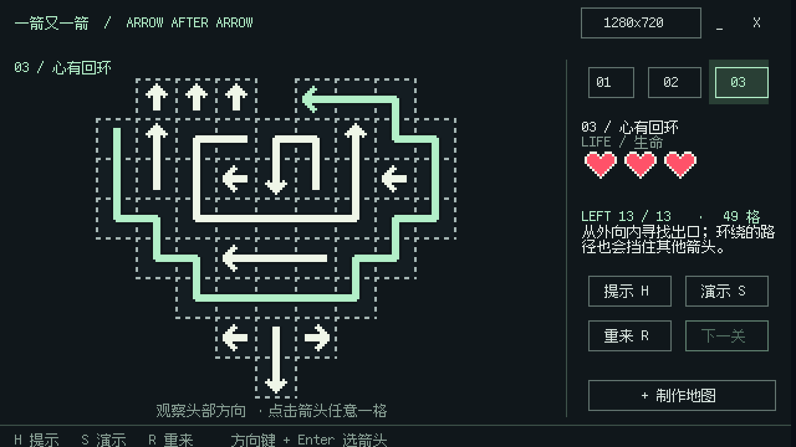

可以看到美术风格已经比较符合我的预期了，现在的问题主要集中在：

- UI流程：没有分页面，本该由开屏页、菜单页和设置页承担的功能全都堆在当前的玩法页中
- UI视觉效果：其实分完页面效果会好很多，这里暂时能看出来的是箭头和爱心的绘制有些简陋且风格不统一
- 窗口逻辑相关：无法通过拖拽顶栏等方式移动窗口位置，固定在屏幕中央显示会导致大分辨率有显示问题。且顶栏太过画蛇添足，无边框不代表要重复实现一遍顶栏
- 交互：鼠标点击TUI存在延迟，一个箭头在移动时无法点击其他箭头，这部分可能是数据结构问题（应该在判断能否移动后用一个队列来存储后续的移动操作，而不是竞争后因当前格子存在占用而丢弃当前操作），也可能是 TUI 本身的问题（如果是的话后续改为纯键盘操作，并考虑手柄适配，以及考虑是否需要用计划中的GUI外边框和屏幕滤镜来存储鼠标的模拟输入）
- 打包与跨平台：当前启动依赖 `start.cmd`，没有体现出 Textual 的跨平台优势，也没有打包流程（这个可以后面弄完 GUI 再弄）

也就是说，demo仅完成了 `1.游戏基本要求` 和 `7.扩展功能` 中的“更多关卡或关卡选择”、“提示功能”、“随机生成可通关的关卡“和“自动求解当前关卡（个人感觉接入 AI 来求解反而会增加需要考虑的问题，你或许可以阅读[《LLM 工程化在福 uu 中的落地实践 —— 假期调课的智能解析》](https://blog.baoshuo.ren/post/fzuhelper-llm-as-function/)这篇文章获取相关证明，而这种仅需贪心的通关逻辑写求解器是很简单的）”，页面要求则因为我过于想当然的没有在提示词中给出。

### 0.2.0

现在需要按上面的分析refactor一下，于是就有了第二版prompt：

```text
当前的demo需延续当前的模块化、继承优先的代码风格，解决如下问题并对需要测试的流程给出对应自动测试（后续需有打包成多平台的二进制可执行文件的能力，因此需对打包后的文件应用同一单测流程以确保逻辑无误）：

游戏应包含开始界面，游戏界面，通关或失败界面，暂停时出现的菜单页和设置页。游戏界面内不应出现这些现有的、应属于其他页面的元素（以从上到下、从左到右为顺序），并需要补充逻辑：
    - 标题“一箭又一箭/ARROW AFTER ARROW”：应在开始页面展示“ARROW.AFTER.ARROW-Y2K”作为标题
    - 分辨率切换按钮：应在设置页中作为“画面”条目的子项存在（设置页应有“基本”、“音频”、“画面”和“关于”等条目，这里需要你先分析一下这个游戏可能需要哪些设置）
    - 最小化按钮“-”和退出按钮“x”：应在游戏流程暂停时的菜单页（任意界面按esc都应当切换到菜单页）中展示“最小化”、“退出到主页”和“退出到桌面”。
另外，这里需要实现游戏中当前局面的存档，菜单页和开始界面也应当支持从保存的进度继续游戏，设置页面中也应当有“自动保存”和“保存频率”在“基本”设置项中，“自动保存”需要默认打开但可持久化关闭，保存频率默认3分钟一次，存档需要分为两个：点击菜单页或开始界面的“读取存档”按钮后应当跳转到对应页面，页面中有五个条目，最上方为自动保存（每<保存频率（分钟）>静默触发一次覆写自动保存的存档，从游戏流程退出前自动触发一次），其余四个是用户自己管理的手动存档，初始化为空即可。存档需显示：第x关卡、LEFT x/x，生命状态（小一点的三颗心，与游戏内进度一致）、存档时间和游戏难度（见下文“关卡列表”部分）
    - xx/关卡名称：删除左上角的，仅使用当前LIFE上方的；地图下方的提示也要删掉，仅保留右侧的
    - 01/02/03（关卡列表）：无需选择关卡，开始页面点击开始游戏的新建游戏（与“读取存档”区分开）后可进行难度选择：简单（初始仅可选简单），中等，困难，无尽（解锁条件见后文），当前关卡数仅作游戏进度提醒和难度解锁标志。01~03只是限制了地图形状，每次的箭头仍需应用随机生成流程。01~03在第一次点击“开始游戏”后作为固定形状的简单少格数地图的新手教程存在，04开始使用80~150格的中等难度地图，一直到10开始使用150格~250格的困难地图。需加入计时器：简单难度不计时（样式为XX:XX），中等难度一张图10:00，困难难度一张图8:00。到50关视为通关，通关后可解锁无尽模式：全困难难度，初始00:30思考时间，每点击一个箭头+00:03，有连击奖励，最高一个箭头+00:10，100连击或剩余时间超过15:00即可通关无尽模式。
    - 新增成就系统：在开始页面查看（开始页面的条目从上到下依次为：标题（不可点击），开始游戏，成就，地图创作，设置，退出到桌面和Github按钮（跳转项目地址）），需包含四个模式的解锁（简单对应“新手上路”，中等对应“熟能生巧”，困难对应“小有所成”，无尽对应“炉火纯青”）、当前共移动多少箭头（100/500/1000/100000），当前最高连续通关（10/50/100/500），当前无尽最快完成时间，是否编辑过地图等。成就在完成时需在右下角有小弹窗出现。
    - “制作地图”按钮删除，功能则移入开始页面的地图创作中。地图创作中需展示当前预设的所有简单、中等与困难地图，你可以自行选择将自己创作的地图算作什么难度（需可以对自己创作的地图作删除和分享（导出）操作，但是不可以删掉预设的地图）
    - 纵向和横向箭头的样式需统一并细一点，转弯也需要带更多一点点的圆角，浅粉爱心和当前浅绿的主色需要做的更科技一点：要黯淡的荧光粉和荧光绿，心要带一点微高光和阴影的低质量拟物（参考我的世界中的生命值，但是保留现在的碎裂效果）
```

这版prompt虽然结构好一点但仍繁杂，其实本来想仅修补的话就开max了，但是还是仍选择 gpt-6 astra 在 codex 中开 ultra。

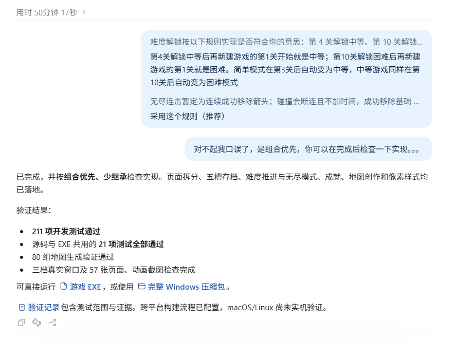

用时50min，源码可查看[refactor: page logic separation, difficulty selection, achievement system, additional unit tests in 0.2.0: \#dfc8597](https://github.com/155TuT/A.A.A-Y2K/commit/dfc859738ead14d0cd47f964b7abbbf924d34302)，可以注意到astra给了一次对关卡难度机制的询问，我后续又在看到思考过程时发现了自己的口误并给出了引导。

由于问题分析写的过早，我发现有两个之前存在的问题没有解决：

- 窗口逻辑相关：无法通过拖拽顶栏等方式移动窗口位置，固定在屏幕中央显示会导致大分辨率有显示问题。
  
- 交互：鼠标点击TUI存在延迟，一个箭头在移动时无法点击其他箭头，这部分可能是数据结构问题（应该在判断能否移动后用一个队列来存储后续的移动操作，而不是竞争后因当前格子存在占用而丢弃当前操作），也可能是 TUI 本身的问题（如果是的话后续改为纯键盘操作，并考虑手柄适配，以及考虑是否需要用计划中的GUI外边框和屏幕滤镜来存储鼠标的模拟输入）

除此之外还新增了一些小问题：

- （中等问题）主页的样式：首先是没对齐；其次是按钮过于单调，应增加icon
  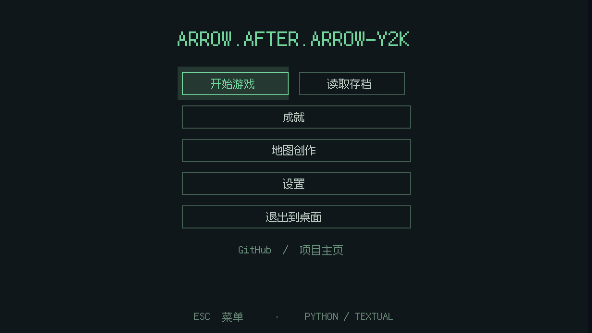
- （小问题）关卡游玩中：由于交互中的鼠标点击存在延迟，多次点击后会错误全选页面上的文本
  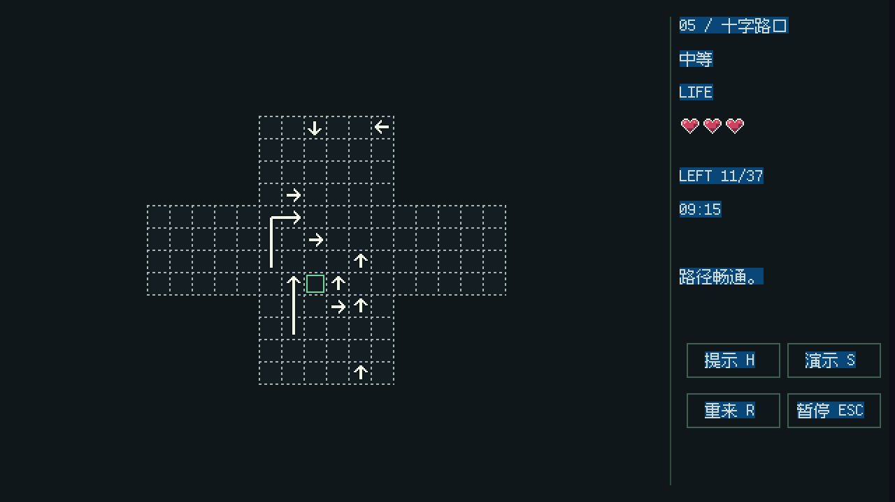
- （小问题）设置页的hover态：在点击其他项的时候没有正常清除“基本”页面的hover态
  
- （小问题）拉杆的press态：同样没有正常清除hover态，且左侧边框被遮挡
  
- （小问题）菜单页的hover态：点击“最小化”后再恢复窗口，最小化的hover态没有被正常清除
  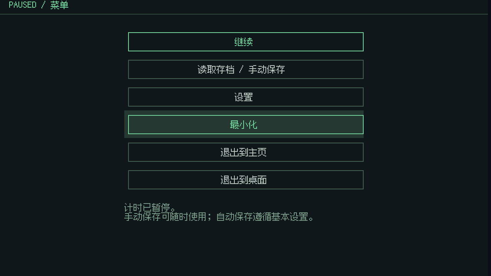
- （玩法难度问题）限时太长，不符合难度：个人测试下中等难度应当被缩减为4min，困难难度应该被缩减为2min，并且应加入掉血惩罚：中等难度掉血应-10s，困难难度掉血应-20s。无尽模式应在保持掉血-20s的情况下，在每关之间共享血量，初始一滴血，每到下一关增加一滴血，上限仍是三滴血：
  
- （大问题）地图创作与创意工坊：这里需要改的比较多，ai好像没太懂我的想法，后续再改
  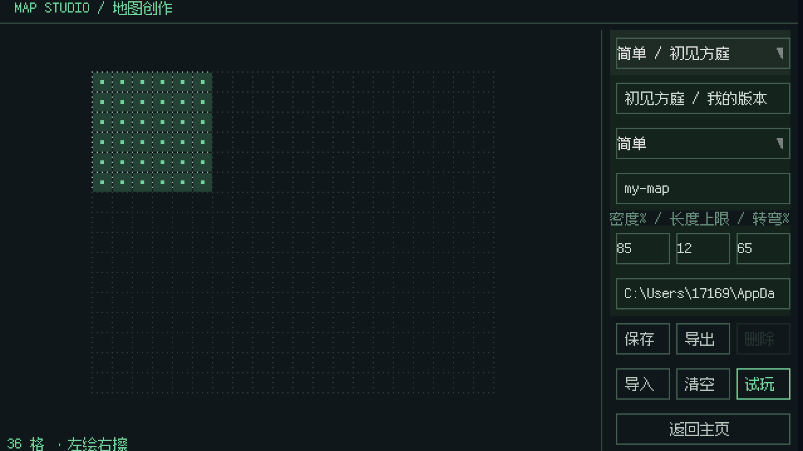

### 0.3.0

先fix一下除地图以外的问题吧，尤其是主页样式需要描述一下：

```text
现在这版很好，但仍有很多地方需要修改：

- （中等问题）窗口逻辑相关：无法通过拖拽顶栏等方式移动窗口位置，固定在屏幕中央显示会导致大分辨率有显示问题，见第 1 张图片
- （中等问题）交互：鼠标点击TUI存在延迟，一个箭头在移动时无法点击其他箭头
- （中等问题）主页的样式：首先是没对齐；其次是按钮过于单调，应增加与生命值的风格相似的、像素风格绘制的icon，如“开始游戏”左侧放一个三角形的播放icon，“读取存档”放一个淡黄色的读取文件夹icon，“成就”左侧放一个黄色的奖杯icon，“地图创作”左侧放一个类似minecraft的地图的icon，“设置”左侧放一个浅灰色的齿轮的icon，“退出到桌面”则变为正方形红色退出（icon为一个左侧半包围的矩形和右侧一个向右指的箭头，白色线条，但按钮描边线为红色，hover态也是红色，注意设置页的“退出到主页”和“退出到桌面”也要同步这个样式）按钮放到当前按钮列表对齐的左侧，“GitHub / 项目主页”则变为正方形github图标放在放到当前按钮列表对齐的右侧，当前最下方的暗色“ESC菜单 · PYTHON/ TEXTUAL”应改为“Made By 155TuT with GPT and Love”并在love左侧放一个当前生命值的爱心icon，见第 2 张图片
- （小问题）关卡游玩中：由于交互中的鼠标点击存在延迟，多次点击后会错误全选页面上的文本，见第 3 张图片
- （小问题）设置页的hover态：在点击其他项的时候没有正常清除“基本”页面的hover态，另外表示下拉菜单的灰色倒三角我希望改为描边色的三个小圆点以表示省略号，见第 4 张图片
- （小问题）拉杆的press态：同样没有正常清除hover态，且左侧边框被遮挡，见第 5 张图片
- （小问题）菜单页的hover态：点击“最小化”后再恢复窗口，最小化的hover态没有被正常清除，见第 6 张图片
- （玩法难度问题）限时太长，不符合难度：个人测试下中等难度应当被缩减为4min，困难难度应该被缩减为2min，并且应加入掉血惩罚：中等难度掉血应-10s，困难难度掉血应-20s。无尽模式应在保持掉血-20s的情况下，在每关之间共享血量，初始一滴血，每到下一关增加一滴血，上限仍是三滴血，见第 7 张图片
第 8 张图片暂时不用管，当前的地图修改逻辑有问题，后续再改
```

这版prompt主要是在修复小问题，仍选择 gpt-6 astra 在 codex 中开 ultra，后面出 GUI 边框的时候再用max吧


用时49min，源码可查看以下六次提交：

- `6eade0c` feat(ui): 更新主页布局与像素图标
- `494eec4` fix(ui): 修复按钮 hover 态与控件焦点残留
- `c2473b3` fix(desktop): 修复窗口拖动与多显示器定位
- `ab77531` feat(gameplay): 调整限时难度与无尽生命规则
- `3787d0b` feat(gameplay): 支持箭头与生命反馈并行动画
- `ca3aeb6` chore(release): 更新版本至 0.3.0

用codex拆了一下提交，但是忘记改语言了：

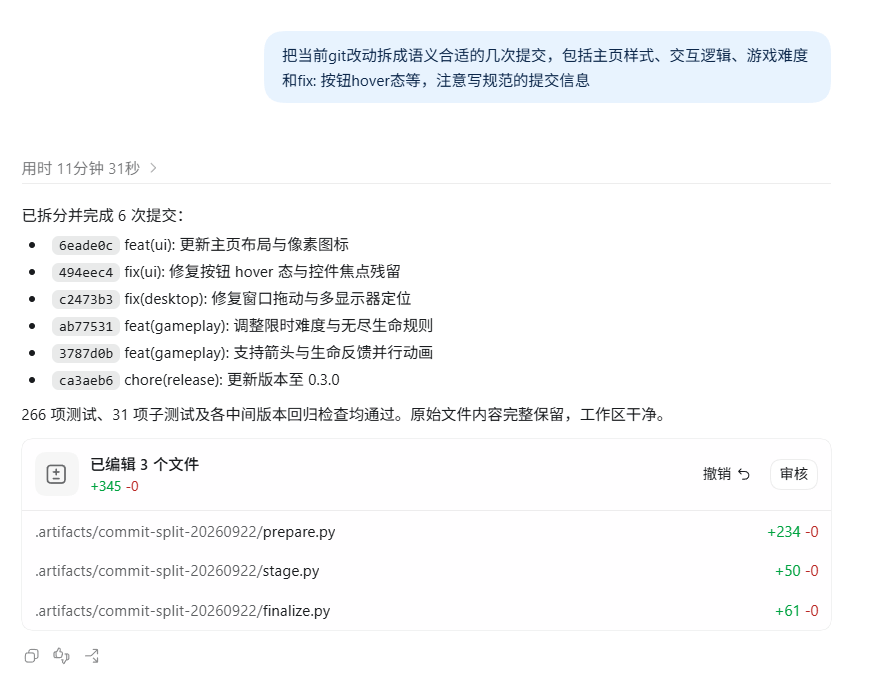

现在完成度就已经很高了，先分析fix，再增加feature吧：

> 其实这个流程很像自己给自己提issue，还挺好玩的

- （小问题）样式：主页的icon没在按钮中居中，github的图标应该用标准icon而不是自绘的icon（设置里的“关于”页的github按钮也没同步这个改动），hover时的背景色块离四条边的间距也不同，hover正方形按钮出现的文本框会在你鼠标停留的位置过于靠近某一区域时被icon遮挡
  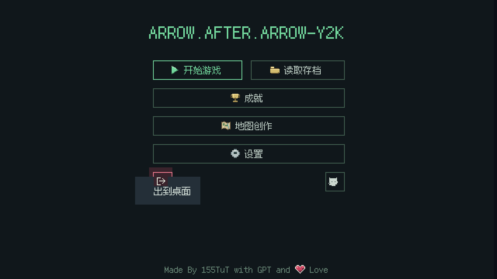
  
- （小问题）除主页外的页面顶栏的样式：所有hover时的背景色块离四条边的间距都不同，“返回”和“返回主页”键的位置和样式也不同，最好统一到顶栏左侧并都使用“返回主页”（左右间距不用那么大，与上下间距一致即可），且顶栏文字到上方的间距应该和顶栏文字到下方的间距一致
  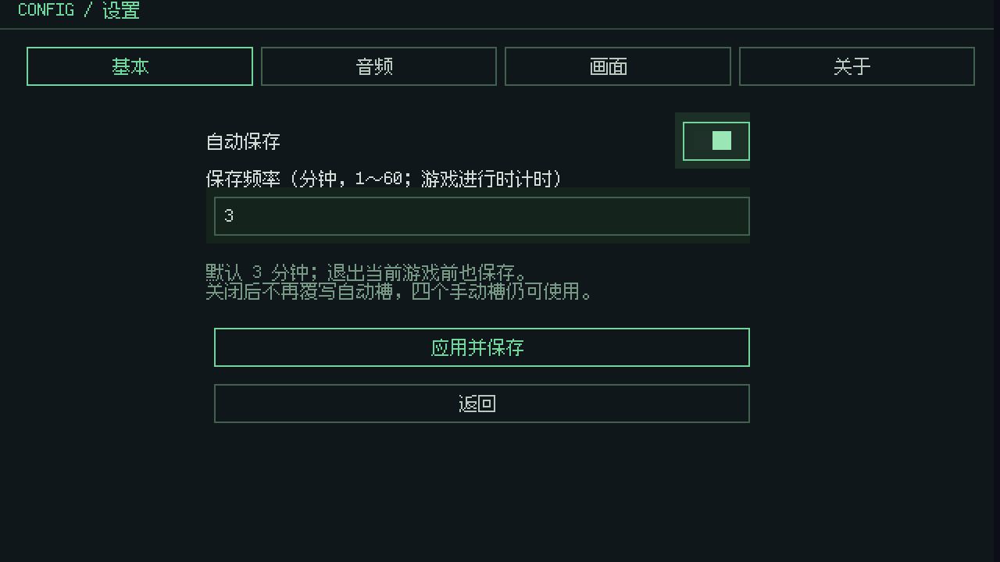
  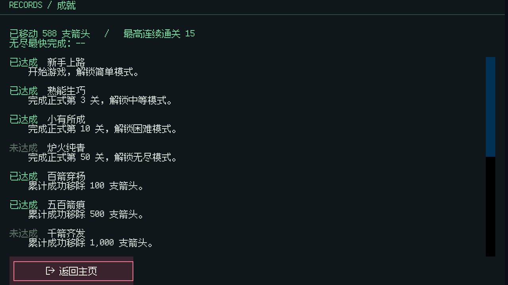
- （游戏体验问题）死亡后不该触发自动保存啊...保存一个死档有什么意义吗，很明显自动保存应该存的是活着的档
  
- （过度设计问题）完全不用这个 `--terminal` 启动，并且 `start.cmd` 也是不能跨平台的做法，不够graceful，只保留通过 `run.py` 和 打包好的 `*.exe` 启动就可以了，这个 terminal 的效果如图所示太差了
  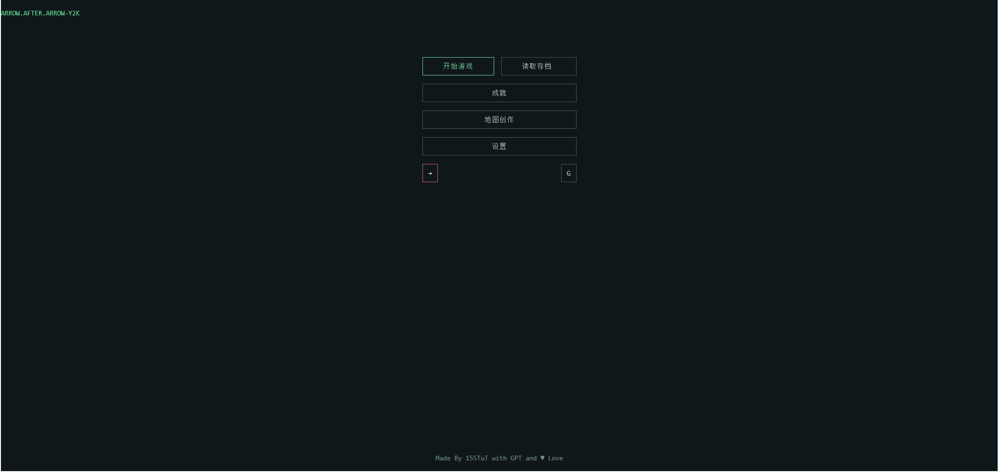

接下来是从最开始就构思好的feat：

当前主体程序是TUI，我想为其加一个无边框的GUI程序作为TUI的边框存在，该GUI的效果是随着TUI的移动而移动，随着分辨率的改变同步增大或缩小（只有三档因此不用做auto layout），风格和视觉效果我期望是老式CRT显示器的边框，略微泛黄的格洛克塑料感白色，下方的显示器面板上有慢速闪烁（非呼吸灯，不要加缓亮缓灭）的荧光黄和红色指示灯存在，并有一定数量的按钮（可按动，如“关机（断开的圆圈里嵌套一条竖线的符号）”点按后会触发TUI内的“退出到桌面”的效果，以及最好在按下GUI的“关机”或TUI的“退出到桌面”后以画面抖动和闪烁过渡到显示一个“NO SIGNAL”的页面，在1s后再完全退出）其他细长方体形状的按钮仅可做按下响应，暂不赋予功能。另外这个GUI我想对框住的TUI实现一个显示滤镜：模拟CRT显示的扫描线和微噪点、玻璃折光导致的微形变，但并不希望这个滤镜会干扰TUI主程序对键鼠事件的响应，这个是可以比较轻松的实现的吗？可以的话帮我完成全部效果，这个滤镜做不到这个效果的话可以告诉我有哪些替代方案，我后续再定夺。

其实这里已经对后续的feat有一些想法了，但是苦于时间太短就暂时不实现了：

- 箭头生成算法：
  - 找个策划来弄吧，我自己应该想不出来了，或许可以让 [Jasonxdd](https://github.com/kasinglee) 同学帮忙，我看他[博客里的算法](https://www.cnblogs.com/jasonxdd/p/22978822)写的不错
- 美工：
  - 当前是纯色背景，我是觉得可以加图片和特效的
  - 关卡的格子也可以各自涂色做像素画
- 创意工坊：
  - 地图绘制，mod，add-on
- 用户与好友：
  - steam来的灵感吧，分用户，并且可以两人联机竞速，或者有什么攻防模式之类的
- 成就：
  - 增加“完美通关”（不掉血通关xx次）的成就
  - 增加“呼朋唤友”（跟好友游玩xx次）的成就
  - etc.


### 0.4.0


按上面规划的分两步走吧，先fix：

```text
只有一点地方需要修改了：

- （小问题）样式：主页的icon没在按钮中居中，github的图标应该用标准icon而不是自绘的icon（设置里的“关于”页的github按钮也没同步这个改动），hover时的背景色块离四条边的间距也不同，hover正方形按钮出现的文本框会在你鼠标停留的位置过于靠近某一区域时被icon遮挡，如图1、图2对比
- （小问题）除主页外的页面顶栏的样式：所有hover时的背景色块离四条边的间距都不同，“返回”和“返回主页”键的位置和样式也不同，最好统一到顶栏左侧并都使用“返回主页”（左右间距不用那么大，与上下间距一致即可），且顶栏文字到上方的间距应该和顶栏文字到下方的间距一致，如图3、图4对比
- （游戏体验问题）死亡后不该触发自动保存啊...保存一个死档有什么意义吗，很明显自动保存应该存的是活着的档
，如图5
- （过度设计问题）完全不用这个 `--terminal` 启动，并且 `start.cmd` 也是不能跨平台的做法，不够graceful，只保留通过 `run.py` 和 打包好的 `*.exe` 启动就可以了，这个 terminal 的效果如图6所示太差了
```


效果不错，来点小fix（懒得截一堆图了）：

```text
当前仍是0.4.0版本范围的改动，无需启用下一个版本号：
首先是我笔误了，“返回主页”按钮应在右上角，然后是主页的Github按钮和退出到桌面的按钮需要交换位置。另外github图片的锯齿化似乎有些问题，现在界面上显示的图标的耳朵消失了。还有主页按esc应该无需触发菜单页，直接触发“确认要退出吗？”的过渡页面即可。最后是菜单页的“最小化”可以采用淡黄色边框和相应的hover态背景。
```

再feature：

```text
当前主体程序是TUI，我想为其加一个无边框的GUI程序作为TUI的边框存在.
该GUI的效果是随着TUI的移动而移动，随着分辨率的改变同步增大或缩小（只有三档因此不用做auto layout）.
风格和视觉效果我期望是模拟一个老式CRT显示器：略微泛黄的格洛克塑料感白色，下方的显示器面板上有速度不同德闪烁（非呼吸灯，不要加缓亮缓灭）的荧光黄和红色指示灯存在，并有一定数量的按钮（可按动，如“关机（断开的圆圈里嵌套一条竖线的符号）”点按后会触发TUI内的“退出到桌面”的效果，以及最好在按下GUI的“关机”或TUI的“退出到桌面”后以画面抖动和闪烁过渡到显示一个“NO SIGNAL”的页面，在1s后再完全退出）其他细长方体形状的按钮仅可做按下响应，暂不赋予功能。
另外这个GUI我想对框住的TUI实现一个显示滤镜：模拟CRT显示的扫描线和微噪点、玻璃折光导致的微形变，但并不希望这个滤镜会干扰TUI主程序对键鼠事件的响应，这个是可以比较轻松的实现的吗？
可以的话帮我完成全部效果，这个滤镜做不到这个效果的话可以告诉我有哪些替代方案，我后续再定夺。
```


效果太好了...给 astra 大人下跪了，必须附一张图了


那其实再改一小点就可以了：

```text
仍是0.4.0版本范围的改动：
CRT显示器的微圆角的边框后面还有一圈方形阴影，建议去掉或改为透明；
边框的关机键的关机符号可以再粗一点，内部类似镂空并透出与左侧荧光黄的颜色一致的光，并且需要在关机按钮居中显示。
+号和-号键可以与“设置”-“音量”中的总音量挂钩，按一下可以+5和-5音量（如在设置页中，按这个按钮应该能实时看到总音量的变化）。
M键可以表示Mode，按一下可以切换成黑白滤镜，你看看能不能把全局颜色css统一一下design token，然后实现这个按一下切换到黑白，再按一下切换回当前的这种绿色的效果
```

## 0x05 测试结果

### 测试方式与证据

测试包括规则单元测试、通过 Textual 消息与应用控制器验证的页面流程、源码/EXE 共用测试，以及 Windows 原生窗口验证。以下结果依据项目现有的 `docs/verification.md` 与对应报告整理，报告日期为 2026-09-22；本文整理时核对了报告内容，没有把已有结果写成重新运行了整套测试。

| 验证层次 | 实际结果 | 对应证据（项目根目录下） |
| --- | --- | --- |
| 开发测试 | 369 项测试通过，另有 42 个 subtests 通过；JUnit 共记录 411 条，失败、错误、跳过均为 0 | `output/verification/pytest-controls-v4.xml` |
| 源码共享套件 | 33/33 通过 | `build/reports/source.json` |
| Windows EXE 共享套件 | 33/33 通过，与源码的测试 ID 和状态一致 | `build/reports/frozen.json` |
| 原生窗口 | 三档分辨率启动、截图和退出通过；包含实体音量键、单色切换和窗口轮廓验证 | `output/native-controls-v4/report.json` |

### 作业要求的六项测试

| 编号 | 测试内容 | 预期结果 | 实际结果 | 是否通过 |
| --- | --- | --- | --- | --- |
| T01 | 点击前方无阻挡的箭头 | 箭头飞出棋盘并消失 | `test_successful_removal_returned_for_animation_and_clear_win` 验证从剩余集合删除、返回动画对象；并行动画与最后一箭结果页测试验证播放后结算 | 通过 |
| T02 | 点击前方有阻挡的箭头 | 箭头不消失，失误次数减 1 | 四向检测找到最近阻挡；`test_three_lives_loss_lock_and_restart_restores_exact_board` 验证布局不变、生命 3→2→1→0；同箭头回弹期间重复点击不重复扣血 | 通过 |
| T03 | 点击位于边缘且朝向棋盘外的箭头 | 正常消失，不发生越界错误 | `test_rays_cross_mask_holes_and_disconnected_islands` 中最右侧朝右箭头先合法离场；`test_successful_removal_returned_for_animation_and_clear_win` 实际点击右边缘箭头并验证消除；四方向检测另有参数化覆盖 | 通过 |
| T04 | 消除本关全部箭头 | 显示通关并进入下一关 | `test_full_fifty_level_progression` 覆盖三种普通模式共 150 关推进；结果路由测试覆盖等待动画后显示结果。本次展示回放还通过应用控制器清空前三关并从结果页进入下一关 | 通过 |
| T05 | 失误次数耗尽 | 显示失败并允许重新开始 | 引擎测试验证零生命后停止接受操作；`test_failure_routes_to_result_and_resets_official_streak` 与页面流程测试验证失败路由；本次展示另实际执行三次受阻点击，生成失败页 | 通过 |
| T06 | 游戏进行中重新开始 | 箭头布局和失误次数恢复 | 引擎重开测试验证初始棋盘与三颗心恢复；`test_restart_replaces_auto_slot_with_restored_live_board` 在碰撞扣血和计时后重开，验证存档与恢复后的局面一致、三颗心与初始时间恢复 | 通过 |

上述测试主要位于 `tests/test_engine.py`、`tests/test_campaign.py`、`tests/test_app.py` 和共享套件中。失败页重新开始、连续输入与暂停也有相应页面/动画回归；测试使用独立数据目录，不覆盖真实玩家存档。

### 人工试玩与问题修正

我已亲自通关简单模式前三关，分别为方形、长方形与心形地图。开发记录中保留了实际运行截图和体验问题，其中较直接影响玩法的几项是：

- 中等 10 分钟、困难 8 分钟过于宽松，因此在试玩后调整为 4 分钟与 2 分钟，并增加碰撞扣时。
- 一支箭头播放动画时不能点击其他箭头，影响连续操作，因此改为每支箭头独立反馈。
- 死亡后自动保存会覆盖可恢复的局面，因此改为仅自动保存活档，同时保留通关后的续关进度。

前三关人工通关属于我的实际试玩确认；本次文档展示回放则固定种子 `capture-pages-2026`，另行自动清空第 1、2、3 关并生成胜负截图，两者不混作同一份成绩记录。随机生成系统的测试也不能代替对每个可能种子的人工试玩。

### 复现与测试范围

```powershell
python -m pip install -e ".[dev,build]"
python -m pytest -q
python run.py --self-test --test-report build/reports/source.json
python tools/build.py
```

`tools/build.py` 运行源码共享测试、构建、EXE 共享测试，并按 ID 比对结果。开发环境的 369 项测试与二进制中的 33 项共享测试范围不同。Windows 原生结果不代表 macOS/Linux 已验证；静态截图与自动回放不代表人工操作覆盖。详细测试条件与限制见 `docs/verification.md`。

## 0x06 PSP 表格

| 任务 | 预估耗时（小时） | 实际耗时（小时） | 差异（小时） |
| --- | --- | --- | --- |
| 需求分析与游戏设计 | 3 | 3 | 0 |
| Python 与图形库学习 | 1 | 0.5 | -0.5 |
| 游戏界面实现 | 2 | 1 | -1 |
| 路径与碰撞逻辑实现 | 1 | 0.5 | -0.5 |
| 关卡设计 | 3 | 1 | -2 |
| AIGC 辅助开发 | 5 | 3 | -2 |
| 测试与修改 | 5 | 2 | -3 |
| README 与博客撰写 | 3 | 2 | -1 |
| 合计 | 23 | 14 | -9 |

## 0x07 心得体会

第一版并不是一个具有良好结构的prompt”，但 Agent 仍然很快做出了能运行、画风基本符合预期的 demo。这次最直接的帮助，就是把我关于像素界面、折线箭头和 CRT 外壳的想法快速变成可以运行、可以继续判断的程序。

不过第一版也暴露了需求表达的问题。我没有明确列出开始页、设置页和结果页，各种功能就堆在玩法页里；后来写错按钮的位置，也需要再纠正。能运行之后，图标居中、hover 残留、点击延迟、窗口拖动和难度平衡这些问题，仍然需要我自己去看、去玩，再把具体问题反馈给 AI。

“死亡后不该触发自动保存啊...保存一个死档有什么意义吗，很明显自动保存应该存的是活着的档”，是这次开发里一个很典型的例子：只有“自动保存”这个功能名是不够的，还需要说清楚什么时候保存、哪些状态不能覆盖，以及读取之后玩家能否继续游戏。后来的修复和测试，也围绕这些具体场景展开。

我在记录里说“其实这个流程很像自己给自己提issue，还挺好玩的”。从 demo 到后续版本，主要就是不断运行、记录问题、调整要求，再验证结果。AI 承担了大量代码实现和测试工作，我需要承担规则、视觉与交互上的判断，并理解路径检测、状态结算和存档边界这些关键代码。

这次也保留了一些暂时没有实现的想法，例如更丰富的地图美术、创意工坊、联机与更多成就。先把当前游戏的基本流程和实际体验完成，比在截止前继续增加功能更合适。
